<div style="width: 50%;">
  <div>
    <p align="center">
      <picture>
        <source srcset="logo.svg" media="(prefers-color-scheme: light)"  style="width: 30%;" alt="logo-dark">
        <source srcset="logo-yellow.svg" media="(prefers-color-scheme: dark)" style="width: 30%;" alt="logo-yellow">
        
      </picture>
    </p>
  </div>
</div>
<br>
&nbsp;
  <div>
  <h1 align="center">◓ Choose your Starter Framework:</h1>
  </div>


&nbsp;
<br>
<p float="left" align="middle">


</p>


<div align="center" style="margin-bottom: 2rem;">
<div style="width: 50%;">
  
</div>
  </div>

<!-- [Choose](https://github.com/nothingnothings/VueDex)
[Choose](https://github.com/nothingnothings/AngularDex)
[Choose](https://github.com/nothingnothings/ReactDex) -->

<div align="center">
<kbd style="float: left; margin-right: 30px;"><a href="https://github.com/nothingnothings/VueDex">Choose</a></kbd>  &nbsp; &nbsp; &nbsp; &nbsp; &nbsp; 
<kbd style="float: left; margin-right: 30px;"><a href="https://github.com/nothingnothings/AngularDex">Choose</a></kbd> &nbsp; &nbsp; &nbsp; &nbsp; &nbsp; 
<kbd style="float: left; margin-right: 30px;"><a href="https://github.com/nothingnothings/ReactDex" style="float: right; margin-left: 30px">Choose</a></kbd>
 </div>
 
 &nbsp; 
 <br>

<div align="center">
<div style="width: 100%;">
  
</div>
  </div>

<!-- ##
## 🛠 Languages and Tools: -->

<br>
&nbsp;
  <div>
  <h1 align="center">🛠 Languages and Tools:</h1>
  </div>

#### Languages:


#### Frontend:


#### Backend: 


#### Databases:


#### Hosting:


#### Testing:


#### Other Tools:


#### Studying:


<br>
&nbsp;
  <div>
  <h1 align="center">🚀 Some of my Projects:</h1>
  </div>

<p>
  <a href="https://github.com/nothingnothings/NodeShopRestAPI" target="_blank">
  
  </a>
  <a href="https://github.com/nothingnothings/nosferatu">
  
  </a>
</p>

<p>
  <a href="https://github.com/nothingnothings/ArtGarageWebpackVersion">
  
  </a>
  <a href="https://github.com/nothingnothings/HostCorpsWebpackVersion">
  
  </a>
</p>
<p>
  <a href="https://github.com/nothingnothings/zap-scraper">
  
  </a>
  <a href="https://github.com/nothingnothings/mlscraper">
  
  </a>
</p>
<p>
  <a href="https://github.com/nothingnothings/snowflake-summary">
  
  </a>
  <a href="https://github.com/nothingnothings/r3f-portfolio">
  
  </a>
</p>
 <p>
  <a href="https://github.com/nothingnothings/tailwindTraining">
   
  </a>
  <a href="https://github.com/nothingnothings/bootstrapTraining">
  
  </a>
</p>
<p> 
  <a href="https://github.com/nothingnothings/PostManager">
  
  </a>
  <a href="https://github.com/nothingnothings/NodeShopMultiPageApp">
  
  </a>
</p>


<br>
&nbsp;
  <div>
  <h1 align="center">💻 This week's activity: </h1>
  </div>
<!-- ##
## 💻 This week's activity -->

<!--START_SECTION:waka-->

```txt
Total Time: 19 hrs 52 mins

Text             12 hrs 14 mins  ███████████████░░░░░░░░░░   61.64 %
PHP              2 hrs 34 mins   ███░░░░░░░░░░░░░░░░░░░░░░   12.94 %
Blade Template   2 hrs 13 mins   ███░░░░░░░░░░░░░░░░░░░░░░   11.16 %
Vue.js           1 hr 16 mins    ██░░░░░░░░░░░░░░░░░░░░░░░   06.39 %
JavaScript       58 mins         █░░░░░░░░░░░░░░░░░░░░░░░░   04.94 %
CSS              21 mins         ░░░░░░░░░░░░░░░░░░░░░░░░░   01.79 %
```

<!--END_SECTION:waka-->

<!-- ##
##  🧙‍♂️ GitHub Stats -->

<br>
&nbsp;
  <div>
  <h1 align="center">🧙 GitHub Stats</h1>
  </div>

<p style="align: left;">
<a href="https://github.com/anuraghazra/github-readme-stats">
  
</a>
<a href="https://github.com/anuraghazra/github-readme-stats">
  
</a>
 </p>

<!-- [](https://github.com/anuraghazra/github-readme-stats)
 -->
 
<!--  ## 📞 Connect With Me -->

<br>
&nbsp;
  <div>
  <h1 align="center">🏙️ GitHub Skyline  (Commit Map 2022-2024)</h1>
  </div>

<!--
[](https://br.linkedin.com/in/arthur-dalla-corte-panazolo)
[](https://stackoverflow.com/users/19997047/apanazolo?tab=profile)
[](mailto:arthur.panazolo@acad.pucrs.br)
-->


```stl

solid TIGER
  facet normal 0 0 -1
    outer loop
      vertex 0 0 0
      vertex 106.14213562011719 30.142135620117188 0
      vertex 106.14213562011719 0 0
    endloop
  endfacet
  facet normal 0 0 -1
    outer loop
      vertex 106.14213562011719 30.142135620117188 0
      vertex 0 0 0
      vertex 0 30.142135620117188 0
    endloop
  endfacet
  facet normal 0 -0.9238795042037964 0.3826834261417389
    outer loop
      vertex 0 0 0
      vertex 104.0710678100586 2.0710678100585938 5
      vertex 2.0710678100585938 2.0710678100585938 5
    endloop
  endfacet
  facet normal 0 -0.9238795042037964 0.3826834261417389
    outer loop
      vertex 104.0710678100586 2.0710678100585938 5
      vertex 0 0 0
      vertex 106.14213562011719 0 0
    endloop
  endfacet
  facet normal -0.9238795042037964 0 0.3826834261417389
    outer loop
      vertex 0 30.142135620117188 0
      vertex 2.0710678100585938 2.0710678100585938 5
      vertex 2.0710678100585938 28.071067810058594 5
    endloop
  endfacet
  facet normal -0.9238795042037964 0 0.3826834261417389
    outer loop
      vertex 2.0710678100585938 2.0710678100585938 5
      vertex 0 30.142135620117188 0
      vertex 0 0 0
    endloop
  endfacet
  facet normal 0 0 1
    outer loop
      vertex 2.0710678100585938 28.071067810058594 5
      vertex 104.0710678100586 2.0710678100585938 5
      vertex 104.0710678100586 28.071067810058594 5
    endloop
  endfacet
  facet normal 0 0 1
    outer loop
      vertex 104.0710678100586 2.0710678100585938 5
      vertex 2.0710678100585938 28.071067810058594 5
      vertex 2.0710678100585938 2.0710678100585938 5
    endloop
  endfacet
  facet normal 0.9238795042037964 0 0.3826834261417389
    outer loop
      vertex 104.0710678100586 2.0710678100585938 5
      vertex 106.14213562011719 30.142135620117188 0
      vertex 104.0710678100586 28.071067810058594 5
    endloop
  endfacet
  facet normal 0.9238795042037964 0 0.3826834261417389
    outer loop
      vertex 106.14213562011719 30.142135620117188 0
      vertex 104.0710678100586 2.0710678100585938 5
      vertex 106.14213562011719 0 0
    endloop
  endfacet
  facet normal 0 0.9238795042037964 0.3826834261417389
    outer loop
      vertex 106.14213562011719 30.142135620117188 0
      vertex 2.0710678100585938 28.071067810058594 5
      vertex 104.0710678100586 28.071067810058594 5
    endloop
  endfacet
  facet normal 0 0.9238795042037964 0.3826834261417389
    outer loop
      vertex 2.0710678100585938 28.071067810058594 5
      vertex 106.14213562011719 30.142135620117188 0
      vertex 0 30.142135620117188 0
    endloop
  endfacet
  facet normal -1 0 0
    outer loop
      vertex 3.171067237854004 7.091067314147949 5.5
      vertex 3.171067237854004 11.09106731414795 5.648882865905762
      vertex 3.171067237854004 11.09106731414795 5.5
    endloop
  endfacet
  facet normal -1 0 0
    outer loop
      vertex 3.171067237854004 11.09106731414795 5.648882865905762
      vertex 3.171067237854004 7.091067314147949 5.5
      vertex 3.171067237854004 7.091067314147949 5.648882865905762
    endloop
  endfacet
  facet normal 0 0 1
    outer loop
      vertex 3.171067237854004 11.09106731414795 5.648882865905762
      vertex 7.171067237854004 7.091067314147949 5.648882865905762
      vertex 7.171067237854004 11.09106731414795 5.648882865905762
    endloop
  endfacet
  facet normal 0 0 1
    outer loop
      vertex 7.171067237854004 7.091067314147949 5.648882865905762
      vertex 3.171067237854004 11.09106731414795 5.648882865905762
      vertex 3.171067237854004 7.091067314147949 5.648882865905762
    endloop
  endfacet
  facet normal 1 0 0
    outer loop
      vertex 7.171067237854004 7.091067314147949 5.648882865905762
      vertex 7.171067237854004 11.09106731414795 5.5
      vertex 7.171067237854004 11.09106731414795 5.648882865905762
    endloop
  endfacet
  facet normal 1 0 0
    outer loop
      vertex 7.171067237854004 11.09106731414795 5.5
      vertex 7.171067237854004 7.091067314147949 5.648882865905762
      vertex 7.171067237854004 7.091067314147949 5.5
    endloop
  endfacet
  facet normal 0 1 0
    outer loop
      vertex 7.171067237854004 11.09106731414795 5.5
      vertex 3.171067237854004 11.09106731414795 5.648882865905762
      vertex 7.171067237854004 11.09106731414795 5.648882865905762
    endloop
  endfacet
  facet normal 0 1 0
    outer loop
      vertex 3.171067237854004 11.09106731414795 5.648882865905762
      vertex 7.171067237854004 11.09106731414795 5.5
      vertex 3.171067237854004 11.09106731414795 5.5
    endloop
  endfacet
  facet normal 0 0 -1
    outer loop
      vertex 3.171067237854004 7.091067314147949 5.5
      vertex 7.171067237854004 11.09106731414795 5.5
      vertex 7.171067237854004 7.091067314147949 5.5
    endloop
  endfacet
  facet normal 0 0 -1
    outer loop
      vertex 7.171067237854004 11.09106731414795 5.5
      vertex 3.171067237854004 7.091067314147949 5.5
      vertex 3.171067237854004 11.09106731414795 5.5
    endloop
  endfacet
  facet normal 0 -1 0
    outer loop
      vertex 3.171067237854004 7.091067314147949 5.5
      vertex 7.171067237854004 7.091067314147949 5.648882865905762
      vertex 3.171067237854004 7.091067314147949 5.648882865905762
    endloop
  endfacet
  facet normal 0 -1 0
    outer loop
      vertex 7.171067237854004 7.091067314147949 5.648882865905762
      vertex 3.171067237854004 7.091067314147949 5.5
      vertex 7.171067237854004 7.091067314147949 5.5
    endloop
  endfacet
  facet normal -1 0 0
    outer loop
      vertex 3.171067237854004 19.15106773376465 5.5
      vertex 3.171067237854004 23.15106773376465 7.286600112915039
      vertex 3.171067237854004 23.15106773376465 5.5
    endloop
  endfacet
  facet normal -1 0 0
    outer loop
      vertex 3.171067237854004 23.15106773376465 7.286600112915039
      vertex 3.171067237854004 19.15106773376465 5.5
      vertex 3.171067237854004 19.15106773376465 7.286600112915039
    endloop
  endfacet
  facet normal 0 0 1
    outer loop
      vertex 3.171067237854004 23.15106773376465 7.286600112915039
      vertex 7.171067237854004 19.15106773376465 7.286600112915039
      vertex 7.171067237854004 23.15106773376465 7.286600112915039
    endloop
  endfacet
  facet normal 0 0 1
    outer loop
      vertex 7.171067237854004 19.15106773376465 7.286600112915039
      vertex 3.171067237854004 23.15106773376465 7.286600112915039
      vertex 3.171067237854004 19.15106773376465 7.286600112915039
    endloop
  endfacet
  facet normal 1 0 0
    outer loop
      vertex 7.171067237854004 19.15106773376465 7.286600112915039
      vertex 7.171067237854004 23.15106773376465 5.5
      vertex 7.171067237854004 23.15106773376465 7.286600112915039
    endloop
  endfacet
  facet normal 1 0 0
    outer loop
      vertex 7.171067237854004 23.15106773376465 5.5
      vertex 7.171067237854004 19.15106773376465 7.286600112915039
      vertex 7.171067237854004 19.15106773376465 5.5
    endloop
  endfacet
  facet normal 0 0 -1
    outer loop
      vertex 3.171067237854004 19.15106773376465 5.5
      vertex 7.171067237854004 23.15106773376465 5.5
      vertex 7.171067237854004 19.15106773376465 5.5
    endloop
  endfacet
  facet normal 0 0 -1
    outer loop
      vertex 7.171067237854004 23.15106773376465 5.5
      vertex 3.171067237854004 19.15106773376465 5.5
      vertex 3.171067237854004 23.15106773376465 5.5
    endloop
  endfacet
  facet normal 0 -1 0
    outer loop
      vertex 3.171067237854004 19.15106773376465 5.5
      vertex 7.171067237854004 19.15106773376465 7.286600112915039
      vertex 3.171067237854004 19.15106773376465 7.286600112915039
    endloop
  endfacet
  facet normal 0 -1 0
    outer loop
      vertex 7.171067237854004 19.15106773376465 7.286600112915039
      vertex 3.171067237854004 19.15106773376465 5.5
      vertex 7.171067237854004 19.15106773376465 5.5
    endloop
  endfacet
  facet normal 0 1 0
    outer loop
      vertex 7.171067237854004 23.15106773376465 5.5
      vertex 3.171067237854004 23.15106773376465 7.286600112915039
      vertex 7.171067237854004 23.15106773376465 7.286600112915039
    endloop
  endfacet
  facet normal 0 1 0
    outer loop
      vertex 3.171067237854004 23.15106773376465 7.286600112915039
      vertex 7.171067237854004 23.15106773376465 5.5
      vertex 3.171067237854004 23.15106773376465 5.5
    endloop
  endfacet
  facet normal -1 0 0
    outer loop
      vertex 3.171067237854004 23.171066284179688 5.5
      vertex 3.171067237854004 27.171066284179688 42.57196044921875
      vertex 3.171067237854004 27.171066284179688 5.5
    endloop
  endfacet
  facet normal -1 0 0
    outer loop
      vertex 3.171067237854004 27.171066284179688 42.57196044921875
      vertex 3.171067237854004 23.171066284179688 5.5
      vertex 3.171067237854004 23.171066284179688 42.57196044921875
    endloop
  endfacet
  facet normal 0 0 1
    outer loop
      vertex 3.171067237854004 27.171066284179688 42.57196044921875
      vertex 7.171067237854004 23.171066284179688 42.57196044921875
      vertex 7.171067237854004 27.171066284179688 42.57196044921875
    endloop
  endfacet
  facet normal 0 0 1
    outer loop
      vertex 7.171067237854004 23.171066284179688 42.57196044921875
      vertex 3.171067237854004 27.171066284179688 42.57196044921875
      vertex 3.171067237854004 23.171066284179688 42.57196044921875
    endloop
  endfacet
  facet normal 1 0 0
    outer loop
      vertex 7.171067237854004 23.171066284179688 42.57196044921875
      vertex 7.171067237854004 27.171066284179688 5.5
      vertex 7.171067237854004 27.171066284179688 42.57196044921875
    endloop
  endfacet
  facet normal 1 0 0
    outer loop
      vertex 7.171067237854004 27.171066284179688 5.5
      vertex 7.171067237854004 23.171066284179688 42.57196044921875
      vertex 7.171067237854004 23.171066284179688 5.5
    endloop
  endfacet
  facet normal 0 1 0
    outer loop
      vertex 7.171067237854004 27.171066284179688 5.5
      vertex 3.171067237854004 27.171066284179688 42.57196044921875
      vertex 7.171067237854004 27.171066284179688 42.57196044921875
    endloop
  endfacet
  facet normal 0 1 0
    outer loop
      vertex 3.171067237854004 27.171066284179688 42.57196044921875
      vertex 7.171067237854004 27.171066284179688 5.5
      vertex 3.171067237854004 27.171066284179688 5.5
    endloop
  endfacet
  facet normal 0 0 -1
    outer loop
      vertex 3.171067237854004 23.171066284179688 5.5
      vertex 7.171067237854004 27.171066284179688 5.5
      vertex 7.171067237854004 23.171066284179688 5.5
    endloop
  endfacet
  facet normal 0 0 -1
    outer loop
      vertex 7.171067237854004 27.171066284179688 5.5
      vertex 3.171067237854004 23.171066284179688 5.5
      vertex 3.171067237854004 27.171066284179688 5.5
    endloop
  endfacet
  facet normal 0 -1 0
    outer loop
      vertex 3.171067237854004 23.171066284179688 5.5
      vertex 7.171067237854004 23.171066284179688 42.57196044921875
      vertex 3.171067237854004 23.171066284179688 42.57196044921875
    endloop
  endfacet
  facet normal 0 -1 0
    outer loop
      vertex 7.171067237854004 23.171066284179688 42.57196044921875
      vertex 3.171067237854004 23.171066284179688 5.5
      vertex 7.171067237854004 23.171066284179688 5.5
    endloop
  endfacet
  facet normal -1 0 0
    outer loop
      vertex 7.191067695617676 3.0710678100585938 5.5
      vertex 7.191067695617676 7.071067810058594 61.92679977416992
      vertex 7.191067695617676 7.071067810058594 5.5
    endloop
  endfacet
  facet normal -1 0 0
    outer loop
      vertex 7.191067695617676 7.071067810058594 61.92679977416992
      vertex 7.191067695617676 3.0710678100585938 5.5
      vertex 7.191067695617676 3.0710678100585938 61.92679977416992
    endloop
  endfacet
  facet normal 0 0 1
    outer loop
      vertex 7.191067695617676 7.071067810058594 61.92679977416992
      vertex 11.191067695617676 3.0710678100585938 61.92679977416992
      vertex 11.191067695617676 7.071067810058594 61.92679977416992
    endloop
  endfacet
  facet normal 0 0 1
    outer loop
      vertex 11.191067695617676 3.0710678100585938 61.92679977416992
      vertex 7.191067695617676 7.071067810058594 61.92679977416992
      vertex 7.191067695617676 3.0710678100585938 61.92679977416992
    endloop
  endfacet
  facet normal 1 0 0
    outer loop
      vertex 11.191067695617676 3.0710678100585938 61.92679977416992
      vertex 11.191067695617676 7.071067810058594 5.5
      vertex 11.191067695617676 7.071067810058594 61.92679977416992
    endloop
  endfacet
  facet normal 1 0 0
    outer loop
      vertex 11.191067695617676 7.071067810058594 5.5
      vertex 11.191067695617676 3.0710678100585938 61.92679977416992
      vertex 11.191067695617676 3.0710678100585938 5.5
    endloop
  endfacet
  facet normal 0 0 -1
    outer loop
      vertex 7.191067695617676 3.0710678100585938 5.5
      vertex 11.191067695617676 7.071067810058594 5.5
      vertex 11.191067695617676 3.0710678100585938 5.5
    endloop
  endfacet
  facet normal 0 0 -1
    outer loop
      vertex 11.191067695617676 7.071067810058594 5.5
      vertex 7.191067695617676 3.0710678100585938 5.5
      vertex 7.191067695617676 7.071067810058594 5.5
    endloop
  endfacet
  facet normal 0 -1 0
    outer loop
      vertex 7.191067695617676 3.0710678100585938 5.5
      vertex 11.191067695617676 3.0710678100585938 61.92679977416992
      vertex 7.191067695617676 3.0710678100585938 61.92679977416992
    endloop
  endfacet
  facet normal 0 -1 0
    outer loop
      vertex 11.191067695617676 3.0710678100585938 61.92679977416992
      vertex 7.191067695617676 3.0710678100585938 5.5
      vertex 11.191067695617676 3.0710678100585938 5.5
    endloop
  endfacet
  facet normal 0 1 0
    outer loop
      vertex 11.191067695617676 7.071067810058594 5.5
      vertex 7.191067695617676 7.071067810058594 61.92679977416992
      vertex 11.191067695617676 7.071067810058594 61.92679977416992
    endloop
  endfacet
  facet normal 0 1 0
    outer loop
      vertex 7.191067695617676 7.071067810058594 61.92679977416992
      vertex 11.191067695617676 7.071067810058594 5.5
      vertex 7.191067695617676 7.071067810058594 5.5
    endloop
  endfacet
  facet normal -1 0 0
    outer loop
      vertex 7.191067695617676 7.091067314147949 5.5
      vertex 7.191067695617676 11.09106731414795 53.58932876586914
      vertex 7.191067695617676 11.09106731414795 5.5
    endloop
  endfacet
  facet normal -1 0 0
    outer loop
      vertex 7.191067695617676 11.09106731414795 53.58932876586914
      vertex 7.191067695617676 7.091067314147949 5.5
      vertex 7.191067695617676 7.091067314147949 53.58932876586914
    endloop
  endfacet
  facet normal 0 0 1
    outer loop
      vertex 7.191067695617676 11.09106731414795 53.58932876586914
      vertex 11.191067695617676 7.091067314147949 53.58932876586914
      vertex 11.191067695617676 11.09106731414795 53.58932876586914
    endloop
  endfacet
  facet normal 0 0 1
    outer loop
      vertex 11.191067695617676 7.091067314147949 53.58932876586914
      vertex 7.191067695617676 11.09106731414795 53.58932876586914
      vertex 7.191067695617676 7.091067314147949 53.58932876586914
    endloop
  endfacet
  facet normal 1 0 0
    outer loop
      vertex 11.191067695617676 7.091067314147949 53.58932876586914
      vertex 11.191067695617676 11.09106731414795 5.5
      vertex 11.191067695617676 11.09106731414795 53.58932876586914
    endloop
  endfacet
  facet normal 1 0 0
    outer loop
      vertex 11.191067695617676 11.09106731414795 5.5
      vertex 11.191067695617676 7.091067314147949 53.58932876586914
      vertex 11.191067695617676 7.091067314147949 5.5
    endloop
  endfacet
  facet normal 0 0 -1
    outer loop
      vertex 7.191067695617676 7.091067314147949 5.5
      vertex 11.191067695617676 11.09106731414795 5.5
      vertex 11.191067695617676 7.091067314147949 5.5
    endloop
  endfacet
  facet normal 0 0 -1
    outer loop
      vertex 11.191067695617676 11.09106731414795 5.5
      vertex 7.191067695617676 7.091067314147949 5.5
      vertex 7.191067695617676 11.09106731414795 5.5
    endloop
  endfacet
  facet normal 0 -1 0
    outer loop
      vertex 7.191067695617676 7.091067314147949 5.5
      vertex 11.191067695617676 7.091067314147949 53.58932876586914
      vertex 7.191067695617676 7.091067314147949 53.58932876586914
    endloop
  endfacet
  facet normal 0 -1 0
    outer loop
      vertex 11.191067695617676 7.091067314147949 53.58932876586914
      vertex 7.191067695617676 7.091067314147949 5.5
      vertex 11.191067695617676 7.091067314147949 5.5
    endloop
  endfacet
  facet normal 0 1 0
    outer loop
      vertex 11.191067695617676 11.09106731414795 5.5
      vertex 7.191067695617676 11.09106731414795 53.58932876586914
      vertex 11.191067695617676 11.09106731414795 53.58932876586914
    endloop
  endfacet
  facet normal 0 1 0
    outer loop
      vertex 7.191067695617676 11.09106731414795 53.58932876586914
      vertex 11.191067695617676 11.09106731414795 5.5
      vertex 7.191067695617676 11.09106731414795 5.5
    endloop
  endfacet
  facet normal -1 0 0
    outer loop
      vertex 7.191067695617676 11.111067771911621 5.5
      vertex 7.191067695617676 15.111067771911621 12.944168090820312
      vertex 7.191067695617676 15.111067771911621 5.5
    endloop
  endfacet
  facet normal -1 0 0
    outer loop
      vertex 7.191067695617676 15.111067771911621 12.944168090820312
      vertex 7.191067695617676 11.111067771911621 5.5
      vertex 7.191067695617676 11.111067771911621 12.944168090820312
    endloop
  endfacet
  facet normal 0 0 1
    outer loop
      vertex 7.191067695617676 15.111067771911621 12.944168090820312
      vertex 11.191067695617676 11.111067771911621 12.944168090820312
      vertex 11.191067695617676 15.111067771911621 12.944168090820312
    endloop
  endfacet
  facet normal 0 0 1
    outer loop
      vertex 11.191067695617676 11.111067771911621 12.944168090820312
      vertex 7.191067695617676 15.111067771911621 12.944168090820312
      vertex 7.191067695617676 11.111067771911621 12.944168090820312
    endloop
  endfacet
  facet normal 1 0 0
    outer loop
      vertex 11.191067695617676 11.111067771911621 12.944168090820312
      vertex 11.191067695617676 15.111067771911621 5.5
      vertex 11.191067695617676 15.111067771911621 12.944168090820312
    endloop
  endfacet
  facet normal 1 0 0
    outer loop
      vertex 11.191067695617676 15.111067771911621 5.5
      vertex 11.191067695617676 11.111067771911621 12.944168090820312
      vertex 11.191067695617676 11.111067771911621 5.5
    endloop
  endfacet
  facet normal 0 1 0
    outer loop
      vertex 11.191067695617676 15.111067771911621 5.5
      vertex 7.191067695617676 15.111067771911621 12.944168090820312
      vertex 11.191067695617676 15.111067771911621 12.944168090820312
    endloop
  endfacet
  facet normal 0 1 0
    outer loop
      vertex 7.191067695617676 15.111067771911621 12.944168090820312
      vertex 11.191067695617676 15.111067771911621 5.5
      vertex 7.191067695617676 15.111067771911621 5.5
    endloop
  endfacet
  facet normal 0 0 -1
    outer loop
      vertex 7.191067695617676 11.111067771911621 5.5
      vertex 11.191067695617676 15.111067771911621 5.5
      vertex 11.191067695617676 11.111067771911621 5.5
    endloop
  endfacet
  facet normal 0 0 -1
    outer loop
      vertex 11.191067695617676 15.111067771911621 5.5
      vertex 7.191067695617676 11.111067771911621 5.5
      vertex 7.191067695617676 15.111067771911621 5.5
    endloop
  endfacet
  facet normal 0 -1 0
    outer loop
      vertex 7.191067695617676 11.111067771911621 5.5
      vertex 11.191067695617676 11.111067771911621 12.944168090820312
      vertex 7.191067695617676 11.111067771911621 12.944168090820312
    endloop
  endfacet
  facet normal 0 -1 0
    outer loop
      vertex 11.191067695617676 11.111067771911621 12.944168090820312
      vertex 7.191067695617676 11.111067771911621 5.5
      vertex 11.191067695617676 11.111067771911621 5.5
    endloop
  endfacet
  facet normal -1 0 0
    outer loop
      vertex 7.191067695617676 15.131067276000977 5.5
      vertex 7.191067695617676 19.131067276000977 16.815135955810547
      vertex 7.191067695617676 19.131067276000977 5.5
    endloop
  endfacet
  facet normal -1 0 0
    outer loop
      vertex 7.191067695617676 19.131067276000977 16.815135955810547
      vertex 7.191067695617676 15.131067276000977 5.5
      vertex 7.191067695617676 15.131067276000977 16.815135955810547
    endloop
  endfacet
  facet normal 0 0 1
    outer loop
      vertex 7.191067695617676 19.131067276000977 16.815135955810547
      vertex 11.191067695617676 15.131067276000977 16.815135955810547
      vertex 11.191067695617676 19.131067276000977 16.815135955810547
    endloop
  endfacet
  facet normal 0 0 1
    outer loop
      vertex 11.191067695617676 15.131067276000977 16.815135955810547
      vertex 7.191067695617676 19.131067276000977 16.815135955810547
      vertex 7.191067695617676 15.131067276000977 16.815135955810547
    endloop
  endfacet
  facet normal 1 0 0
    outer loop
      vertex 11.191067695617676 15.131067276000977 16.815135955810547
      vertex 11.191067695617676 19.131067276000977 5.5
      vertex 11.191067695617676 19.131067276000977 16.815135955810547
    endloop
  endfacet
  facet normal 1 0 0
    outer loop
      vertex 11.191067695617676 19.131067276000977 5.5
      vertex 11.191067695617676 15.131067276000977 16.815135955810547
      vertex 11.191067695617676 15.131067276000977 5.5
    endloop
  endfacet
  facet normal 0 1 0
    outer loop
      vertex 11.191067695617676 19.131067276000977 5.5
      vertex 7.191067695617676 19.131067276000977 16.815135955810547
      vertex 11.191067695617676 19.131067276000977 16.815135955810547
    endloop
  endfacet
  facet normal 0 1 0
    outer loop
      vertex 7.191067695617676 19.131067276000977 16.815135955810547
      vertex 11.191067695617676 19.131067276000977 5.5
      vertex 7.191067695617676 19.131067276000977 5.5
    endloop
  endfacet
  facet normal 0 0 -1
    outer loop
      vertex 7.191067695617676 15.131067276000977 5.5
      vertex 11.191067695617676 19.131067276000977 5.5
      vertex 11.191067695617676 15.131067276000977 5.5
    endloop
  endfacet
  facet normal 0 0 -1
    outer loop
      vertex 11.191067695617676 19.131067276000977 5.5
      vertex 7.191067695617676 15.131067276000977 5.5
      vertex 7.191067695617676 19.131067276000977 5.5
    endloop
  endfacet
  facet normal 0 -1 0
    outer loop
      vertex 7.191067695617676 15.131067276000977 5.5
      vertex 11.191067695617676 15.131067276000977 16.815135955810547
      vertex 7.191067695617676 15.131067276000977 16.815135955810547
    endloop
  endfacet
  facet normal 0 -1 0
    outer loop
      vertex 11.191067695617676 15.131067276000977 16.815135955810547
      vertex 7.191067695617676 15.131067276000977 5.5
      vertex 11.191067695617676 15.131067276000977 5.5
    endloop
  endfacet
  facet normal -1 0 0
    outer loop
      vertex 7.191067695617676 19.15106773376465 5.5
      vertex 7.191067695617676 23.15106773376465 21.728286743164062
      vertex 7.191067695617676 23.15106773376465 5.5
    endloop
  endfacet
  facet normal -1 0 0
    outer loop
      vertex 7.191067695617676 23.15106773376465 21.728286743164062
      vertex 7.191067695617676 19.15106773376465 5.5
      vertex 7.191067695617676 19.15106773376465 21.728286743164062
    endloop
  endfacet
  facet normal 0 0 1
    outer loop
      vertex 7.191067695617676 23.15106773376465 21.728286743164062
      vertex 11.191067695617676 19.15106773376465 21.728286743164062
      vertex 11.191067695617676 23.15106773376465 21.728286743164062
    endloop
  endfacet
  facet normal 0 0 1
    outer loop
      vertex 11.191067695617676 19.15106773376465 21.728286743164062
      vertex 7.191067695617676 23.15106773376465 21.728286743164062
      vertex 7.191067695617676 19.15106773376465 21.728286743164062
    endloop
  endfacet
  facet normal 1 0 0
    outer loop
      vertex 11.191067695617676 19.15106773376465 21.728286743164062
      vertex 11.191067695617676 23.15106773376465 5.5
      vertex 11.191067695617676 23.15106773376465 21.728286743164062
    endloop
  endfacet
  facet normal 1 0 0
    outer loop
      vertex 11.191067695617676 23.15106773376465 5.5
      vertex 11.191067695617676 19.15106773376465 21.728286743164062
      vertex 11.191067695617676 19.15106773376465 5.5
    endloop
  endfacet
  facet normal 0 1 0
    outer loop
      vertex 11.191067695617676 23.15106773376465 5.5
      vertex 7.191067695617676 23.15106773376465 21.728286743164062
      vertex 11.191067695617676 23.15106773376465 21.728286743164062
    endloop
  endfacet
  facet normal 0 1 0
    outer loop
      vertex 7.191067695617676 23.15106773376465 21.728286743164062
      vertex 11.191067695617676 23.15106773376465 5.5
      vertex 7.191067695617676 23.15106773376465 5.5
    endloop
  endfacet
  facet normal 0 0 -1
    outer loop
      vertex 7.191067695617676 19.15106773376465 5.5
      vertex 11.191067695617676 23.15106773376465 5.5
      vertex 11.191067695617676 19.15106773376465 5.5
    endloop
  endfacet
  facet normal 0 0 -1
    outer loop
      vertex 11.191067695617676 23.15106773376465 5.5
      vertex 7.191067695617676 19.15106773376465 5.5
      vertex 7.191067695617676 23.15106773376465 5.5
    endloop
  endfacet
  facet normal 0 -1 0
    outer loop
      vertex 7.191067695617676 19.15106773376465 5.5
      vertex 11.191067695617676 19.15106773376465 21.728286743164062
      vertex 7.191067695617676 19.15106773376465 21.728286743164062
    endloop
  endfacet
  facet normal 0 -1 0
    outer loop
      vertex 11.191067695617676 19.15106773376465 21.728286743164062
      vertex 7.191067695617676 19.15106773376465 5.5
      vertex 11.191067695617676 19.15106773376465 5.5
    endloop
  endfacet
  facet normal -1 0 0
    outer loop
      vertex 7.191067695617676 23.171066284179688 5.5
      vertex 7.191067695617676 27.171066284179688 23.0682373046875
      vertex 7.191067695617676 27.171066284179688 5.5
    endloop
  endfacet
  facet normal -1 0 0
    outer loop
      vertex 7.191067695617676 27.171066284179688 23.0682373046875
      vertex 7.191067695617676 23.171066284179688 5.5
      vertex 7.191067695617676 23.171066284179688 23.0682373046875
    endloop
  endfacet
  facet normal 0 0 1
    outer loop
      vertex 7.191067695617676 27.171066284179688 23.0682373046875
      vertex 11.191067695617676 23.171066284179688 23.0682373046875
      vertex 11.191067695617676 27.171066284179688 23.0682373046875
    endloop
  endfacet
  facet normal 0 0 1
    outer loop
      vertex 11.191067695617676 23.171066284179688 23.0682373046875
      vertex 7.191067695617676 27.171066284179688 23.0682373046875
      vertex 7.191067695617676 23.171066284179688 23.0682373046875
    endloop
  endfacet
  facet normal 1 0 0
    outer loop
      vertex 11.191067695617676 23.171066284179688 23.0682373046875
      vertex 11.191067695617676 27.171066284179688 5.5
      vertex 11.191067695617676 27.171066284179688 23.0682373046875
    endloop
  endfacet
  facet normal 1 0 0
    outer loop
      vertex 11.191067695617676 27.171066284179688 5.5
      vertex 11.191067695617676 23.171066284179688 23.0682373046875
      vertex 11.191067695617676 23.171066284179688 5.5
    endloop
  endfacet
  facet normal 0 1 0
    outer loop
      vertex 11.191067695617676 27.171066284179688 5.5
      vertex 7.191067695617676 27.171066284179688 23.0682373046875
      vertex 11.191067695617676 27.171066284179688 23.0682373046875
    endloop
  endfacet
  facet normal 0 1 0
    outer loop
      vertex 7.191067695617676 27.171066284179688 23.0682373046875
      vertex 11.191067695617676 27.171066284179688 5.5
      vertex 7.191067695617676 27.171066284179688 5.5
    endloop
  endfacet
  facet normal 0 0 -1
    outer loop
      vertex 7.191067695617676 23.171066284179688 5.5
      vertex 11.191067695617676 27.171066284179688 5.5
      vertex 11.191067695617676 23.171066284179688 5.5
    endloop
  endfacet
  facet normal 0 0 -1
    outer loop
      vertex 11.191067695617676 27.171066284179688 5.5
      vertex 7.191067695617676 23.171066284179688 5.5
      vertex 7.191067695617676 27.171066284179688 5.5
    endloop
  endfacet
  facet normal 0 -1 0
    outer loop
      vertex 7.191067695617676 23.171066284179688 5.5
      vertex 11.191067695617676 23.171066284179688 23.0682373046875
      vertex 7.191067695617676 23.171066284179688 23.0682373046875
    endloop
  endfacet
  facet normal 0 -1 0
    outer loop
      vertex 11.191067695617676 23.171066284179688 23.0682373046875
      vertex 7.191067695617676 23.171066284179688 5.5
      vertex 11.191067695617676 23.171066284179688 5.5
    endloop
  endfacet
  facet normal -1 0 0
    outer loop
      vertex 11.211067199707031 3.0710678100585938 5.5
      vertex 11.211067199707031 7.071067810058594 65.5
      vertex 11.211067199707031 7.071067810058594 5.5
    endloop
  endfacet
  facet normal -1 0 0
    outer loop
      vertex 11.211067199707031 7.071067810058594 65.5
      vertex 11.211067199707031 3.0710678100585938 5.5
      vertex 11.211067199707031 3.0710678100585938 65.5
    endloop
  endfacet
  facet normal 0 0 1
    outer loop
      vertex 11.211067199707031 7.071067810058594 65.5
      vertex 15.211067199707031 3.0710678100585938 65.5
      vertex 15.211067199707031 7.071067810058594 65.5
    endloop
  endfacet
  facet normal 0 0 1
    outer loop
      vertex 15.211067199707031 3.0710678100585938 65.5
      vertex 11.211067199707031 7.071067810058594 65.5
      vertex 11.211067199707031 3.0710678100585938 65.5
    endloop
  endfacet
  facet normal 1 0 0
    outer loop
      vertex 15.211067199707031 3.0710678100585938 65.5
      vertex 15.211067199707031 7.071067810058594 5.5
      vertex 15.211067199707031 7.071067810058594 65.5
    endloop
  endfacet
  facet normal 1 0 0
    outer loop
      vertex 15.211067199707031 7.071067810058594 5.5
      vertex 15.211067199707031 3.0710678100585938 65.5
      vertex 15.211067199707031 3.0710678100585938 5.5
    endloop
  endfacet
  facet normal 0 1 0
    outer loop
      vertex 15.211067199707031 7.071067810058594 5.5
      vertex 11.211067199707031 7.071067810058594 65.5
      vertex 15.211067199707031 7.071067810058594 65.5
    endloop
  endfacet
  facet normal 0 1 0
    outer loop
      vertex 11.211067199707031 7.071067810058594 65.5
      vertex 15.211067199707031 7.071067810058594 5.5
      vertex 11.211067199707031 7.071067810058594 5.5
    endloop
  endfacet
  facet normal 0 0 -1
    outer loop
      vertex 11.211067199707031 3.0710678100585938 5.5
      vertex 15.211067199707031 7.071067810058594 5.5
      vertex 15.211067199707031 3.0710678100585938 5.5
    endloop
  endfacet
  facet normal 0 0 -1
    outer loop
      vertex 15.211067199707031 7.071067810058594 5.5
      vertex 11.211067199707031 3.0710678100585938 5.5
      vertex 11.211067199707031 7.071067810058594 5.5
    endloop
  endfacet
  facet normal 0 -1 0
    outer loop
      vertex 11.211067199707031 3.0710678100585938 5.5
      vertex 15.211067199707031 3.0710678100585938 65.5
      vertex 11.211067199707031 3.0710678100585938 65.5
    endloop
  endfacet
  facet normal 0 -1 0
    outer loop
      vertex 15.211067199707031 3.0710678100585938 65.5
      vertex 11.211067199707031 3.0710678100585938 5.5
      vertex 15.211067199707031 3.0710678100585938 5.5
    endloop
  endfacet
  facet normal -1 0 0
    outer loop
      vertex 11.211067199707031 7.091067314147949 5.5
      vertex 11.211067199707031 11.09106731414795 27.38585662841797
      vertex 11.211067199707031 11.09106731414795 5.5
    endloop
  endfacet
  facet normal -1 0 0
    outer loop
      vertex 11.211067199707031 11.09106731414795 27.38585662841797
      vertex 11.211067199707031 7.091067314147949 5.5
      vertex 11.211067199707031 7.091067314147949 27.38585662841797
    endloop
  endfacet
  facet normal 0 0 1
    outer loop
      vertex 11.211067199707031 11.09106731414795 27.38585662841797
      vertex 15.211067199707031 7.091067314147949 27.38585662841797
      vertex 15.211067199707031 11.09106731414795 27.38585662841797
    endloop
  endfacet
  facet normal 0 0 1
    outer loop
      vertex 15.211067199707031 7.091067314147949 27.38585662841797
      vertex 11.211067199707031 11.09106731414795 27.38585662841797
      vertex 11.211067199707031 7.091067314147949 27.38585662841797
    endloop
  endfacet
  facet normal 1 0 0
    outer loop
      vertex 15.211067199707031 7.091067314147949 27.38585662841797
      vertex 15.211067199707031 11.09106731414795 5.5
      vertex 15.211067199707031 11.09106731414795 27.38585662841797
    endloop
  endfacet
  facet normal 1 0 0
    outer loop
      vertex 15.211067199707031 11.09106731414795 5.5
      vertex 15.211067199707031 7.091067314147949 27.38585662841797
      vertex 15.211067199707031 7.091067314147949 5.5
    endloop
  endfacet
  facet normal 0 1 0
    outer loop
      vertex 15.211067199707031 11.09106731414795 5.5
      vertex 11.211067199707031 11.09106731414795 27.38585662841797
      vertex 15.211067199707031 11.09106731414795 27.38585662841797
    endloop
  endfacet
  facet normal 0 1 0
    outer loop
      vertex 11.211067199707031 11.09106731414795 27.38585662841797
      vertex 15.211067199707031 11.09106731414795 5.5
      vertex 11.211067199707031 11.09106731414795 5.5
    endloop
  endfacet
  facet normal 0 0 -1
    outer loop
      vertex 11.211067199707031 7.091067314147949 5.5
      vertex 15.211067199707031 11.09106731414795 5.5
      vertex 15.211067199707031 7.091067314147949 5.5
    endloop
  endfacet
  facet normal 0 0 -1
    outer loop
      vertex 15.211067199707031 11.09106731414795 5.5
      vertex 11.211067199707031 7.091067314147949 5.5
      vertex 11.211067199707031 11.09106731414795 5.5
    endloop
  endfacet
  facet normal 0 -1 0
    outer loop
      vertex 11.211067199707031 7.091067314147949 5.5
      vertex 15.211067199707031 7.091067314147949 27.38585662841797
      vertex 11.211067199707031 7.091067314147949 27.38585662841797
    endloop
  endfacet
  facet normal 0 -1 0
    outer loop
      vertex 15.211067199707031 7.091067314147949 27.38585662841797
      vertex 11.211067199707031 7.091067314147949 5.5
      vertex 15.211067199707031 7.091067314147949 5.5
    endloop
  endfacet
  facet normal -1 0 0
    outer loop
      vertex 11.211067199707031 11.111067771911621 5.5
      vertex 11.211067199707031 15.111067771911621 9.817617416381836
      vertex 11.211067199707031 15.111067771911621 5.5
    endloop
  endfacet
  facet normal -1 0 0
    outer loop
      vertex 11.211067199707031 15.111067771911621 9.817617416381836
      vertex 11.211067199707031 11.111067771911621 5.5
      vertex 11.211067199707031 11.111067771911621 9.817617416381836
    endloop
  endfacet
  facet normal 0 0 1
    outer loop
      vertex 11.211067199707031 15.111067771911621 9.817617416381836
      vertex 15.211067199707031 11.111067771911621 9.817617416381836
      vertex 15.211067199707031 15.111067771911621 9.817617416381836
    endloop
  endfacet
  facet normal 0 0 1
    outer loop
      vertex 15.211067199707031 11.111067771911621 9.817617416381836
      vertex 11.211067199707031 15.111067771911621 9.817617416381836
      vertex 11.211067199707031 11.111067771911621 9.817617416381836
    endloop
  endfacet
  facet normal 1 0 0
    outer loop
      vertex 15.211067199707031 11.111067771911621 9.817617416381836
      vertex 15.211067199707031 15.111067771911621 5.5
      vertex 15.211067199707031 15.111067771911621 9.817617416381836
    endloop
  endfacet
  facet normal 1 0 0
    outer loop
      vertex 15.211067199707031 15.111067771911621 5.5
      vertex 15.211067199707031 11.111067771911621 9.817617416381836
      vertex 15.211067199707031 11.111067771911621 5.5
    endloop
  endfacet
  facet normal 0 1 0
    outer loop
      vertex 15.211067199707031 15.111067771911621 5.5
      vertex 11.211067199707031 15.111067771911621 9.817617416381836
      vertex 15.211067199707031 15.111067771911621 9.817617416381836
    endloop
  endfacet
  facet normal 0 1 0
    outer loop
      vertex 11.211067199707031 15.111067771911621 9.817617416381836
      vertex 15.211067199707031 15.111067771911621 5.5
      vertex 11.211067199707031 15.111067771911621 5.5
    endloop
  endfacet
  facet normal 0 0 -1
    outer loop
      vertex 11.211067199707031 11.111067771911621 5.5
      vertex 15.211067199707031 15.111067771911621 5.5
      vertex 15.211067199707031 11.111067771911621 5.5
    endloop
  endfacet
  facet normal 0 0 -1
    outer loop
      vertex 15.211067199707031 15.111067771911621 5.5
      vertex 11.211067199707031 11.111067771911621 5.5
      vertex 11.211067199707031 15.111067771911621 5.5
    endloop
  endfacet
  facet normal 0 -1 0
    outer loop
      vertex 11.211067199707031 11.111067771911621 5.5
      vertex 15.211067199707031 11.111067771911621 9.817617416381836
      vertex 11.211067199707031 11.111067771911621 9.817617416381836
    endloop
  endfacet
  facet normal 0 -1 0
    outer loop
      vertex 15.211067199707031 11.111067771911621 9.817617416381836
      vertex 11.211067199707031 11.111067771911621 5.5
      vertex 15.211067199707031 11.111067771911621 5.5
    endloop
  endfacet
  facet normal -1 0 0
    outer loop
      vertex 11.211067199707031 15.131067276000977 5.5
      vertex 11.211067199707031 19.131067276000977 14.87965202331543
      vertex 11.211067199707031 19.131067276000977 5.5
    endloop
  endfacet
  facet normal -1 0 0
    outer loop
      vertex 11.211067199707031 19.131067276000977 14.87965202331543
      vertex 11.211067199707031 15.131067276000977 5.5
      vertex 11.211067199707031 15.131067276000977 14.87965202331543
    endloop
  endfacet
  facet normal 0 0 1
    outer loop
      vertex 11.211067199707031 19.131067276000977 14.87965202331543
      vertex 15.211067199707031 15.131067276000977 14.87965202331543
      vertex 15.211067199707031 19.131067276000977 14.87965202331543
    endloop
  endfacet
  facet normal 0 0 1
    outer loop
      vertex 15.211067199707031 15.131067276000977 14.87965202331543
      vertex 11.211067199707031 19.131067276000977 14.87965202331543
      vertex 11.211067199707031 15.131067276000977 14.87965202331543
    endloop
  endfacet
  facet normal 1 0 0
    outer loop
      vertex 15.211067199707031 15.131067276000977 14.87965202331543
      vertex 15.211067199707031 19.131067276000977 5.5
      vertex 15.211067199707031 19.131067276000977 14.87965202331543
    endloop
  endfacet
  facet normal 1 0 0
    outer loop
      vertex 15.211067199707031 19.131067276000977 5.5
      vertex 15.211067199707031 15.131067276000977 14.87965202331543
      vertex 15.211067199707031 15.131067276000977 5.5
    endloop
  endfacet
  facet normal 0 1 0
    outer loop
      vertex 15.211067199707031 19.131067276000977 5.5
      vertex 11.211067199707031 19.131067276000977 14.87965202331543
      vertex 15.211067199707031 19.131067276000977 14.87965202331543
    endloop
  endfacet
  facet normal 0 1 0
    outer loop
      vertex 11.211067199707031 19.131067276000977 14.87965202331543
      vertex 15.211067199707031 19.131067276000977 5.5
      vertex 11.211067199707031 19.131067276000977 5.5
    endloop
  endfacet
  facet normal 0 0 -1
    outer loop
      vertex 11.211067199707031 15.131067276000977 5.5
      vertex 15.211067199707031 19.131067276000977 5.5
      vertex 15.211067199707031 15.131067276000977 5.5
    endloop
  endfacet
  facet normal 0 0 -1
    outer loop
      vertex 15.211067199707031 19.131067276000977 5.5
      vertex 11.211067199707031 15.131067276000977 5.5
      vertex 11.211067199707031 19.131067276000977 5.5
    endloop
  endfacet
  facet normal 0 -1 0
    outer loop
      vertex 11.211067199707031 15.131067276000977 5.5
      vertex 15.211067199707031 15.131067276000977 14.87965202331543
      vertex 11.211067199707031 15.131067276000977 14.87965202331543
    endloop
  endfacet
  facet normal 0 -1 0
    outer loop
      vertex 15.211067199707031 15.131067276000977 14.87965202331543
      vertex 11.211067199707031 15.131067276000977 5.5
      vertex 15.211067199707031 15.131067276000977 5.5
    endloop
  endfacet
  facet normal -1 0 0
    outer loop
      vertex 11.211067199707031 19.15106773376465 5.5
      vertex 11.211067199707031 23.15106773376465 10.562034606933594
      vertex 11.211067199707031 23.15106773376465 5.5
    endloop
  endfacet
  facet normal -1 0 0
    outer loop
      vertex 11.211067199707031 23.15106773376465 10.562034606933594
      vertex 11.211067199707031 19.15106773376465 5.5
      vertex 11.211067199707031 19.15106773376465 10.562034606933594
    endloop
  endfacet
  facet normal 0 0 1
    outer loop
      vertex 11.211067199707031 23.15106773376465 10.562034606933594
      vertex 15.211067199707031 19.15106773376465 10.562034606933594
      vertex 15.211067199707031 23.15106773376465 10.562034606933594
    endloop
  endfacet
  facet normal 0 0 1
    outer loop
      vertex 15.211067199707031 19.15106773376465 10.562034606933594
      vertex 11.211067199707031 23.15106773376465 10.562034606933594
      vertex 11.211067199707031 19.15106773376465 10.562034606933594
    endloop
  endfacet
  facet normal 1 0 0
    outer loop
      vertex 15.211067199707031 19.15106773376465 10.562034606933594
      vertex 15.211067199707031 23.15106773376465 5.5
      vertex 15.211067199707031 23.15106773376465 10.562034606933594
    endloop
  endfacet
  facet normal 1 0 0
    outer loop
      vertex 15.211067199707031 23.15106773376465 5.5
      vertex 15.211067199707031 19.15106773376465 10.562034606933594
      vertex 15.211067199707031 19.15106773376465 5.5
    endloop
  endfacet
  facet normal 0 0 -1
    outer loop
      vertex 11.211067199707031 19.15106773376465 5.5
      vertex 15.211067199707031 23.15106773376465 5.5
      vertex 15.211067199707031 19.15106773376465 5.5
    endloop
  endfacet
  facet normal 0 0 -1
    outer loop
      vertex 15.211067199707031 23.15106773376465 5.5
      vertex 11.211067199707031 19.15106773376465 5.5
      vertex 11.211067199707031 23.15106773376465 5.5
    endloop
  endfacet
  facet normal 0 -1 0
    outer loop
      vertex 11.211067199707031 19.15106773376465 5.5
      vertex 15.211067199707031 19.15106773376465 10.562034606933594
      vertex 11.211067199707031 19.15106773376465 10.562034606933594
    endloop
  endfacet
  facet normal 0 -1 0
    outer loop
      vertex 15.211067199707031 19.15106773376465 10.562034606933594
      vertex 11.211067199707031 19.15106773376465 5.5
      vertex 15.211067199707031 19.15106773376465 5.5
    endloop
  endfacet
  facet normal 0 1 0
    outer loop
      vertex 15.211067199707031 23.15106773376465 5.5
      vertex 11.211067199707031 23.15106773376465 10.562034606933594
      vertex 15.211067199707031 23.15106773376465 10.562034606933594
    endloop
  endfacet
  facet normal 0 1 0
    outer loop
      vertex 11.211067199707031 23.15106773376465 10.562034606933594
      vertex 15.211067199707031 23.15106773376465 5.5
      vertex 11.211067199707031 23.15106773376465 5.5
    endloop
  endfacet
  facet normal -1 0 0
    outer loop
      vertex 11.211067199707031 23.171066284179688 5.5
      vertex 11.211067199707031 27.171066284179688 11.604217529296875
      vertex 11.211067199707031 27.171066284179688 5.5
    endloop
  endfacet
  facet normal -1 0 0
    outer loop
      vertex 11.211067199707031 27.171066284179688 11.604217529296875
      vertex 11.211067199707031 23.171066284179688 5.5
      vertex 11.211067199707031 23.171066284179688 11.604217529296875
    endloop
  endfacet
  facet normal 0 0 1
    outer loop
      vertex 11.211067199707031 27.171066284179688 11.604217529296875
      vertex 15.211067199707031 23.171066284179688 11.604217529296875
      vertex 15.211067199707031 27.171066284179688 11.604217529296875
    endloop
  endfacet
  facet normal 0 0 1
    outer loop
      vertex 15.211067199707031 23.171066284179688 11.604217529296875
      vertex 11.211067199707031 27.171066284179688 11.604217529296875
      vertex 11.211067199707031 23.171066284179688 11.604217529296875
    endloop
  endfacet
  facet normal 1 0 0
    outer loop
      vertex 15.211067199707031 23.171066284179688 11.604217529296875
      vertex 15.211067199707031 27.171066284179688 5.5
      vertex 15.211067199707031 27.171066284179688 11.604217529296875
    endloop
  endfacet
  facet normal 1 0 0
    outer loop
      vertex 15.211067199707031 27.171066284179688 5.5
      vertex 15.211067199707031 23.171066284179688 11.604217529296875
      vertex 15.211067199707031 23.171066284179688 5.5
    endloop
  endfacet
  facet normal 0 0 -1
    outer loop
      vertex 11.211067199707031 23.171066284179688 5.5
      vertex 15.211067199707031 27.171066284179688 5.5
      vertex 15.211067199707031 23.171066284179688 5.5
    endloop
  endfacet
  facet normal 0 0 -1
    outer loop
      vertex 15.211067199707031 27.171066284179688 5.5
      vertex 11.211067199707031 23.171066284179688 5.5
      vertex 11.211067199707031 27.171066284179688 5.5
    endloop
  endfacet
  facet normal 0 -1 0
    outer loop
      vertex 11.211067199707031 23.171066284179688 5.5
      vertex 15.211067199707031 23.171066284179688 11.604217529296875
      vertex 11.211067199707031 23.171066284179688 11.604217529296875
    endloop
  endfacet
  facet normal 0 -1 0
    outer loop
      vertex 15.211067199707031 23.171066284179688 11.604217529296875
      vertex 11.211067199707031 23.171066284179688 5.5
      vertex 15.211067199707031 23.171066284179688 5.5
    endloop
  endfacet
  facet normal 0 1 0
    outer loop
      vertex 15.211067199707031 27.171066284179688 5.5
      vertex 11.211067199707031 27.171066284179688 11.604217529296875
      vertex 15.211067199707031 27.171066284179688 11.604217529296875
    endloop
  endfacet
  facet normal 0 1 0
    outer loop
      vertex 11.211067199707031 27.171066284179688 11.604217529296875
      vertex 15.211067199707031 27.171066284179688 5.5
      vertex 11.211067199707031 27.171066284179688 5.5
    endloop
  endfacet
  facet normal -1 0 0
    outer loop
      vertex 15.231067657470703 3.0710678100585938 5.5
      vertex 15.231067657470703 7.071067810058594 10.413150787353516
      vertex 15.231067657470703 7.071067810058594 5.5
    endloop
  endfacet
  facet normal -1 0 0
    outer loop
      vertex 15.231067657470703 7.071067810058594 10.413150787353516
      vertex 15.231067657470703 3.0710678100585938 5.5
      vertex 15.231067657470703 3.0710678100585938 10.413150787353516
    endloop
  endfacet
  facet normal 0 0 1
    outer loop
      vertex 15.231067657470703 7.071067810058594 10.413150787353516
      vertex 19.231067657470703 3.0710678100585938 10.413150787353516
      vertex 19.231067657470703 7.071067810058594 10.413150787353516
    endloop
  endfacet
  facet normal 0 0 1
    outer loop
      vertex 19.231067657470703 3.0710678100585938 10.413150787353516
      vertex 15.231067657470703 7.071067810058594 10.413150787353516
      vertex 15.231067657470703 3.0710678100585938 10.413150787353516
    endloop
  endfacet
  facet normal 1 0 0
    outer loop
      vertex 19.231067657470703 3.0710678100585938 10.413150787353516
      vertex 19.231067657470703 7.071067810058594 5.5
      vertex 19.231067657470703 7.071067810058594 10.413150787353516
    endloop
  endfacet
  facet normal 1 0 0
    outer loop
      vertex 19.231067657470703 7.071067810058594 5.5
      vertex 19.231067657470703 3.0710678100585938 10.413150787353516
      vertex 19.231067657470703 3.0710678100585938 5.5
    endloop
  endfacet
  facet normal 0 0 -1
    outer loop
      vertex 15.231067657470703 3.0710678100585938 5.5
      vertex 19.231067657470703 7.071067810058594 5.5
      vertex 19.231067657470703 3.0710678100585938 5.5
    endloop
  endfacet
  facet normal 0 0 -1
    outer loop
      vertex 19.231067657470703 7.071067810058594 5.5
      vertex 15.231067657470703 3.0710678100585938 5.5
      vertex 15.231067657470703 7.071067810058594 5.5
    endloop
  endfacet
  facet normal 0 -1 0
    outer loop
      vertex 15.231067657470703 3.0710678100585938 5.5
      vertex 19.231067657470703 3.0710678100585938 10.413150787353516
      vertex 15.231067657470703 3.0710678100585938 10.413150787353516
    endloop
  endfacet
  facet normal 0 -1 0
    outer loop
      vertex 19.231067657470703 3.0710678100585938 10.413150787353516
      vertex 15.231067657470703 3.0710678100585938 5.5
      vertex 19.231067657470703 3.0710678100585938 5.5
    endloop
  endfacet
  facet normal 0 1 0
    outer loop
      vertex 19.231067657470703 7.071067810058594 5.5
      vertex 15.231067657470703 7.071067810058594 10.413150787353516
      vertex 19.231067657470703 7.071067810058594 10.413150787353516
    endloop
  endfacet
  facet normal 0 1 0
    outer loop
      vertex 15.231067657470703 7.071067810058594 10.413150787353516
      vertex 19.231067657470703 7.071067810058594 5.5
      vertex 15.231067657470703 7.071067810058594 5.5
    endloop
  endfacet
  facet normal -1 0 0
    outer loop
      vertex 15.231067657470703 7.091067314147949 5.5
      vertex 15.231067657470703 11.09106731414795 10.562034606933594
      vertex 15.231067657470703 11.09106731414795 5.5
    endloop
  endfacet
  facet normal -1 0 0
    outer loop
      vertex 15.231067657470703 11.09106731414795 10.562034606933594
      vertex 15.231067657470703 7.091067314147949 5.5
      vertex 15.231067657470703 7.091067314147949 10.562034606933594
    endloop
  endfacet
  facet normal 0 0 1
    outer loop
      vertex 15.231067657470703 11.09106731414795 10.562034606933594
      vertex 19.231067657470703 7.091067314147949 10.562034606933594
      vertex 19.231067657470703 11.09106731414795 10.562034606933594
    endloop
  endfacet
  facet normal 0 0 1
    outer loop
      vertex 19.231067657470703 7.091067314147949 10.562034606933594
      vertex 15.231067657470703 11.09106731414795 10.562034606933594
      vertex 15.231067657470703 7.091067314147949 10.562034606933594
    endloop
  endfacet
  facet normal 1 0 0
    outer loop
      vertex 19.231067657470703 7.091067314147949 10.562034606933594
      vertex 19.231067657470703 11.09106731414795 5.5
      vertex 19.231067657470703 11.09106731414795 10.562034606933594
    endloop
  endfacet
  facet normal 1 0 0
    outer loop
      vertex 19.231067657470703 11.09106731414795 5.5
      vertex 19.231067657470703 7.091067314147949 10.562034606933594
      vertex 19.231067657470703 7.091067314147949 5.5
    endloop
  endfacet
  facet normal 0 1 0
    outer loop
      vertex 19.231067657470703 11.09106731414795 5.5
      vertex 15.231067657470703 11.09106731414795 10.562034606933594
      vertex 19.231067657470703 11.09106731414795 10.562034606933594
    endloop
  endfacet
  facet normal 0 1 0
    outer loop
      vertex 15.231067657470703 11.09106731414795 10.562034606933594
      vertex 19.231067657470703 11.09106731414795 5.5
      vertex 15.231067657470703 11.09106731414795 5.5
    endloop
  endfacet
  facet normal 0 0 -1
    outer loop
      vertex 15.231067657470703 7.091067314147949 5.5
      vertex 19.231067657470703 11.09106731414795 5.5
      vertex 19.231067657470703 7.091067314147949 5.5
    endloop
  endfacet
  facet normal 0 0 -1
    outer loop
      vertex 19.231067657470703 11.09106731414795 5.5
      vertex 15.231067657470703 7.091067314147949 5.5
      vertex 15.231067657470703 11.09106731414795 5.5
    endloop
  endfacet
  facet normal 0 -1 0
    outer loop
      vertex 15.231067657470703 7.091067314147949 5.5
      vertex 19.231067657470703 7.091067314147949 10.562034606933594
      vertex 15.231067657470703 7.091067314147949 10.562034606933594
    endloop
  endfacet
  facet normal 0 -1 0
    outer loop
      vertex 19.231067657470703 7.091067314147949 10.562034606933594
      vertex 15.231067657470703 7.091067314147949 5.5
      vertex 19.231067657470703 7.091067314147949 5.5
    endloop
  endfacet
  facet normal -1 0 0
    outer loop
      vertex 15.231067657470703 11.111067771911621 5.5
      vertex 15.231067657470703 15.111067771911621 8.179900169372559
      vertex 15.231067657470703 15.111067771911621 5.5
    endloop
  endfacet
  facet normal -1 0 0
    outer loop
      vertex 15.231067657470703 15.111067771911621 8.179900169372559
      vertex 15.231067657470703 11.111067771911621 5.5
      vertex 15.231067657470703 11.111067771911621 8.179900169372559
    endloop
  endfacet
  facet normal 0 0 1
    outer loop
      vertex 15.231067657470703 15.111067771911621 8.179900169372559
      vertex 19.231067657470703 11.111067771911621 8.179900169372559
      vertex 19.231067657470703 15.111067771911621 8.179900169372559
    endloop
  endfacet
  facet normal 0 0 1
    outer loop
      vertex 19.231067657470703 11.111067771911621 8.179900169372559
      vertex 15.231067657470703 15.111067771911621 8.179900169372559
      vertex 15.231067657470703 11.111067771911621 8.179900169372559
    endloop
  endfacet
  facet normal 1 0 0
    outer loop
      vertex 19.231067657470703 11.111067771911621 8.179900169372559
      vertex 19.231067657470703 15.111067771911621 5.5
      vertex 19.231067657470703 15.111067771911621 8.179900169372559
    endloop
  endfacet
  facet normal 1 0 0
    outer loop
      vertex 19.231067657470703 15.111067771911621 5.5
      vertex 19.231067657470703 11.111067771911621 8.179900169372559
      vertex 19.231067657470703 11.111067771911621 5.5
    endloop
  endfacet
  facet normal 0 1 0
    outer loop
      vertex 19.231067657470703 15.111067771911621 5.5
      vertex 15.231067657470703 15.111067771911621 8.179900169372559
      vertex 19.231067657470703 15.111067771911621 8.179900169372559
    endloop
  endfacet
  facet normal 0 1 0
    outer loop
      vertex 15.231067657470703 15.111067771911621 8.179900169372559
      vertex 19.231067657470703 15.111067771911621 5.5
      vertex 15.231067657470703 15.111067771911621 5.5
    endloop
  endfacet
  facet normal 0 0 -1
    outer loop
      vertex 15.231067657470703 11.111067771911621 5.5
      vertex 19.231067657470703 15.111067771911621 5.5
      vertex 19.231067657470703 11.111067771911621 5.5
    endloop
  endfacet
  facet normal 0 0 -1
    outer loop
      vertex 19.231067657470703 15.111067771911621 5.5
      vertex 15.231067657470703 11.111067771911621 5.5
      vertex 15.231067657470703 15.111067771911621 5.5
    endloop
  endfacet
  facet normal 0 -1 0
    outer loop
      vertex 15.231067657470703 11.111067771911621 5.5
      vertex 19.231067657470703 11.111067771911621 8.179900169372559
      vertex 15.231067657470703 11.111067771911621 8.179900169372559
    endloop
  endfacet
  facet normal 0 -1 0
    outer loop
      vertex 19.231067657470703 11.111067771911621 8.179900169372559
      vertex 15.231067657470703 11.111067771911621 5.5
      vertex 19.231067657470703 11.111067771911621 5.5
    endloop
  endfacet
  facet normal -1 0 0
    outer loop
      vertex 15.231067657470703 15.131067276000977 5.5
      vertex 15.231067657470703 19.131067276000977 11.306450843811035
      vertex 15.231067657470703 19.131067276000977 5.5
    endloop
  endfacet
  facet normal -1 0 0
    outer loop
      vertex 15.231067657470703 19.131067276000977 11.306450843811035
      vertex 15.231067657470703 15.131067276000977 5.5
      vertex 15.231067657470703 15.131067276000977 11.306450843811035
    endloop
  endfacet
  facet normal 0 0 1
    outer loop
      vertex 15.231067657470703 19.131067276000977 11.306450843811035
      vertex 19.231067657470703 15.131067276000977 11.306450843811035
      vertex 19.231067657470703 19.131067276000977 11.306450843811035
    endloop
  endfacet
  facet normal 0 0 1
    outer loop
      vertex 19.231067657470703 15.131067276000977 11.306450843811035
      vertex 15.231067657470703 19.131067276000977 11.306450843811035
      vertex 15.231067657470703 15.131067276000977 11.306450843811035
    endloop
  endfacet
  facet normal 1 0 0
    outer loop
      vertex 19.231067657470703 15.131067276000977 11.306450843811035
      vertex 19.231067657470703 19.131067276000977 5.5
      vertex 19.231067657470703 19.131067276000977 11.306450843811035
    endloop
  endfacet
  facet normal 1 0 0
    outer loop
      vertex 19.231067657470703 19.131067276000977 5.5
      vertex 19.231067657470703 15.131067276000977 11.306450843811035
      vertex 19.231067657470703 15.131067276000977 5.5
    endloop
  endfacet
  facet normal 0 0 -1
    outer loop
      vertex 15.231067657470703 15.131067276000977 5.5
      vertex 19.231067657470703 19.131067276000977 5.5
      vertex 19.231067657470703 15.131067276000977 5.5
    endloop
  endfacet
  facet normal 0 0 -1
    outer loop
      vertex 19.231067657470703 19.131067276000977 5.5
      vertex 15.231067657470703 15.131067276000977 5.5
      vertex 15.231067657470703 19.131067276000977 5.5
    endloop
  endfacet
  facet normal 0 -1 0
    outer loop
      vertex 15.231067657470703 15.131067276000977 5.5
      vertex 19.231067657470703 15.131067276000977 11.306450843811035
      vertex 15.231067657470703 15.131067276000977 11.306450843811035
    endloop
  endfacet
  facet normal 0 -1 0
    outer loop
      vertex 19.231067657470703 15.131067276000977 11.306450843811035
      vertex 15.231067657470703 15.131067276000977 5.5
      vertex 19.231067657470703 15.131067276000977 5.5
    endloop
  endfacet
  facet normal 0 1 0
    outer loop
      vertex 19.231067657470703 19.131067276000977 5.5
      vertex 15.231067657470703 19.131067276000977 11.306450843811035
      vertex 19.231067657470703 19.131067276000977 11.306450843811035
    endloop
  endfacet
  facet normal 0 1 0
    outer loop
      vertex 15.231067657470703 19.131067276000977 11.306450843811035
      vertex 19.231067657470703 19.131067276000977 5.5
      vertex 15.231067657470703 19.131067276000977 5.5
    endloop
  endfacet
  facet normal -1 0 0
    outer loop
      vertex 15.231067657470703 19.15106773376465 5.5
      vertex 15.231067657470703 23.15106773376465 8.924317359924316
      vertex 15.231067657470703 23.15106773376465 5.5
    endloop
  endfacet
  facet normal -1 0 0
    outer loop
      vertex 15.231067657470703 23.15106773376465 8.924317359924316
      vertex 15.231067657470703 19.15106773376465 5.5
      vertex 15.231067657470703 19.15106773376465 8.924317359924316
    endloop
  endfacet
  facet normal 0 0 1
    outer loop
      vertex 15.231067657470703 23.15106773376465 8.924317359924316
      vertex 19.231067657470703 19.15106773376465 8.924317359924316
      vertex 19.231067657470703 23.15106773376465 8.924317359924316
    endloop
  endfacet
  facet normal 0 0 1
    outer loop
      vertex 19.231067657470703 19.15106773376465 8.924317359924316
      vertex 15.231067657470703 23.15106773376465 8.924317359924316
      vertex 15.231067657470703 19.15106773376465 8.924317359924316
    endloop
  endfacet
  facet normal 1 0 0
    outer loop
      vertex 19.231067657470703 19.15106773376465 8.924317359924316
      vertex 19.231067657470703 23.15106773376465 5.5
      vertex 19.231067657470703 23.15106773376465 8.924317359924316
    endloop
  endfacet
  facet normal 1 0 0
    outer loop
      vertex 19.231067657470703 23.15106773376465 5.5
      vertex 19.231067657470703 19.15106773376465 8.924317359924316
      vertex 19.231067657470703 19.15106773376465 5.5
    endloop
  endfacet
  facet normal 0 1 0
    outer loop
      vertex 19.231067657470703 23.15106773376465 5.5
      vertex 15.231067657470703 23.15106773376465 8.924317359924316
      vertex 19.231067657470703 23.15106773376465 8.924317359924316
    endloop
  endfacet
  facet normal 0 1 0
    outer loop
      vertex 15.231067657470703 23.15106773376465 8.924317359924316
      vertex 19.231067657470703 23.15106773376465 5.5
      vertex 15.231067657470703 23.15106773376465 5.5
    endloop
  endfacet
  facet normal 0 0 -1
    outer loop
      vertex 15.231067657470703 19.15106773376465 5.5
      vertex 19.231067657470703 23.15106773376465 5.5
      vertex 19.231067657470703 19.15106773376465 5.5
    endloop
  endfacet
  facet normal 0 0 -1
    outer loop
      vertex 19.231067657470703 23.15106773376465 5.5
      vertex 15.231067657470703 19.15106773376465 5.5
      vertex 15.231067657470703 23.15106773376465 5.5
    endloop
  endfacet
  facet normal 0 -1 0
    outer loop
      vertex 15.231067657470703 19.15106773376465 5.5
      vertex 19.231067657470703 19.15106773376465 8.924317359924316
      vertex 15.231067657470703 19.15106773376465 8.924317359924316
    endloop
  endfacet
  facet normal 0 -1 0
    outer loop
      vertex 19.231067657470703 19.15106773376465 8.924317359924316
      vertex 15.231067657470703 19.15106773376465 5.5
      vertex 19.231067657470703 19.15106773376465 5.5
    endloop
  endfacet
  facet normal -1 0 0
    outer loop
      vertex 15.231067657470703 23.171066284179688 5.5
      vertex 15.231067657470703 27.171066284179688 10.115384101867676
      vertex 15.231067657470703 27.171066284179688 5.5
    endloop
  endfacet
  facet normal -1 0 0
    outer loop
      vertex 15.231067657470703 27.171066284179688 10.115384101867676
      vertex 15.231067657470703 23.171066284179688 5.5
      vertex 15.231067657470703 23.171066284179688 10.115384101867676
    endloop
  endfacet
  facet normal 0 0 1
    outer loop
      vertex 15.231067657470703 27.171066284179688 10.115384101867676
      vertex 19.231067657470703 23.171066284179688 10.115384101867676
      vertex 19.231067657470703 27.171066284179688 10.115384101867676
    endloop
  endfacet
  facet normal 0 0 1
    outer loop
      vertex 19.231067657470703 23.171066284179688 10.115384101867676
      vertex 15.231067657470703 27.171066284179688 10.115384101867676
      vertex 15.231067657470703 23.171066284179688 10.115384101867676
    endloop
  endfacet
  facet normal 1 0 0
    outer loop
      vertex 19.231067657470703 23.171066284179688 10.115384101867676
      vertex 19.231067657470703 27.171066284179688 5.5
      vertex 19.231067657470703 27.171066284179688 10.115384101867676
    endloop
  endfacet
  facet normal 1 0 0
    outer loop
      vertex 19.231067657470703 27.171066284179688 5.5
      vertex 19.231067657470703 23.171066284179688 10.115384101867676
      vertex 19.231067657470703 23.171066284179688 5.5
    endloop
  endfacet
  facet normal 0 0 -1
    outer loop
      vertex 15.231067657470703 23.171066284179688 5.5
      vertex 19.231067657470703 27.171066284179688 5.5
      vertex 19.231067657470703 23.171066284179688 5.5
    endloop
  endfacet
  facet normal 0 0 -1
    outer loop
      vertex 19.231067657470703 27.171066284179688 5.5
      vertex 15.231067657470703 23.171066284179688 5.5
      vertex 15.231067657470703 27.171066284179688 5.5
    endloop
  endfacet
  facet normal 0 -1 0
    outer loop
      vertex 15.231067657470703 23.171066284179688 5.5
      vertex 19.231067657470703 23.171066284179688 10.115384101867676
      vertex 15.231067657470703 23.171066284179688 10.115384101867676
    endloop
  endfacet
  facet normal 0 -1 0
    outer loop
      vertex 19.231067657470703 23.171066284179688 10.115384101867676
      vertex 15.231067657470703 23.171066284179688 5.5
      vertex 19.231067657470703 23.171066284179688 5.5
    endloop
  endfacet
  facet normal 0 1 0
    outer loop
      vertex 19.231067657470703 27.171066284179688 5.5
      vertex 15.231067657470703 27.171066284179688 10.115384101867676
      vertex 19.231067657470703 27.171066284179688 10.115384101867676
    endloop
  endfacet
  facet normal 0 1 0
    outer loop
      vertex 15.231067657470703 27.171066284179688 10.115384101867676
      vertex 19.231067657470703 27.171066284179688 5.5
      vertex 15.231067657470703 27.171066284179688 5.5
    endloop
  endfacet
  facet normal -1 0 0
    outer loop
      vertex 19.251068115234375 3.0710678100585938 5.5
      vertex 19.251068115234375 7.071067810058594 16.815135955810547
      vertex 19.251068115234375 7.071067810058594 5.5
    endloop
  endfacet
  facet normal -1 0 0
    outer loop
      vertex 19.251068115234375 7.071067810058594 16.815135955810547
      vertex 19.251068115234375 3.0710678100585938 5.5
      vertex 19.251068115234375 3.0710678100585938 16.815135955810547
    endloop
  endfacet
  facet normal 0 0 1
    outer loop
      vertex 19.251068115234375 7.071067810058594 16.815135955810547
      vertex 23.251068115234375 3.0710678100585938 16.815135955810547
      vertex 23.251068115234375 7.071067810058594 16.815135955810547
    endloop
  endfacet
  facet normal 0 0 1
    outer loop
      vertex 23.251068115234375 3.0710678100585938 16.815135955810547
      vertex 19.251068115234375 7.071067810058594 16.815135955810547
      vertex 19.251068115234375 3.0710678100585938 16.815135955810547
    endloop
  endfacet
  facet normal 1 0 0
    outer loop
      vertex 23.251068115234375 3.0710678100585938 16.815135955810547
      vertex 23.251068115234375 7.071067810058594 5.5
      vertex 23.251068115234375 7.071067810058594 16.815135955810547
    endloop
  endfacet
  facet normal 1 0 0
    outer loop
      vertex 23.251068115234375 7.071067810058594 5.5
      vertex 23.251068115234375 3.0710678100585938 16.815135955810547
      vertex 23.251068115234375 3.0710678100585938 5.5
    endloop
  endfacet
  facet normal 0 0 -1
    outer loop
      vertex 19.251068115234375 3.0710678100585938 5.5
      vertex 23.251068115234375 7.071067810058594 5.5
      vertex 23.251068115234375 3.0710678100585938 5.5
    endloop
  endfacet
  facet normal 0 0 -1
    outer loop
      vertex 23.251068115234375 7.071067810058594 5.5
      vertex 19.251068115234375 3.0710678100585938 5.5
      vertex 19.251068115234375 7.071067810058594 5.5
    endloop
  endfacet
  facet normal 0 -1 0
    outer loop
      vertex 19.251068115234375 3.0710678100585938 5.5
      vertex 23.251068115234375 3.0710678100585938 16.815135955810547
      vertex 19.251068115234375 3.0710678100585938 16.815135955810547
    endloop
  endfacet
  facet normal 0 -1 0
    outer loop
      vertex 23.251068115234375 3.0710678100585938 16.815135955810547
      vertex 19.251068115234375 3.0710678100585938 5.5
      vertex 23.251068115234375 3.0710678100585938 5.5
    endloop
  endfacet
  facet normal 0 1 0
    outer loop
      vertex 23.251068115234375 7.071067810058594 5.5
      vertex 19.251068115234375 7.071067810058594 16.815135955810547
      vertex 23.251068115234375 7.071067810058594 16.815135955810547
    endloop
  endfacet
  facet normal 0 1 0
    outer loop
      vertex 19.251068115234375 7.071067810058594 16.815135955810547
      vertex 23.251068115234375 7.071067810058594 5.5
      vertex 19.251068115234375 7.071067810058594 5.5
    endloop
  endfacet
  facet normal -1 0 0
    outer loop
      vertex 19.251068115234375 7.091067314147949 5.5
      vertex 19.251068115234375 11.09106731414795 11.604217529296875
      vertex 19.251068115234375 11.09106731414795 5.5
    endloop
  endfacet
  facet normal -1 0 0
    outer loop
      vertex 19.251068115234375 11.09106731414795 11.604217529296875
      vertex 19.251068115234375 7.091067314147949 5.5
      vertex 19.251068115234375 7.091067314147949 11.604217529296875
    endloop
  endfacet
  facet normal 0 0 1
    outer loop
      vertex 19.251068115234375 11.09106731414795 11.604217529296875
      vertex 23.251068115234375 7.091067314147949 11.604217529296875
      vertex 23.251068115234375 11.09106731414795 11.604217529296875
    endloop
  endfacet
  facet normal 0 0 1
    outer loop
      vertex 23.251068115234375 7.091067314147949 11.604217529296875
      vertex 19.251068115234375 11.09106731414795 11.604217529296875
      vertex 19.251068115234375 7.091067314147949 11.604217529296875
    endloop
  endfacet
  facet normal 1 0 0
    outer loop
      vertex 23.251068115234375 7.091067314147949 11.604217529296875
      vertex 23.251068115234375 11.09106731414795 5.5
      vertex 23.251068115234375 11.09106731414795 11.604217529296875
    endloop
  endfacet
  facet normal 1 0 0
    outer loop
      vertex 23.251068115234375 11.09106731414795 5.5
      vertex 23.251068115234375 7.091067314147949 11.604217529296875
      vertex 23.251068115234375 7.091067314147949 5.5
    endloop
  endfacet
  facet normal 0 1 0
    outer loop
      vertex 23.251068115234375 11.09106731414795 5.5
      vertex 19.251068115234375 11.09106731414795 11.604217529296875
      vertex 23.251068115234375 11.09106731414795 11.604217529296875
    endloop
  endfacet
  facet normal 0 1 0
    outer loop
      vertex 19.251068115234375 11.09106731414795 11.604217529296875
      vertex 23.251068115234375 11.09106731414795 5.5
      vertex 19.251068115234375 11.09106731414795 5.5
    endloop
  endfacet
  facet normal 0 0 -1
    outer loop
      vertex 19.251068115234375 7.091067314147949 5.5
      vertex 23.251068115234375 11.09106731414795 5.5
      vertex 23.251068115234375 7.091067314147949 5.5
    endloop
  endfacet
  facet normal 0 0 -1
    outer loop
      vertex 23.251068115234375 11.09106731414795 5.5
      vertex 19.251068115234375 7.091067314147949 5.5
      vertex 19.251068115234375 11.09106731414795 5.5
    endloop
  endfacet
  facet normal 0 -1 0
    outer loop
      vertex 19.251068115234375 7.091067314147949 5.5
      vertex 23.251068115234375 7.091067314147949 11.604217529296875
      vertex 19.251068115234375 7.091067314147949 11.604217529296875
    endloop
  endfacet
  facet normal 0 -1 0
    outer loop
      vertex 23.251068115234375 7.091067314147949 11.604217529296875
      vertex 19.251068115234375 7.091067314147949 5.5
      vertex 23.251068115234375 7.091067314147949 5.5
    endloop
  endfacet
  facet normal -1 0 0
    outer loop
      vertex 19.251068115234375 11.111067771911621 5.5
      vertex 19.251068115234375 15.111067771911621 12.497518539428711
      vertex 19.251068115234375 15.111067771911621 5.5
    endloop
  endfacet
  facet normal -1 0 0
    outer loop
      vertex 19.251068115234375 15.111067771911621 12.497518539428711
      vertex 19.251068115234375 11.111067771911621 5.5
      vertex 19.251068115234375 11.111067771911621 12.497518539428711
    endloop
  endfacet
  facet normal 0 0 1
    outer loop
      vertex 19.251068115234375 15.111067771911621 12.497518539428711
      vertex 23.251068115234375 11.111067771911621 12.497518539428711
      vertex 23.251068115234375 15.111067771911621 12.497518539428711
    endloop
  endfacet
  facet normal 0 0 1
    outer loop
      vertex 23.251068115234375 11.111067771911621 12.497518539428711
      vertex 19.251068115234375 15.111067771911621 12.497518539428711
      vertex 19.251068115234375 11.111067771911621 12.497518539428711
    endloop
  endfacet
  facet normal 1 0 0
    outer loop
      vertex 23.251068115234375 11.111067771911621 12.497518539428711
      vertex 23.251068115234375 15.111067771911621 5.5
      vertex 23.251068115234375 15.111067771911621 12.497518539428711
    endloop
  endfacet
  facet normal 1 0 0
    outer loop
      vertex 23.251068115234375 15.111067771911621 5.5
      vertex 23.251068115234375 11.111067771911621 12.497518539428711
      vertex 23.251068115234375 11.111067771911621 5.5
    endloop
  endfacet
  facet normal 0 1 0
    outer loop
      vertex 23.251068115234375 15.111067771911621 5.5
      vertex 19.251068115234375 15.111067771911621 12.497518539428711
      vertex 23.251068115234375 15.111067771911621 12.497518539428711
    endloop
  endfacet
  facet normal 0 1 0
    outer loop
      vertex 19.251068115234375 15.111067771911621 12.497518539428711
      vertex 23.251068115234375 15.111067771911621 5.5
      vertex 19.251068115234375 15.111067771911621 5.5
    endloop
  endfacet
  facet normal 0 0 -1
    outer loop
      vertex 19.251068115234375 11.111067771911621 5.5
      vertex 23.251068115234375 15.111067771911621 5.5
      vertex 23.251068115234375 11.111067771911621 5.5
    endloop
  endfacet
  facet normal 0 0 -1
    outer loop
      vertex 23.251068115234375 15.111067771911621 5.5
      vertex 19.251068115234375 11.111067771911621 5.5
      vertex 19.251068115234375 15.111067771911621 5.5
    endloop
  endfacet
  facet normal 0 -1 0
    outer loop
      vertex 19.251068115234375 11.111067771911621 5.5
      vertex 23.251068115234375 11.111067771911621 12.497518539428711
      vertex 19.251068115234375 11.111067771911621 12.497518539428711
    endloop
  endfacet
  facet normal 0 -1 0
    outer loop
      vertex 23.251068115234375 11.111067771911621 12.497518539428711
      vertex 19.251068115234375 11.111067771911621 5.5
      vertex 23.251068115234375 11.111067771911621 5.5
    endloop
  endfacet
  facet normal -1 0 0
    outer loop
      vertex 19.251068115234375 15.131067276000977 5.5
      vertex 19.251068115234375 19.131067276000977 11.157567977905273
      vertex 19.251068115234375 19.131067276000977 5.5
    endloop
  endfacet
  facet normal -1 0 0
    outer loop
      vertex 19.251068115234375 19.131067276000977 11.157567977905273
      vertex 19.251068115234375 15.131067276000977 5.5
      vertex 19.251068115234375 15.131067276000977 11.157567977905273
    endloop
  endfacet
  facet normal 0 0 1
    outer loop
      vertex 19.251068115234375 19.131067276000977 11.157567977905273
      vertex 23.251068115234375 15.131067276000977 11.157567977905273
      vertex 23.251068115234375 19.131067276000977 11.157567977905273
    endloop
  endfacet
  facet normal 0 0 1
    outer loop
      vertex 23.251068115234375 15.131067276000977 11.157567977905273
      vertex 19.251068115234375 19.131067276000977 11.157567977905273
      vertex 19.251068115234375 15.131067276000977 11.157567977905273
    endloop
  endfacet
  facet normal 1 0 0
    outer loop
      vertex 23.251068115234375 15.131067276000977 11.157567977905273
      vertex 23.251068115234375 19.131067276000977 5.5
      vertex 23.251068115234375 19.131067276000977 11.157567977905273
    endloop
  endfacet
  facet normal 1 0 0
    outer loop
      vertex 23.251068115234375 19.131067276000977 5.5
      vertex 23.251068115234375 15.131067276000977 11.157567977905273
      vertex 23.251068115234375 15.131067276000977 5.5
    endloop
  endfacet
  facet normal 0 1 0
    outer loop
      vertex 23.251068115234375 19.131067276000977 5.5
      vertex 19.251068115234375 19.131067276000977 11.157567977905273
      vertex 23.251068115234375 19.131067276000977 11.157567977905273
    endloop
  endfacet
  facet normal 0 1 0
    outer loop
      vertex 19.251068115234375 19.131067276000977 11.157567977905273
      vertex 23.251068115234375 19.131067276000977 5.5
      vertex 19.251068115234375 19.131067276000977 5.5
    endloop
  endfacet
  facet normal 0 0 -1
    outer loop
      vertex 19.251068115234375 15.131067276000977 5.5
      vertex 23.251068115234375 19.131067276000977 5.5
      vertex 23.251068115234375 15.131067276000977 5.5
    endloop
  endfacet
  facet normal 0 0 -1
    outer loop
      vertex 23.251068115234375 19.131067276000977 5.5
      vertex 19.251068115234375 15.131067276000977 5.5
      vertex 19.251068115234375 19.131067276000977 5.5
    endloop
  endfacet
  facet normal 0 -1 0
    outer loop
      vertex 19.251068115234375 15.131067276000977 5.5
      vertex 23.251068115234375 15.131067276000977 11.157567977905273
      vertex 19.251068115234375 15.131067276000977 11.157567977905273
    endloop
  endfacet
  facet normal 0 -1 0
    outer loop
      vertex 23.251068115234375 15.131067276000977 11.157567977905273
      vertex 19.251068115234375 15.131067276000977 5.5
      vertex 23.251068115234375 15.131067276000977 5.5
    endloop
  endfacet
  facet normal -1 0 0
    outer loop
      vertex 19.251068115234375 19.15106773376465 5.5
      vertex 19.251068115234375 23.15106773376465 7.882133483886719
      vertex 19.251068115234375 23.15106773376465 5.5
    endloop
  endfacet
  facet normal -1 0 0
    outer loop
      vertex 19.251068115234375 23.15106773376465 7.882133483886719
      vertex 19.251068115234375 19.15106773376465 5.5
      vertex 19.251068115234375 19.15106773376465 7.882133483886719
    endloop
  endfacet
  facet normal 0 0 1
    outer loop
      vertex 19.251068115234375 23.15106773376465 7.882133483886719
      vertex 23.251068115234375 19.15106773376465 7.882133483886719
      vertex 23.251068115234375 23.15106773376465 7.882133483886719
    endloop
  endfacet
  facet normal 0 0 1
    outer loop
      vertex 23.251068115234375 19.15106773376465 7.882133483886719
      vertex 19.251068115234375 23.15106773376465 7.882133483886719
      vertex 19.251068115234375 19.15106773376465 7.882133483886719
    endloop
  endfacet
  facet normal 1 0 0
    outer loop
      vertex 23.251068115234375 19.15106773376465 7.882133483886719
      vertex 23.251068115234375 23.15106773376465 5.5
      vertex 23.251068115234375 23.15106773376465 7.882133483886719
    endloop
  endfacet
  facet normal 1 0 0
    outer loop
      vertex 23.251068115234375 23.15106773376465 5.5
      vertex 23.251068115234375 19.15106773376465 7.882133483886719
      vertex 23.251068115234375 19.15106773376465 5.5
    endloop
  endfacet
  facet normal 0 1 0
    outer loop
      vertex 23.251068115234375 23.15106773376465 5.5
      vertex 19.251068115234375 23.15106773376465 7.882133483886719
      vertex 23.251068115234375 23.15106773376465 7.882133483886719
    endloop
  endfacet
  facet normal 0 1 0
    outer loop
      vertex 19.251068115234375 23.15106773376465 7.882133483886719
      vertex 23.251068115234375 23.15106773376465 5.5
      vertex 19.251068115234375 23.15106773376465 5.5
    endloop
  endfacet
  facet normal 0 0 -1
    outer loop
      vertex 19.251068115234375 19.15106773376465 5.5
      vertex 23.251068115234375 23.15106773376465 5.5
      vertex 23.251068115234375 19.15106773376465 5.5
    endloop
  endfacet
  facet normal 0 0 -1
    outer loop
      vertex 23.251068115234375 23.15106773376465 5.5
      vertex 19.251068115234375 19.15106773376465 5.5
      vertex 19.251068115234375 23.15106773376465 5.5
    endloop
  endfacet
  facet normal 0 -1 0
    outer loop
      vertex 19.251068115234375 19.15106773376465 5.5
      vertex 23.251068115234375 19.15106773376465 7.882133483886719
      vertex 19.251068115234375 19.15106773376465 7.882133483886719
    endloop
  endfacet
  facet normal 0 -1 0
    outer loop
      vertex 23.251068115234375 19.15106773376465 7.882133483886719
      vertex 19.251068115234375 19.15106773376465 5.5
      vertex 23.251068115234375 19.15106773376465 5.5
    endloop
  endfacet
  facet normal -1 0 0
    outer loop
      vertex 19.251068115234375 23.171066284179688 5.5
      vertex 19.251068115234375 27.171066284179688 23.217121124267578
      vertex 19.251068115234375 27.171066284179688 5.5
    endloop
  endfacet
  facet normal -1 0 0
    outer loop
      vertex 19.251068115234375 27.171066284179688 23.217121124267578
      vertex 19.251068115234375 23.171066284179688 5.5
      vertex 19.251068115234375 23.171066284179688 23.217121124267578
    endloop
  endfacet
  facet normal 0 0 1
    outer loop
      vertex 19.251068115234375 27.171066284179688 23.217121124267578
      vertex 23.251068115234375 23.171066284179688 23.217121124267578
      vertex 23.251068115234375 27.171066284179688 23.217121124267578
    endloop
  endfacet
  facet normal 0 0 1
    outer loop
      vertex 23.251068115234375 23.171066284179688 23.217121124267578
      vertex 19.251068115234375 27.171066284179688 23.217121124267578
      vertex 19.251068115234375 23.171066284179688 23.217121124267578
    endloop
  endfacet
  facet normal 1 0 0
    outer loop
      vertex 23.251068115234375 23.171066284179688 23.217121124267578
      vertex 23.251068115234375 27.171066284179688 5.5
      vertex 23.251068115234375 27.171066284179688 23.217121124267578
    endloop
  endfacet
  facet normal 1 0 0
    outer loop
      vertex 23.251068115234375 27.171066284179688 5.5
      vertex 23.251068115234375 23.171066284179688 23.217121124267578
      vertex 23.251068115234375 23.171066284179688 5.5
    endloop
  endfacet
  facet normal 0 1 0
    outer loop
      vertex 23.251068115234375 27.171066284179688 5.5
      vertex 19.251068115234375 27.171066284179688 23.217121124267578
      vertex 23.251068115234375 27.171066284179688 23.217121124267578
    endloop
  endfacet
  facet normal 0 1 0
    outer loop
      vertex 19.251068115234375 27.171066284179688 23.217121124267578
      vertex 23.251068115234375 27.171066284179688 5.5
      vertex 19.251068115234375 27.171066284179688 5.5
    endloop
  endfacet
  facet normal 0 0 -1
    outer loop
      vertex 19.251068115234375 23.171066284179688 5.5
      vertex 23.251068115234375 27.171066284179688 5.5
      vertex 23.251068115234375 23.171066284179688 5.5
    endloop
  endfacet
  facet normal 0 0 -1
    outer loop
      vertex 23.251068115234375 27.171066284179688 5.5
      vertex 19.251068115234375 23.171066284179688 5.5
      vertex 19.251068115234375 27.171066284179688 5.5
    endloop
  endfacet
  facet normal 0 -1 0
    outer loop
      vertex 19.251068115234375 23.171066284179688 5.5
      vertex 23.251068115234375 23.171066284179688 23.217121124267578
      vertex 19.251068115234375 23.171066284179688 23.217121124267578
    endloop
  endfacet
  facet normal 0 -1 0
    outer loop
      vertex 23.251068115234375 23.171066284179688 23.217121124267578
      vertex 19.251068115234375 23.171066284179688 5.5
      vertex 23.251068115234375 23.171066284179688 5.5
    endloop
  endfacet
  facet normal -1 0 0
    outer loop
      vertex 23.271068572998047 3.0710678100585938 5.5
      vertex 23.271068572998047 7.071067810058594 19.197269439697266
      vertex 23.271068572998047 7.071067810058594 5.5
    endloop
  endfacet
  facet normal -1 0 0
    outer loop
      vertex 23.271068572998047 7.071067810058594 19.197269439697266
      vertex 23.271068572998047 3.0710678100585938 5.5
      vertex 23.271068572998047 3.0710678100585938 19.197269439697266
    endloop
  endfacet
  facet normal 0 0 1
    outer loop
      vertex 23.271068572998047 7.071067810058594 19.197269439697266
      vertex 27.271068572998047 3.0710678100585938 19.197269439697266
      vertex 27.271068572998047 7.071067810058594 19.197269439697266
    endloop
  endfacet
  facet normal 0 0 1
    outer loop
      vertex 27.271068572998047 3.0710678100585938 19.197269439697266
      vertex 23.271068572998047 7.071067810058594 19.197269439697266
      vertex 23.271068572998047 3.0710678100585938 19.197269439697266
    endloop
  endfacet
  facet normal 1 0 0
    outer loop
      vertex 27.271068572998047 3.0710678100585938 19.197269439697266
      vertex 27.271068572998047 7.071067810058594 5.5
      vertex 27.271068572998047 7.071067810058594 19.197269439697266
    endloop
  endfacet
  facet normal 1 0 0
    outer loop
      vertex 27.271068572998047 7.071067810058594 5.5
      vertex 27.271068572998047 3.0710678100585938 19.197269439697266
      vertex 27.271068572998047 3.0710678100585938 5.5
    endloop
  endfacet
  facet normal 0 0 -1
    outer loop
      vertex 23.271068572998047 3.0710678100585938 5.5
      vertex 27.271068572998047 7.071067810058594 5.5
      vertex 27.271068572998047 3.0710678100585938 5.5
    endloop
  endfacet
  facet normal 0 0 -1
    outer loop
      vertex 27.271068572998047 7.071067810058594 5.5
      vertex 23.271068572998047 3.0710678100585938 5.5
      vertex 23.271068572998047 7.071067810058594 5.5
    endloop
  endfacet
  facet normal 0 -1 0
    outer loop
      vertex 23.271068572998047 3.0710678100585938 5.5
      vertex 27.271068572998047 3.0710678100585938 19.197269439697266
      vertex 23.271068572998047 3.0710678100585938 19.197269439697266
    endloop
  endfacet
  facet normal 0 -1 0
    outer loop
      vertex 27.271068572998047 3.0710678100585938 19.197269439697266
      vertex 23.271068572998047 3.0710678100585938 5.5
      vertex 27.271068572998047 3.0710678100585938 5.5
    endloop
  endfacet
  facet normal 0 1 0
    outer loop
      vertex 27.271068572998047 7.071067810058594 5.5
      vertex 23.271068572998047 7.071067810058594 19.197269439697266
      vertex 27.271068572998047 7.071067810058594 19.197269439697266
    endloop
  endfacet
  facet normal 0 1 0
    outer loop
      vertex 23.271068572998047 7.071067810058594 19.197269439697266
      vertex 27.271068572998047 7.071067810058594 5.5
      vertex 23.271068572998047 7.071067810058594 5.5
    endloop
  endfacet
  facet normal -1 0 0
    outer loop
      vertex 23.271068572998047 7.091067314147949 5.5
      vertex 23.271068572998047 11.09106731414795 10.264267921447754
      vertex 23.271068572998047 11.09106731414795 5.5
    endloop
  endfacet
  facet normal -1 0 0
    outer loop
      vertex 23.271068572998047 11.09106731414795 10.264267921447754
      vertex 23.271068572998047 7.091067314147949 5.5
      vertex 23.271068572998047 7.091067314147949 10.264267921447754
    endloop
  endfacet
  facet normal 0 0 1
    outer loop
      vertex 23.271068572998047 11.09106731414795 10.264267921447754
      vertex 27.271068572998047 7.091067314147949 10.264267921447754
      vertex 27.271068572998047 11.09106731414795 10.264267921447754
    endloop
  endfacet
  facet normal 0 0 1
    outer loop
      vertex 27.271068572998047 7.091067314147949 10.264267921447754
      vertex 23.271068572998047 11.09106731414795 10.264267921447754
      vertex 23.271068572998047 7.091067314147949 10.264267921447754
    endloop
  endfacet
  facet normal 1 0 0
    outer loop
      vertex 27.271068572998047 7.091067314147949 10.264267921447754
      vertex 27.271068572998047 11.09106731414795 5.5
      vertex 27.271068572998047 11.09106731414795 10.264267921447754
    endloop
  endfacet
  facet normal 1 0 0
    outer loop
      vertex 27.271068572998047 11.09106731414795 5.5
      vertex 27.271068572998047 7.091067314147949 10.264267921447754
      vertex 27.271068572998047 7.091067314147949 5.5
    endloop
  endfacet
  facet normal 0 1 0
    outer loop
      vertex 27.271068572998047 11.09106731414795 5.5
      vertex 23.271068572998047 11.09106731414795 10.264267921447754
      vertex 27.271068572998047 11.09106731414795 10.264267921447754
    endloop
  endfacet
  facet normal 0 1 0
    outer loop
      vertex 23.271068572998047 11.09106731414795 10.264267921447754
      vertex 27.271068572998047 11.09106731414795 5.5
      vertex 23.271068572998047 11.09106731414795 5.5
    endloop
  endfacet
  facet normal 0 0 -1
    outer loop
      vertex 23.271068572998047 7.091067314147949 5.5
      vertex 27.271068572998047 11.09106731414795 5.5
      vertex 27.271068572998047 7.091067314147949 5.5
    endloop
  endfacet
  facet normal 0 0 -1
    outer loop
      vertex 27.271068572998047 11.09106731414795 5.5
      vertex 23.271068572998047 7.091067314147949 5.5
      vertex 23.271068572998047 11.09106731414795 5.5
    endloop
  endfacet
  facet normal 0 -1 0
    outer loop
      vertex 23.271068572998047 7.091067314147949 5.5
      vertex 27.271068572998047 7.091067314147949 10.264267921447754
      vertex 23.271068572998047 7.091067314147949 10.264267921447754
    endloop
  endfacet
  facet normal 0 -1 0
    outer loop
      vertex 27.271068572998047 7.091067314147949 10.264267921447754
      vertex 23.271068572998047 7.091067314147949 5.5
      vertex 27.271068572998047 7.091067314147949 5.5
    endloop
  endfacet
  facet normal -1 0 0
    outer loop
      vertex 23.271068572998047 11.111067771911621 5.5
      vertex 23.271068572998047 15.111067771911621 7.584366798400879
      vertex 23.271068572998047 15.111067771911621 5.5
    endloop
  endfacet
  facet normal -1 0 0
    outer loop
      vertex 23.271068572998047 15.111067771911621 7.584366798400879
      vertex 23.271068572998047 11.111067771911621 5.5
      vertex 23.271068572998047 11.111067771911621 7.584366798400879
    endloop
  endfacet
  facet normal 0 0 1
    outer loop
      vertex 23.271068572998047 15.111067771911621 7.584366798400879
      vertex 27.271068572998047 11.111067771911621 7.584366798400879
      vertex 27.271068572998047 15.111067771911621 7.584366798400879
    endloop
  endfacet
  facet normal 0 0 1
    outer loop
      vertex 27.271068572998047 11.111067771911621 7.584366798400879
      vertex 23.271068572998047 15.111067771911621 7.584366798400879
      vertex 23.271068572998047 11.111067771911621 7.584366798400879
    endloop
  endfacet
  facet normal 1 0 0
    outer loop
      vertex 27.271068572998047 11.111067771911621 7.584366798400879
      vertex 27.271068572998047 15.111067771911621 5.5
      vertex 27.271068572998047 15.111067771911621 7.584366798400879
    endloop
  endfacet
  facet normal 1 0 0
    outer loop
      vertex 27.271068572998047 15.111067771911621 5.5
      vertex 27.271068572998047 11.111067771911621 7.584366798400879
      vertex 27.271068572998047 11.111067771911621 5.5
    endloop
  endfacet
  facet normal 0 1 0
    outer loop
      vertex 27.271068572998047 15.111067771911621 5.5
      vertex 23.271068572998047 15.111067771911621 7.584366798400879
      vertex 27.271068572998047 15.111067771911621 7.584366798400879
    endloop
  endfacet
  facet normal 0 1 0
    outer loop
      vertex 23.271068572998047 15.111067771911621 7.584366798400879
      vertex 27.271068572998047 15.111067771911621 5.5
      vertex 23.271068572998047 15.111067771911621 5.5
    endloop
  endfacet
  facet normal 0 0 -1
    outer loop
      vertex 23.271068572998047 11.111067771911621 5.5
      vertex 27.271068572998047 15.111067771911621 5.5
      vertex 27.271068572998047 11.111067771911621 5.5
    endloop
  endfacet
  facet normal 0 0 -1
    outer loop
      vertex 27.271068572998047 15.111067771911621 5.5
      vertex 23.271068572998047 11.111067771911621 5.5
      vertex 23.271068572998047 15.111067771911621 5.5
    endloop
  endfacet
  facet normal 0 -1 0
    outer loop
      vertex 23.271068572998047 11.111067771911621 5.5
      vertex 27.271068572998047 11.111067771911621 7.584366798400879
      vertex 23.271068572998047 11.111067771911621 7.584366798400879
    endloop
  endfacet
  facet normal 0 -1 0
    outer loop
      vertex 27.271068572998047 11.111067771911621 7.584366798400879
      vertex 23.271068572998047 11.111067771911621 5.5
      vertex 27.271068572998047 11.111067771911621 5.5
    endloop
  endfacet
  facet normal -1 0 0
    outer loop
      vertex 23.271068572998047 15.131067276000977 5.5
      vertex 23.271068572998047 19.131067276000977 8.328783988952637
      vertex 23.271068572998047 19.131067276000977 5.5
    endloop
  endfacet
  facet normal -1 0 0
    outer loop
      vertex 23.271068572998047 19.131067276000977 8.328783988952637
      vertex 23.271068572998047 15.131067276000977 5.5
      vertex 23.271068572998047 15.131067276000977 8.328783988952637
    endloop
  endfacet
  facet normal 0 0 1
    outer loop
      vertex 23.271068572998047 19.131067276000977 8.328783988952637
      vertex 27.271068572998047 15.131067276000977 8.328783988952637
      vertex 27.271068572998047 19.131067276000977 8.328783988952637
    endloop
  endfacet
  facet normal 0 0 1
    outer loop
      vertex 27.271068572998047 15.131067276000977 8.328783988952637
      vertex 23.271068572998047 19.131067276000977 8.328783988952637
      vertex 23.271068572998047 15.131067276000977 8.328783988952637
    endloop
  endfacet
  facet normal 1 0 0
    outer loop
      vertex 27.271068572998047 15.131067276000977 8.328783988952637
      vertex 27.271068572998047 19.131067276000977 5.5
      vertex 27.271068572998047 19.131067276000977 8.328783988952637
    endloop
  endfacet
  facet normal 1 0 0
    outer loop
      vertex 27.271068572998047 19.131067276000977 5.5
      vertex 27.271068572998047 15.131067276000977 8.328783988952637
      vertex 27.271068572998047 15.131067276000977 5.5
    endloop
  endfacet
  facet normal 0 0 -1
    outer loop
      vertex 23.271068572998047 15.131067276000977 5.5
      vertex 27.271068572998047 19.131067276000977 5.5
      vertex 27.271068572998047 15.131067276000977 5.5
    endloop
  endfacet
  facet normal 0 0 -1
    outer loop
      vertex 27.271068572998047 19.131067276000977 5.5
      vertex 23.271068572998047 15.131067276000977 5.5
      vertex 23.271068572998047 19.131067276000977 5.5
    endloop
  endfacet
  facet normal 0 -1 0
    outer loop
      vertex 23.271068572998047 15.131067276000977 5.5
      vertex 27.271068572998047 15.131067276000977 8.328783988952637
      vertex 23.271068572998047 15.131067276000977 8.328783988952637
    endloop
  endfacet
  facet normal 0 -1 0
    outer loop
      vertex 27.271068572998047 15.131067276000977 8.328783988952637
      vertex 23.271068572998047 15.131067276000977 5.5
      vertex 27.271068572998047 15.131067276000977 5.5
    endloop
  endfacet
  facet normal 0 1 0
    outer loop
      vertex 27.271068572998047 19.131067276000977 5.5
      vertex 23.271068572998047 19.131067276000977 8.328783988952637
      vertex 27.271068572998047 19.131067276000977 8.328783988952637
    endloop
  endfacet
  facet normal 0 1 0
    outer loop
      vertex 23.271068572998047 19.131067276000977 8.328783988952637
      vertex 27.271068572998047 19.131067276000977 5.5
      vertex 23.271068572998047 19.131067276000977 5.5
    endloop
  endfacet
  facet normal -1 0 0
    outer loop
      vertex 23.271068572998047 19.15106773376465 5.5
      vertex 23.271068572998047 23.15106773376465 11.901984214782715
      vertex 23.271068572998047 23.15106773376465 5.5
    endloop
  endfacet
  facet normal -1 0 0
    outer loop
      vertex 23.271068572998047 23.15106773376465 11.901984214782715
      vertex 23.271068572998047 19.15106773376465 5.5
      vertex 23.271068572998047 19.15106773376465 11.901984214782715
    endloop
  endfacet
  facet normal 0 0 1
    outer loop
      vertex 23.271068572998047 23.15106773376465 11.901984214782715
      vertex 27.271068572998047 19.15106773376465 11.901984214782715
      vertex 27.271068572998047 23.15106773376465 11.901984214782715
    endloop
  endfacet
  facet normal 0 0 1
    outer loop
      vertex 27.271068572998047 19.15106773376465 11.901984214782715
      vertex 23.271068572998047 23.15106773376465 11.901984214782715
      vertex 23.271068572998047 19.15106773376465 11.901984214782715
    endloop
  endfacet
  facet normal 1 0 0
    outer loop
      vertex 27.271068572998047 19.15106773376465 11.901984214782715
      vertex 27.271068572998047 23.15106773376465 5.5
      vertex 27.271068572998047 23.15106773376465 11.901984214782715
    endloop
  endfacet
  facet normal 1 0 0
    outer loop
      vertex 27.271068572998047 23.15106773376465 5.5
      vertex 27.271068572998047 19.15106773376465 11.901984214782715
      vertex 27.271068572998047 19.15106773376465 5.5
    endloop
  endfacet
  facet normal 0 0 -1
    outer loop
      vertex 23.271068572998047 19.15106773376465 5.5
      vertex 27.271068572998047 23.15106773376465 5.5
      vertex 27.271068572998047 19.15106773376465 5.5
    endloop
  endfacet
  facet normal 0 0 -1
    outer loop
      vertex 27.271068572998047 23.15106773376465 5.5
      vertex 23.271068572998047 19.15106773376465 5.5
      vertex 23.271068572998047 23.15106773376465 5.5
    endloop
  endfacet
  facet normal 0 -1 0
    outer loop
      vertex 23.271068572998047 19.15106773376465 5.5
      vertex 27.271068572998047 19.15106773376465 11.901984214782715
      vertex 23.271068572998047 19.15106773376465 11.901984214782715
    endloop
  endfacet
  facet normal 0 -1 0
    outer loop
      vertex 27.271068572998047 19.15106773376465 11.901984214782715
      vertex 23.271068572998047 19.15106773376465 5.5
      vertex 27.271068572998047 19.15106773376465 5.5
    endloop
  endfacet
  facet normal 0 1 0
    outer loop
      vertex 27.271068572998047 23.15106773376465 5.5
      vertex 23.271068572998047 23.15106773376465 11.901984214782715
      vertex 27.271068572998047 23.15106773376465 11.901984214782715
    endloop
  endfacet
  facet normal 0 1 0
    outer loop
      vertex 23.271068572998047 23.15106773376465 11.901984214782715
      vertex 27.271068572998047 23.15106773376465 5.5
      vertex 23.271068572998047 23.15106773376465 5.5
    endloop
  endfacet
  facet normal -1 0 0
    outer loop
      vertex 23.271068572998047 23.171066284179688 5.5
      vertex 23.271068572998047 27.171066284179688 36.76551055908203
      vertex 23.271068572998047 27.171066284179688 5.5
    endloop
  endfacet
  facet normal -1 0 0
    outer loop
      vertex 23.271068572998047 27.171066284179688 36.76551055908203
      vertex 23.271068572998047 23.171066284179688 5.5
      vertex 23.271068572998047 23.171066284179688 36.76551055908203
    endloop
  endfacet
  facet normal 0 0 1
    outer loop
      vertex 23.271068572998047 27.171066284179688 36.76551055908203
      vertex 27.271068572998047 23.171066284179688 36.76551055908203
      vertex 27.271068572998047 27.171066284179688 36.76551055908203
    endloop
  endfacet
  facet normal 0 0 1
    outer loop
      vertex 27.271068572998047 23.171066284179688 36.76551055908203
      vertex 23.271068572998047 27.171066284179688 36.76551055908203
      vertex 23.271068572998047 23.171066284179688 36.76551055908203
    endloop
  endfacet
  facet normal 1 0 0
    outer loop
      vertex 27.271068572998047 23.171066284179688 36.76551055908203
      vertex 27.271068572998047 27.171066284179688 5.5
      vertex 27.271068572998047 27.171066284179688 36.76551055908203
    endloop
  endfacet
  facet normal 1 0 0
    outer loop
      vertex 27.271068572998047 27.171066284179688 5.5
      vertex 27.271068572998047 23.171066284179688 36.76551055908203
      vertex 27.271068572998047 23.171066284179688 5.5
    endloop
  endfacet
  facet normal 0 1 0
    outer loop
      vertex 27.271068572998047 27.171066284179688 5.5
      vertex 23.271068572998047 27.171066284179688 36.76551055908203
      vertex 27.271068572998047 27.171066284179688 36.76551055908203
    endloop
  endfacet
  facet normal 0 1 0
    outer loop
      vertex 23.271068572998047 27.171066284179688 36.76551055908203
      vertex 27.271068572998047 27.171066284179688 5.5
      vertex 23.271068572998047 27.171066284179688 5.5
    endloop
  endfacet
  facet normal 0 0 -1
    outer loop
      vertex 23.271068572998047 23.171066284179688 5.5
      vertex 27.271068572998047 27.171066284179688 5.5
      vertex 27.271068572998047 23.171066284179688 5.5
    endloop
  endfacet
  facet normal 0 0 -1
    outer loop
      vertex 27.271068572998047 27.171066284179688 5.5
      vertex 23.271068572998047 23.171066284179688 5.5
      vertex 23.271068572998047 27.171066284179688 5.5
    endloop
  endfacet
  facet normal 0 -1 0
    outer loop
      vertex 23.271068572998047 23.171066284179688 5.5
      vertex 27.271068572998047 23.171066284179688 36.76551055908203
      vertex 23.271068572998047 23.171066284179688 36.76551055908203
    endloop
  endfacet
  facet normal 0 -1 0
    outer loop
      vertex 27.271068572998047 23.171066284179688 36.76551055908203
      vertex 23.271068572998047 23.171066284179688 5.5
      vertex 27.271068572998047 23.171066284179688 5.5
    endloop
  endfacet
  facet normal -1 0 0
    outer loop
      vertex 27.291067123413086 3.0710678100585938 5.5
      vertex 27.291067123413086 7.071067810058594 13.09305191040039
      vertex 27.291067123413086 7.071067810058594 5.5
    endloop
  endfacet
  facet normal -1 0 0
    outer loop
      vertex 27.291067123413086 7.071067810058594 13.09305191040039
      vertex 27.291067123413086 3.0710678100585938 5.5
      vertex 27.291067123413086 3.0710678100585938 13.09305191040039
    endloop
  endfacet
  facet normal 0 0 1
    outer loop
      vertex 27.291067123413086 7.071067810058594 13.09305191040039
      vertex 31.291067123413086 3.0710678100585938 13.09305191040039
      vertex 31.291067123413086 7.071067810058594 13.09305191040039
    endloop
  endfacet
  facet normal 0 0 1
    outer loop
      vertex 31.291067123413086 3.0710678100585938 13.09305191040039
      vertex 27.291067123413086 7.071067810058594 13.09305191040039
      vertex 27.291067123413086 3.0710678100585938 13.09305191040039
    endloop
  endfacet
  facet normal 1 0 0
    outer loop
      vertex 31.291067123413086 3.0710678100585938 13.09305191040039
      vertex 31.291067123413086 7.071067810058594 5.5
      vertex 31.291067123413086 7.071067810058594 13.09305191040039
    endloop
  endfacet
  facet normal 1 0 0
    outer loop
      vertex 31.291067123413086 7.071067810058594 5.5
      vertex 31.291067123413086 3.0710678100585938 13.09305191040039
      vertex 31.291067123413086 3.0710678100585938 5.5
    endloop
  endfacet
  facet normal 0 1 0
    outer loop
      vertex 31.291067123413086 7.071067810058594 5.5
      vertex 27.291067123413086 7.071067810058594 13.09305191040039
      vertex 31.291067123413086 7.071067810058594 13.09305191040039
    endloop
  endfacet
  facet normal 0 1 0
    outer loop
      vertex 27.291067123413086 7.071067810058594 13.09305191040039
      vertex 31.291067123413086 7.071067810058594 5.5
      vertex 27.291067123413086 7.071067810058594 5.5
    endloop
  endfacet
  facet normal 0 0 -1
    outer loop
      vertex 27.291067123413086 3.0710678100585938 5.5
      vertex 31.291067123413086 7.071067810058594 5.5
      vertex 31.291067123413086 3.0710678100585938 5.5
    endloop
  endfacet
  facet normal 0 0 -1
    outer loop
      vertex 31.291067123413086 7.071067810058594 5.5
      vertex 27.291067123413086 3.0710678100585938 5.5
      vertex 27.291067123413086 7.071067810058594 5.5
    endloop
  endfacet
  facet normal 0 -1 0
    outer loop
      vertex 27.291067123413086 3.0710678100585938 5.5
      vertex 31.291067123413086 3.0710678100585938 13.09305191040039
      vertex 27.291067123413086 3.0710678100585938 13.09305191040039
    endloop
  endfacet
  facet normal 0 -1 0
    outer loop
      vertex 31.291067123413086 3.0710678100585938 13.09305191040039
      vertex 27.291067123413086 3.0710678100585938 5.5
      vertex 31.291067123413086 3.0710678100585938 5.5
    endloop
  endfacet
  facet normal -1 0 0
    outer loop
      vertex 27.291067123413086 7.091067314147949 5.5
      vertex 27.291067123413086 11.09106731414795 6.691066741943359
      vertex 27.291067123413086 11.09106731414795 5.5
    endloop
  endfacet
  facet normal -1 0 0
    outer loop
      vertex 27.291067123413086 11.09106731414795 6.691066741943359
      vertex 27.291067123413086 7.091067314147949 5.5
      vertex 27.291067123413086 7.091067314147949 6.691066741943359
    endloop
  endfacet
  facet normal 0 0 1
    outer loop
      vertex 27.291067123413086 11.09106731414795 6.691066741943359
      vertex 31.291067123413086 7.091067314147949 6.691066741943359
      vertex 31.291067123413086 11.09106731414795 6.691066741943359
    endloop
  endfacet
  facet normal 0 0 1
    outer loop
      vertex 31.291067123413086 7.091067314147949 6.691066741943359
      vertex 27.291067123413086 11.09106731414795 6.691066741943359
      vertex 27.291067123413086 7.091067314147949 6.691066741943359
    endloop
  endfacet
  facet normal 1 0 0
    outer loop
      vertex 31.291067123413086 7.091067314147949 6.691066741943359
      vertex 31.291067123413086 11.09106731414795 5.5
      vertex 31.291067123413086 11.09106731414795 6.691066741943359
    endloop
  endfacet
  facet normal 1 0 0
    outer loop
      vertex 31.291067123413086 11.09106731414795 5.5
      vertex 31.291067123413086 7.091067314147949 6.691066741943359
      vertex 31.291067123413086 7.091067314147949 5.5
    endloop
  endfacet
  facet normal 0 1 0
    outer loop
      vertex 31.291067123413086 11.09106731414795 5.5
      vertex 27.291067123413086 11.09106731414795 6.691066741943359
      vertex 31.291067123413086 11.09106731414795 6.691066741943359
    endloop
  endfacet
  facet normal 0 1 0
    outer loop
      vertex 27.291067123413086 11.09106731414795 6.691066741943359
      vertex 31.291067123413086 11.09106731414795 5.5
      vertex 27.291067123413086 11.09106731414795 5.5
    endloop
  endfacet
  facet normal 0 0 -1
    outer loop
      vertex 27.291067123413086 7.091067314147949 5.5
      vertex 31.291067123413086 11.09106731414795 5.5
      vertex 31.291067123413086 7.091067314147949 5.5
    endloop
  endfacet
  facet normal 0 0 -1
    outer loop
      vertex 31.291067123413086 11.09106731414795 5.5
      vertex 27.291067123413086 7.091067314147949 5.5
      vertex 27.291067123413086 11.09106731414795 5.5
    endloop
  endfacet
  facet normal 0 -1 0
    outer loop
      vertex 27.291067123413086 7.091067314147949 5.5
      vertex 31.291067123413086 7.091067314147949 6.691066741943359
      vertex 27.291067123413086 7.091067314147949 6.691066741943359
    endloop
  endfacet
  facet normal 0 -1 0
    outer loop
      vertex 31.291067123413086 7.091067314147949 6.691066741943359
      vertex 27.291067123413086 7.091067314147949 5.5
      vertex 31.291067123413086 7.091067314147949 5.5
    endloop
  endfacet
  facet normal -1 0 0
    outer loop
      vertex 27.291067123413086 11.111067771911621 5.5
      vertex 27.291067123413086 15.111067771911621 9.222084045410156
      vertex 27.291067123413086 15.111067771911621 5.5
    endloop
  endfacet
  facet normal -1 0 0
    outer loop
      vertex 27.291067123413086 15.111067771911621 9.222084045410156
      vertex 27.291067123413086 11.111067771911621 5.5
      vertex 27.291067123413086 11.111067771911621 9.222084045410156
    endloop
  endfacet
  facet normal 0 0 1
    outer loop
      vertex 27.291067123413086 15.111067771911621 9.222084045410156
      vertex 31.291067123413086 11.111067771911621 9.222084045410156
      vertex 31.291067123413086 15.111067771911621 9.222084045410156
    endloop
  endfacet
  facet normal 0 0 1
    outer loop
      vertex 31.291067123413086 11.111067771911621 9.222084045410156
      vertex 27.291067123413086 15.111067771911621 9.222084045410156
      vertex 27.291067123413086 11.111067771911621 9.222084045410156
    endloop
  endfacet
  facet normal 1 0 0
    outer loop
      vertex 31.291067123413086 11.111067771911621 9.222084045410156
      vertex 31.291067123413086 15.111067771911621 5.5
      vertex 31.291067123413086 15.111067771911621 9.222084045410156
    endloop
  endfacet
  facet normal 1 0 0
    outer loop
      vertex 31.291067123413086 15.111067771911621 5.5
      vertex 31.291067123413086 11.111067771911621 9.222084045410156
      vertex 31.291067123413086 11.111067771911621 5.5
    endloop
  endfacet
  facet normal 0 1 0
    outer loop
      vertex 31.291067123413086 15.111067771911621 5.5
      vertex 27.291067123413086 15.111067771911621 9.222084045410156
      vertex 31.291067123413086 15.111067771911621 9.222084045410156
    endloop
  endfacet
  facet normal 0 1 0
    outer loop
      vertex 27.291067123413086 15.111067771911621 9.222084045410156
      vertex 31.291067123413086 15.111067771911621 5.5
      vertex 27.291067123413086 15.111067771911621 5.5
    endloop
  endfacet
  facet normal 0 0 -1
    outer loop
      vertex 27.291067123413086 11.111067771911621 5.5
      vertex 31.291067123413086 15.111067771911621 5.5
      vertex 31.291067123413086 11.111067771911621 5.5
    endloop
  endfacet
  facet normal 0 0 -1
    outer loop
      vertex 31.291067123413086 15.111067771911621 5.5
      vertex 27.291067123413086 11.111067771911621 5.5
      vertex 27.291067123413086 15.111067771911621 5.5
    endloop
  endfacet
  facet normal 0 -1 0
    outer loop
      vertex 27.291067123413086 11.111067771911621 5.5
      vertex 31.291067123413086 11.111067771911621 9.222084045410156
      vertex 27.291067123413086 11.111067771911621 9.222084045410156
    endloop
  endfacet
  facet normal 0 -1 0
    outer loop
      vertex 31.291067123413086 11.111067771911621 9.222084045410156
      vertex 27.291067123413086 11.111067771911621 5.5
      vertex 31.291067123413086 11.111067771911621 5.5
    endloop
  endfacet
  facet normal -1 0 0
    outer loop
      vertex 27.291067123413086 15.131067276000977 5.5
      vertex 27.291067123413086 19.131067276000977 9.073200225830078
      vertex 27.291067123413086 19.131067276000977 5.5
    endloop
  endfacet
  facet normal -1 0 0
    outer loop
      vertex 27.291067123413086 19.131067276000977 9.073200225830078
      vertex 27.291067123413086 15.131067276000977 5.5
      vertex 27.291067123413086 15.131067276000977 9.073200225830078
    endloop
  endfacet
  facet normal 0 0 1
    outer loop
      vertex 27.291067123413086 19.131067276000977 9.073200225830078
      vertex 31.291067123413086 15.131067276000977 9.073200225830078
      vertex 31.291067123413086 19.131067276000977 9.073200225830078
    endloop
  endfacet
  facet normal 0 0 1
    outer loop
      vertex 31.291067123413086 15.131067276000977 9.073200225830078
      vertex 27.291067123413086 19.131067276000977 9.073200225830078
      vertex 27.291067123413086 15.131067276000977 9.073200225830078
    endloop
  endfacet
  facet normal 1 0 0
    outer loop
      vertex 31.291067123413086 15.131067276000977 9.073200225830078
      vertex 31.291067123413086 19.131067276000977 5.5
      vertex 31.291067123413086 19.131067276000977 9.073200225830078
    endloop
  endfacet
  facet normal 1 0 0
    outer loop
      vertex 31.291067123413086 19.131067276000977 5.5
      vertex 31.291067123413086 15.131067276000977 9.073200225830078
      vertex 31.291067123413086 15.131067276000977 5.5
    endloop
  endfacet
  facet normal 0 1 0
    outer loop
      vertex 31.291067123413086 19.131067276000977 5.5
      vertex 27.291067123413086 19.131067276000977 9.073200225830078
      vertex 31.291067123413086 19.131067276000977 9.073200225830078
    endloop
  endfacet
  facet normal 0 1 0
    outer loop
      vertex 27.291067123413086 19.131067276000977 9.073200225830078
      vertex 31.291067123413086 19.131067276000977 5.5
      vertex 27.291067123413086 19.131067276000977 5.5
    endloop
  endfacet
  facet normal 0 0 -1
    outer loop
      vertex 27.291067123413086 15.131067276000977 5.5
      vertex 31.291067123413086 19.131067276000977 5.5
      vertex 31.291067123413086 15.131067276000977 5.5
    endloop
  endfacet
  facet normal 0 0 -1
    outer loop
      vertex 31.291067123413086 19.131067276000977 5.5
      vertex 27.291067123413086 15.131067276000977 5.5
      vertex 27.291067123413086 19.131067276000977 5.5
    endloop
  endfacet
  facet normal 0 -1 0
    outer loop
      vertex 27.291067123413086 15.131067276000977 5.5
      vertex 31.291067123413086 15.131067276000977 9.073200225830078
      vertex 27.291067123413086 15.131067276000977 9.073200225830078
    endloop
  endfacet
  facet normal 0 -1 0
    outer loop
      vertex 31.291067123413086 15.131067276000977 9.073200225830078
      vertex 27.291067123413086 15.131067276000977 5.5
      vertex 31.291067123413086 15.131067276000977 5.5
    endloop
  endfacet
  facet normal -1 0 0
    outer loop
      vertex 27.291067123413086 19.15106773376465 5.5
      vertex 27.291067123413086 23.15106773376465 15.326302528381348
      vertex 27.291067123413086 23.15106773376465 5.5
    endloop
  endfacet
  facet normal -1 0 0
    outer loop
      vertex 27.291067123413086 23.15106773376465 15.326302528381348
      vertex 27.291067123413086 19.15106773376465 5.5
      vertex 27.291067123413086 19.15106773376465 15.326302528381348
    endloop
  endfacet
  facet normal 0 0 1
    outer loop
      vertex 27.291067123413086 23.15106773376465 15.326302528381348
      vertex 31.291067123413086 19.15106773376465 15.326302528381348
      vertex 31.291067123413086 23.15106773376465 15.326302528381348
    endloop
  endfacet
  facet normal 0 0 1
    outer loop
      vertex 31.291067123413086 19.15106773376465 15.326302528381348
      vertex 27.291067123413086 23.15106773376465 15.326302528381348
      vertex 27.291067123413086 19.15106773376465 15.326302528381348
    endloop
  endfacet
  facet normal 1 0 0
    outer loop
      vertex 31.291067123413086 19.15106773376465 15.326302528381348
      vertex 31.291067123413086 23.15106773376465 5.5
      vertex 31.291067123413086 23.15106773376465 15.326302528381348
    endloop
  endfacet
  facet normal 1 0 0
    outer loop
      vertex 31.291067123413086 23.15106773376465 5.5
      vertex 31.291067123413086 19.15106773376465 15.326302528381348
      vertex 31.291067123413086 19.15106773376465 5.5
    endloop
  endfacet
  facet normal 0 0 -1
    outer loop
      vertex 27.291067123413086 19.15106773376465 5.5
      vertex 31.291067123413086 23.15106773376465 5.5
      vertex 31.291067123413086 19.15106773376465 5.5
    endloop
  endfacet
  facet normal 0 0 -1
    outer loop
      vertex 31.291067123413086 23.15106773376465 5.5
      vertex 27.291067123413086 19.15106773376465 5.5
      vertex 27.291067123413086 23.15106773376465 5.5
    endloop
  endfacet
  facet normal 0 -1 0
    outer loop
      vertex 27.291067123413086 19.15106773376465 5.5
      vertex 31.291067123413086 19.15106773376465 15.326302528381348
      vertex 27.291067123413086 19.15106773376465 15.326302528381348
    endloop
  endfacet
  facet normal 0 -1 0
    outer loop
      vertex 31.291067123413086 19.15106773376465 15.326302528381348
      vertex 27.291067123413086 19.15106773376465 5.5
      vertex 31.291067123413086 19.15106773376465 5.5
    endloop
  endfacet
  facet normal 0 1 0
    outer loop
      vertex 31.291067123413086 23.15106773376465 5.5
      vertex 27.291067123413086 23.15106773376465 15.326302528381348
      vertex 31.291067123413086 23.15106773376465 15.326302528381348
    endloop
  endfacet
  facet normal 0 1 0
    outer loop
      vertex 27.291067123413086 23.15106773376465 15.326302528381348
      vertex 31.291067123413086 23.15106773376465 5.5
      vertex 27.291067123413086 23.15106773376465 5.5
    endloop
  endfacet
  facet normal -1 0 0
    outer loop
      vertex 27.291067123413086 23.171066284179688 5.5
      vertex 27.291067123413086 27.171066284179688 43.46525955200195
      vertex 27.291067123413086 27.171066284179688 5.5
    endloop
  endfacet
  facet normal -1 0 0
    outer loop
      vertex 27.291067123413086 27.171066284179688 43.46525955200195
      vertex 27.291067123413086 23.171066284179688 5.5
      vertex 27.291067123413086 23.171066284179688 43.46525955200195
    endloop
  endfacet
  facet normal 0 0 1
    outer loop
      vertex 27.291067123413086 27.171066284179688 43.46525955200195
      vertex 31.291067123413086 23.171066284179688 43.46525955200195
      vertex 31.291067123413086 27.171066284179688 43.46525955200195
    endloop
  endfacet
  facet normal 0 0 1
    outer loop
      vertex 31.291067123413086 23.171066284179688 43.46525955200195
      vertex 27.291067123413086 27.171066284179688 43.46525955200195
      vertex 27.291067123413086 23.171066284179688 43.46525955200195
    endloop
  endfacet
  facet normal 1 0 0
    outer loop
      vertex 31.291067123413086 23.171066284179688 43.46525955200195
      vertex 31.291067123413086 27.171066284179688 5.5
      vertex 31.291067123413086 27.171066284179688 43.46525955200195
    endloop
  endfacet
  facet normal 1 0 0
    outer loop
      vertex 31.291067123413086 27.171066284179688 5.5
      vertex 31.291067123413086 23.171066284179688 43.46525955200195
      vertex 31.291067123413086 23.171066284179688 5.5
    endloop
  endfacet
  facet normal 0 1 0
    outer loop
      vertex 31.291067123413086 27.171066284179688 5.5
      vertex 27.291067123413086 27.171066284179688 43.46525955200195
      vertex 31.291067123413086 27.171066284179688 43.46525955200195
    endloop
  endfacet
  facet normal 0 1 0
    outer loop
      vertex 27.291067123413086 27.171066284179688 43.46525955200195
      vertex 31.291067123413086 27.171066284179688 5.5
      vertex 27.291067123413086 27.171066284179688 5.5
    endloop
  endfacet
  facet normal 0 0 -1
    outer loop
      vertex 27.291067123413086 23.171066284179688 5.5
      vertex 31.291067123413086 27.171066284179688 5.5
      vertex 31.291067123413086 23.171066284179688 5.5
    endloop
  endfacet
  facet normal 0 0 -1
    outer loop
      vertex 31.291067123413086 27.171066284179688 5.5
      vertex 27.291067123413086 23.171066284179688 5.5
      vertex 27.291067123413086 27.171066284179688 5.5
    endloop
  endfacet
  facet normal 0 -1 0
    outer loop
      vertex 27.291067123413086 23.171066284179688 5.5
      vertex 31.291067123413086 23.171066284179688 43.46525955200195
      vertex 27.291067123413086 23.171066284179688 43.46525955200195
    endloop
  endfacet
  facet normal 0 -1 0
    outer loop
      vertex 31.291067123413086 23.171066284179688 43.46525955200195
      vertex 27.291067123413086 23.171066284179688 5.5
      vertex 31.291067123413086 23.171066284179688 5.5
    endloop
  endfacet
  facet normal -1 0 0
    outer loop
      vertex 31.311067581176758 3.0710678100585938 5.5
      vertex 31.311067581176758 7.071067810058594 25.45037078857422
      vertex 31.311067581176758 7.071067810058594 5.5
    endloop
  endfacet
  facet normal -1 0 0
    outer loop
      vertex 31.311067581176758 7.071067810058594 25.45037078857422
      vertex 31.311067581176758 3.0710678100585938 5.5
      vertex 31.311067581176758 3.0710678100585938 25.45037078857422
    endloop
  endfacet
  facet normal 0 0 1
    outer loop
      vertex 31.311067581176758 7.071067810058594 25.45037078857422
      vertex 35.311065673828125 3.0710678100585938 25.45037078857422
      vertex 35.311065673828125 7.071067810058594 25.45037078857422
    endloop
  endfacet
  facet normal 0 0 1
    outer loop
      vertex 35.311065673828125 3.0710678100585938 25.45037078857422
      vertex 31.311067581176758 7.071067810058594 25.45037078857422
      vertex 31.311067581176758 3.0710678100585938 25.45037078857422
    endloop
  endfacet
  facet normal 1 0 0
    outer loop
      vertex 35.311065673828125 3.0710678100585938 25.45037078857422
      vertex 35.311065673828125 7.071067810058594 5.5
      vertex 35.311065673828125 7.071067810058594 25.45037078857422
    endloop
  endfacet
  facet normal 1 0 0
    outer loop
      vertex 35.311065673828125 7.071067810058594 5.5
      vertex 35.311065673828125 3.0710678100585938 25.45037078857422
      vertex 35.311065673828125 3.0710678100585938 5.5
    endloop
  endfacet
  facet normal 0 0 -1
    outer loop
      vertex 31.311067581176758 3.0710678100585938 5.5
      vertex 35.311065673828125 7.071067810058594 5.5
      vertex 35.311065673828125 3.0710678100585938 5.5
    endloop
  endfacet
  facet normal 0 0 -1
    outer loop
      vertex 35.311065673828125 7.071067810058594 5.5
      vertex 31.311067581176758 3.0710678100585938 5.5
      vertex 31.311067581176758 7.071067810058594 5.5
    endloop
  endfacet
  facet normal 0 -1 0
    outer loop
      vertex 31.311067581176758 3.0710678100585938 5.5
      vertex 35.311065673828125 3.0710678100585938 25.45037078857422
      vertex 31.311067581176758 3.0710678100585938 25.45037078857422
    endloop
  endfacet
  facet normal 0 -1 0
    outer loop
      vertex 35.311065673828125 3.0710678100585938 25.45037078857422
      vertex 31.311067581176758 3.0710678100585938 5.5
      vertex 35.311065673828125 3.0710678100585938 5.5
    endloop
  endfacet
  facet normal 0 1 0
    outer loop
      vertex 35.311065673828125 7.071067810058594 5.5
      vertex 31.311067581176758 7.071067810058594 25.45037078857422
      vertex 35.311065673828125 7.071067810058594 25.45037078857422
    endloop
  endfacet
  facet normal 0 1 0
    outer loop
      vertex 31.311067581176758 7.071067810058594 25.45037078857422
      vertex 35.311065673828125 7.071067810058594 5.5
      vertex 31.311067581176758 7.071067810058594 5.5
    endloop
  endfacet
  facet normal -1 0 0
    outer loop
      vertex 31.311067581176758 11.111067771911621 5.5
      vertex 31.311067581176758 15.111067771911621 9.966501235961914
      vertex 31.311067581176758 15.111067771911621 5.5
    endloop
  endfacet
  facet normal -1 0 0
    outer loop
      vertex 31.311067581176758 15.111067771911621 9.966501235961914
      vertex 31.311067581176758 11.111067771911621 5.5
      vertex 31.311067581176758 11.111067771911621 9.966501235961914
    endloop
  endfacet
  facet normal 0 0 1
    outer loop
      vertex 31.311067581176758 15.111067771911621 9.966501235961914
      vertex 35.311065673828125 11.111067771911621 9.966501235961914
      vertex 35.311065673828125 15.111067771911621 9.966501235961914
    endloop
  endfacet
  facet normal 0 0 1
    outer loop
      vertex 35.311065673828125 11.111067771911621 9.966501235961914
      vertex 31.311067581176758 15.111067771911621 9.966501235961914
      vertex 31.311067581176758 11.111067771911621 9.966501235961914
    endloop
  endfacet
  facet normal 1 0 0
    outer loop
      vertex 35.311065673828125 11.111067771911621 9.966501235961914
      vertex 35.311065673828125 15.111067771911621 5.5
      vertex 35.311065673828125 15.111067771911621 9.966501235961914
    endloop
  endfacet
  facet normal 1 0 0
    outer loop
      vertex 35.311065673828125 15.111067771911621 5.5
      vertex 35.311065673828125 11.111067771911621 9.966501235961914
      vertex 35.311065673828125 11.111067771911621 5.5
    endloop
  endfacet
  facet normal 0 0 -1
    outer loop
      vertex 31.311067581176758 11.111067771911621 5.5
      vertex 35.311065673828125 15.111067771911621 5.5
      vertex 35.311065673828125 11.111067771911621 5.5
    endloop
  endfacet
  facet normal 0 0 -1
    outer loop
      vertex 35.311065673828125 15.111067771911621 5.5
      vertex 31.311067581176758 11.111067771911621 5.5
      vertex 31.311067581176758 15.111067771911621 5.5
    endloop
  endfacet
  facet normal 0 -1 0
    outer loop
      vertex 31.311067581176758 11.111067771911621 5.5
      vertex 35.311065673828125 11.111067771911621 9.966501235961914
      vertex 31.311067581176758 11.111067771911621 9.966501235961914
    endloop
  endfacet
  facet normal 0 -1 0
    outer loop
      vertex 35.311065673828125 11.111067771911621 9.966501235961914
      vertex 31.311067581176758 11.111067771911621 5.5
      vertex 35.311065673828125 11.111067771911621 5.5
    endloop
  endfacet
  facet normal 0 1 0
    outer loop
      vertex 35.311065673828125 15.111067771911621 5.5
      vertex 31.311067581176758 15.111067771911621 9.966501235961914
      vertex 35.311065673828125 15.111067771911621 9.966501235961914
    endloop
  endfacet
  facet normal 0 1 0
    outer loop
      vertex 31.311067581176758 15.111067771911621 9.966501235961914
      vertex 35.311065673828125 15.111067771911621 5.5
      vertex 31.311067581176758 15.111067771911621 5.5
    endloop
  endfacet
  facet normal -1 0 0
    outer loop
      vertex 31.311067581176758 15.131067276000977 5.5
      vertex 31.311067581176758 19.131067276000977 20.537220001220703
      vertex 31.311067581176758 19.131067276000977 5.5
    endloop
  endfacet
  facet normal -1 0 0
    outer loop
      vertex 31.311067581176758 19.131067276000977 20.537220001220703
      vertex 31.311067581176758 15.131067276000977 5.5
      vertex 31.311067581176758 15.131067276000977 20.537220001220703
    endloop
  endfacet
  facet normal 0 0 1
    outer loop
      vertex 31.311067581176758 19.131067276000977 20.537220001220703
      vertex 35.311065673828125 15.131067276000977 20.537220001220703
      vertex 35.311065673828125 19.131067276000977 20.537220001220703
    endloop
  endfacet
  facet normal 0 0 1
    outer loop
      vertex 35.311065673828125 15.131067276000977 20.537220001220703
      vertex 31.311067581176758 19.131067276000977 20.537220001220703
      vertex 31.311067581176758 15.131067276000977 20.537220001220703
    endloop
  endfacet
  facet normal 1 0 0
    outer loop
      vertex 35.311065673828125 15.131067276000977 20.537220001220703
      vertex 35.311065673828125 19.131067276000977 5.5
      vertex 35.311065673828125 19.131067276000977 20.537220001220703
    endloop
  endfacet
  facet normal 1 0 0
    outer loop
      vertex 35.311065673828125 19.131067276000977 5.5
      vertex 35.311065673828125 15.131067276000977 20.537220001220703
      vertex 35.311065673828125 15.131067276000977 5.5
    endloop
  endfacet
  facet normal 0 1 0
    outer loop
      vertex 35.311065673828125 19.131067276000977 5.5
      vertex 31.311067581176758 19.131067276000977 20.537220001220703
      vertex 35.311065673828125 19.131067276000977 20.537220001220703
    endloop
  endfacet
  facet normal 0 1 0
    outer loop
      vertex 31.311067581176758 19.131067276000977 20.537220001220703
      vertex 35.311065673828125 19.131067276000977 5.5
      vertex 31.311067581176758 19.131067276000977 5.5
    endloop
  endfacet
  facet normal 0 0 -1
    outer loop
      vertex 31.311067581176758 15.131067276000977 5.5
      vertex 35.311065673828125 19.131067276000977 5.5
      vertex 35.311065673828125 15.131067276000977 5.5
    endloop
  endfacet
  facet normal 0 0 -1
    outer loop
      vertex 35.311065673828125 19.131067276000977 5.5
      vertex 31.311067581176758 15.131067276000977 5.5
      vertex 31.311067581176758 19.131067276000977 5.5
    endloop
  endfacet
  facet normal 0 -1 0
    outer loop
      vertex 31.311067581176758 15.131067276000977 5.5
      vertex 35.311065673828125 15.131067276000977 20.537220001220703
      vertex 31.311067581176758 15.131067276000977 20.537220001220703
    endloop
  endfacet
  facet normal 0 -1 0
    outer loop
      vertex 35.311065673828125 15.131067276000977 20.537220001220703
      vertex 31.311067581176758 15.131067276000977 5.5
      vertex 35.311065673828125 15.131067276000977 5.5
    endloop
  endfacet
  facet normal -1 0 0
    outer loop
      vertex 31.311067581176758 19.15106773376465 5.5
      vertex 31.311067581176758 23.15106773376465 11.306450843811035
      vertex 31.311067581176758 23.15106773376465 5.5
    endloop
  endfacet
  facet normal -1 0 0
    outer loop
      vertex 31.311067581176758 23.15106773376465 11.306450843811035
      vertex 31.311067581176758 19.15106773376465 5.5
      vertex 31.311067581176758 19.15106773376465 11.306450843811035
    endloop
  endfacet
  facet normal 0 0 1
    outer loop
      vertex 31.311067581176758 23.15106773376465 11.306450843811035
      vertex 35.311065673828125 19.15106773376465 11.306450843811035
      vertex 35.311065673828125 23.15106773376465 11.306450843811035
    endloop
  endfacet
  facet normal 0 0 1
    outer loop
      vertex 35.311065673828125 19.15106773376465 11.306450843811035
      vertex 31.311067581176758 23.15106773376465 11.306450843811035
      vertex 31.311067581176758 19.15106773376465 11.306450843811035
    endloop
  endfacet
  facet normal 1 0 0
    outer loop
      vertex 35.311065673828125 19.15106773376465 11.306450843811035
      vertex 35.311065673828125 23.15106773376465 5.5
      vertex 35.311065673828125 23.15106773376465 11.306450843811035
    endloop
  endfacet
  facet normal 1 0 0
    outer loop
      vertex 35.311065673828125 23.15106773376465 5.5
      vertex 35.311065673828125 19.15106773376465 11.306450843811035
      vertex 35.311065673828125 19.15106773376465 5.5
    endloop
  endfacet
  facet normal 0 1 0
    outer loop
      vertex 35.311065673828125 23.15106773376465 5.5
      vertex 31.311067581176758 23.15106773376465 11.306450843811035
      vertex 35.311065673828125 23.15106773376465 11.306450843811035
    endloop
  endfacet
  facet normal 0 1 0
    outer loop
      vertex 31.311067581176758 23.15106773376465 11.306450843811035
      vertex 35.311065673828125 23.15106773376465 5.5
      vertex 31.311067581176758 23.15106773376465 5.5
    endloop
  endfacet
  facet normal 0 0 -1
    outer loop
      vertex 31.311067581176758 19.15106773376465 5.5
      vertex 35.311065673828125 23.15106773376465 5.5
      vertex 35.311065673828125 19.15106773376465 5.5
    endloop
  endfacet
  facet normal 0 0 -1
    outer loop
      vertex 35.311065673828125 23.15106773376465 5.5
      vertex 31.311067581176758 19.15106773376465 5.5
      vertex 31.311067581176758 23.15106773376465 5.5
    endloop
  endfacet
  facet normal 0 -1 0
    outer loop
      vertex 31.311067581176758 19.15106773376465 5.5
      vertex 35.311065673828125 19.15106773376465 11.306450843811035
      vertex 31.311067581176758 19.15106773376465 11.306450843811035
    endloop
  endfacet
  facet normal 0 -1 0
    outer loop
      vertex 35.311065673828125 19.15106773376465 11.306450843811035
      vertex 31.311067581176758 19.15106773376465 5.5
      vertex 35.311065673828125 19.15106773376465 5.5
    endloop
  endfacet
  facet normal -1 0 0
    outer loop
      vertex 31.311067581176758 23.171066284179688 5.5
      vertex 31.311067581176758 27.171066284179688 5.946649551391602
      vertex 31.311067581176758 27.171066284179688 5.5
    endloop
  endfacet
  facet normal -1 0 0
    outer loop
      vertex 31.311067581176758 27.171066284179688 5.946649551391602
      vertex 31.311067581176758 23.171066284179688 5.5
      vertex 31.311067581176758 23.171066284179688 5.946649551391602
    endloop
  endfacet
  facet normal 0 0 1
    outer loop
      vertex 31.311067581176758 27.171066284179688 5.946649551391602
      vertex 35.311065673828125 23.171066284179688 5.946649551391602
      vertex 35.311065673828125 27.171066284179688 5.946649551391602
    endloop
  endfacet
  facet normal 0 0 1
    outer loop
      vertex 35.311065673828125 23.171066284179688 5.946649551391602
      vertex 31.311067581176758 27.171066284179688 5.946649551391602
      vertex 31.311067581176758 23.171066284179688 5.946649551391602
    endloop
  endfacet
  facet normal 1 0 0
    outer loop
      vertex 35.311065673828125 23.171066284179688 5.946649551391602
      vertex 35.311065673828125 27.171066284179688 5.5
      vertex 35.311065673828125 27.171066284179688 5.946649551391602
    endloop
  endfacet
  facet normal 1 0 0
    outer loop
      vertex 35.311065673828125 27.171066284179688 5.5
      vertex 35.311065673828125 23.171066284179688 5.946649551391602
      vertex 35.311065673828125 23.171066284179688 5.5
    endloop
  endfacet
  facet normal 0 0 -1
    outer loop
      vertex 31.311067581176758 23.171066284179688 5.5
      vertex 35.311065673828125 27.171066284179688 5.5
      vertex 35.311065673828125 23.171066284179688 5.5
    endloop
  endfacet
  facet normal 0 0 -1
    outer loop
      vertex 35.311065673828125 27.171066284179688 5.5
      vertex 31.311067581176758 23.171066284179688 5.5
      vertex 31.311067581176758 27.171066284179688 5.5
    endloop
  endfacet
  facet normal 0 -1 0
    outer loop
      vertex 31.311067581176758 23.171066284179688 5.5
      vertex 35.311065673828125 23.171066284179688 5.946649551391602
      vertex 31.311067581176758 23.171066284179688 5.946649551391602
    endloop
  endfacet
  facet normal 0 -1 0
    outer loop
      vertex 35.311065673828125 23.171066284179688 5.946649551391602
      vertex 31.311067581176758 23.171066284179688 5.5
      vertex 35.311065673828125 23.171066284179688 5.5
    endloop
  endfacet
  facet normal 0 1 0
    outer loop
      vertex 35.311065673828125 27.171066284179688 5.5
      vertex 31.311067581176758 27.171066284179688 5.946649551391602
      vertex 35.311065673828125 27.171066284179688 5.946649551391602
    endloop
  endfacet
  facet normal 0 1 0
    outer loop
      vertex 31.311067581176758 27.171066284179688 5.946649551391602
      vertex 35.311065673828125 27.171066284179688 5.5
      vertex 31.311067581176758 27.171066284179688 5.5
    endloop
  endfacet
  facet normal -1 0 0
    outer loop
      vertex 35.3310661315918 3.0710678100585938 5.5
      vertex 35.3310661315918 7.071067810058594 22.323822021484375
      vertex 35.3310661315918 7.071067810058594 5.5
    endloop
  endfacet
  facet normal -1 0 0
    outer loop
      vertex 35.3310661315918 7.071067810058594 22.323822021484375
      vertex 35.3310661315918 3.0710678100585938 5.5
      vertex 35.3310661315918 3.0710678100585938 22.323822021484375
    endloop
  endfacet
  facet normal 0 0 1
    outer loop
      vertex 35.3310661315918 7.071067810058594 22.323822021484375
      vertex 39.3310661315918 3.0710678100585938 22.323822021484375
      vertex 39.3310661315918 7.071067810058594 22.323822021484375
    endloop
  endfacet
  facet normal 0 0 1
    outer loop
      vertex 39.3310661315918 3.0710678100585938 22.323822021484375
      vertex 35.3310661315918 7.071067810058594 22.323822021484375
      vertex 35.3310661315918 3.0710678100585938 22.323822021484375
    endloop
  endfacet
  facet normal 1 0 0
    outer loop
      vertex 39.3310661315918 3.0710678100585938 22.323822021484375
      vertex 39.3310661315918 7.071067810058594 5.5
      vertex 39.3310661315918 7.071067810058594 22.323822021484375
    endloop
  endfacet
  facet normal 1 0 0
    outer loop
      vertex 39.3310661315918 7.071067810058594 5.5
      vertex 39.3310661315918 3.0710678100585938 22.323822021484375
      vertex 39.3310661315918 3.0710678100585938 5.5
    endloop
  endfacet
  facet normal 0 1 0
    outer loop
      vertex 39.3310661315918 7.071067810058594 5.5
      vertex 35.3310661315918 7.071067810058594 22.323822021484375
      vertex 39.3310661315918 7.071067810058594 22.323822021484375
    endloop
  endfacet
  facet normal 0 1 0
    outer loop
      vertex 35.3310661315918 7.071067810058594 22.323822021484375
      vertex 39.3310661315918 7.071067810058594 5.5
      vertex 35.3310661315918 7.071067810058594 5.5
    endloop
  endfacet
  facet normal 0 0 -1
    outer loop
      vertex 35.3310661315918 3.0710678100585938 5.5
      vertex 39.3310661315918 7.071067810058594 5.5
      vertex 39.3310661315918 3.0710678100585938 5.5
    endloop
  endfacet
  facet normal 0 0 -1
    outer loop
      vertex 39.3310661315918 7.071067810058594 5.5
      vertex 35.3310661315918 3.0710678100585938 5.5
      vertex 35.3310661315918 7.071067810058594 5.5
    endloop
  endfacet
  facet normal 0 -1 0
    outer loop
      vertex 35.3310661315918 3.0710678100585938 5.5
      vertex 39.3310661315918 3.0710678100585938 22.323822021484375
      vertex 35.3310661315918 3.0710678100585938 22.323822021484375
    endloop
  endfacet
  facet normal 0 -1 0
    outer loop
      vertex 39.3310661315918 3.0710678100585938 22.323822021484375
      vertex 35.3310661315918 3.0710678100585938 5.5
      vertex 39.3310661315918 3.0710678100585938 5.5
    endloop
  endfacet
  facet normal -1 0 0
    outer loop
      vertex 35.3310661315918 7.091067314147949 5.5
      vertex 35.3310661315918 11.09106731414795 34.532257080078125
      vertex 35.3310661315918 11.09106731414795 5.5
    endloop
  endfacet
  facet normal -1 0 0
    outer loop
      vertex 35.3310661315918 11.09106731414795 34.532257080078125
      vertex 35.3310661315918 7.091067314147949 5.5
      vertex 35.3310661315918 7.091067314147949 34.532257080078125
    endloop
  endfacet
  facet normal 0 0 1
    outer loop
      vertex 35.3310661315918 11.09106731414795 34.532257080078125
      vertex 39.3310661315918 7.091067314147949 34.532257080078125
      vertex 39.3310661315918 11.09106731414795 34.532257080078125
    endloop
  endfacet
  facet normal 0 0 1
    outer loop
      vertex 39.3310661315918 7.091067314147949 34.532257080078125
      vertex 35.3310661315918 11.09106731414795 34.532257080078125
      vertex 35.3310661315918 7.091067314147949 34.532257080078125
    endloop
  endfacet
  facet normal 1 0 0
    outer loop
      vertex 39.3310661315918 7.091067314147949 34.532257080078125
      vertex 39.3310661315918 11.09106731414795 5.5
      vertex 39.3310661315918 11.09106731414795 34.532257080078125
    endloop
  endfacet
  facet normal 1 0 0
    outer loop
      vertex 39.3310661315918 11.09106731414795 5.5
      vertex 39.3310661315918 7.091067314147949 34.532257080078125
      vertex 39.3310661315918 7.091067314147949 5.5
    endloop
  endfacet
  facet normal 0 1 0
    outer loop
      vertex 39.3310661315918 11.09106731414795 5.5
      vertex 35.3310661315918 11.09106731414795 34.532257080078125
      vertex 39.3310661315918 11.09106731414795 34.532257080078125
    endloop
  endfacet
  facet normal 0 1 0
    outer loop
      vertex 35.3310661315918 11.09106731414795 34.532257080078125
      vertex 39.3310661315918 11.09106731414795 5.5
      vertex 35.3310661315918 11.09106731414795 5.5
    endloop
  endfacet
  facet normal 0 0 -1
    outer loop
      vertex 35.3310661315918 7.091067314147949 5.5
      vertex 39.3310661315918 11.09106731414795 5.5
      vertex 39.3310661315918 7.091067314147949 5.5
    endloop
  endfacet
  facet normal 0 0 -1
    outer loop
      vertex 39.3310661315918 11.09106731414795 5.5
      vertex 35.3310661315918 7.091067314147949 5.5
      vertex 35.3310661315918 11.09106731414795 5.5
    endloop
  endfacet
  facet normal 0 -1 0
    outer loop
      vertex 35.3310661315918 7.091067314147949 5.5
      vertex 39.3310661315918 7.091067314147949 34.532257080078125
      vertex 35.3310661315918 7.091067314147949 34.532257080078125
    endloop
  endfacet
  facet normal 0 -1 0
    outer loop
      vertex 39.3310661315918 7.091067314147949 34.532257080078125
      vertex 35.3310661315918 7.091067314147949 5.5
      vertex 39.3310661315918 7.091067314147949 5.5
    endloop
  endfacet
  facet normal -1 0 0
    outer loop
      vertex 35.3310661315918 11.111067771911621 5.5
      vertex 35.3310661315918 15.111067771911621 35.574440002441406
      vertex 35.3310661315918 15.111067771911621 5.5
    endloop
  endfacet
  facet normal -1 0 0
    outer loop
      vertex 35.3310661315918 15.111067771911621 35.574440002441406
      vertex 35.3310661315918 11.111067771911621 5.5
      vertex 35.3310661315918 11.111067771911621 35.574440002441406
    endloop
  endfacet
  facet normal 0 0 1
    outer loop
      vertex 35.3310661315918 15.111067771911621 35.574440002441406
      vertex 39.3310661315918 11.111067771911621 35.574440002441406
      vertex 39.3310661315918 15.111067771911621 35.574440002441406
    endloop
  endfacet
  facet normal 0 0 1
    outer loop
      vertex 39.3310661315918 11.111067771911621 35.574440002441406
      vertex 35.3310661315918 15.111067771911621 35.574440002441406
      vertex 35.3310661315918 11.111067771911621 35.574440002441406
    endloop
  endfacet
  facet normal 1 0 0
    outer loop
      vertex 39.3310661315918 11.111067771911621 35.574440002441406
      vertex 39.3310661315918 15.111067771911621 5.5
      vertex 39.3310661315918 15.111067771911621 35.574440002441406
    endloop
  endfacet
  facet normal 1 0 0
    outer loop
      vertex 39.3310661315918 15.111067771911621 5.5
      vertex 39.3310661315918 11.111067771911621 35.574440002441406
      vertex 39.3310661315918 11.111067771911621 5.5
    endloop
  endfacet
  facet normal 0 0 -1
    outer loop
      vertex 35.3310661315918 11.111067771911621 5.5
      vertex 39.3310661315918 15.111067771911621 5.5
      vertex 39.3310661315918 11.111067771911621 5.5
    endloop
  endfacet
  facet normal 0 0 -1
    outer loop
      vertex 39.3310661315918 15.111067771911621 5.5
      vertex 35.3310661315918 11.111067771911621 5.5
      vertex 35.3310661315918 15.111067771911621 5.5
    endloop
  endfacet
  facet normal 0 -1 0
    outer loop
      vertex 35.3310661315918 11.111067771911621 5.5
      vertex 39.3310661315918 11.111067771911621 35.574440002441406
      vertex 35.3310661315918 11.111067771911621 35.574440002441406
    endloop
  endfacet
  facet normal 0 -1 0
    outer loop
      vertex 39.3310661315918 11.111067771911621 35.574440002441406
      vertex 35.3310661315918 11.111067771911621 5.5
      vertex 39.3310661315918 11.111067771911621 5.5
    endloop
  endfacet
  facet normal 0 1 0
    outer loop
      vertex 39.3310661315918 15.111067771911621 5.5
      vertex 35.3310661315918 15.111067771911621 35.574440002441406
      vertex 39.3310661315918 15.111067771911621 35.574440002441406
    endloop
  endfacet
  facet normal 0 1 0
    outer loop
      vertex 35.3310661315918 15.111067771911621 35.574440002441406
      vertex 39.3310661315918 15.111067771911621 5.5
      vertex 35.3310661315918 15.111067771911621 5.5
    endloop
  endfacet
  facet normal -1 0 0
    outer loop
      vertex 35.3310661315918 15.131067276000977 5.5
      vertex 35.3310661315918 19.131067276000977 19.941686630249023
      vertex 35.3310661315918 19.131067276000977 5.5
    endloop
  endfacet
  facet normal -1 0 0
    outer loop
      vertex 35.3310661315918 19.131067276000977 19.941686630249023
      vertex 35.3310661315918 15.131067276000977 5.5
      vertex 35.3310661315918 15.131067276000977 19.941686630249023
    endloop
  endfacet
  facet normal 0 0 1
    outer loop
      vertex 35.3310661315918 19.131067276000977 19.941686630249023
      vertex 39.3310661315918 15.131067276000977 19.941686630249023
      vertex 39.3310661315918 19.131067276000977 19.941686630249023
    endloop
  endfacet
  facet normal 0 0 1
    outer loop
      vertex 39.3310661315918 15.131067276000977 19.941686630249023
      vertex 35.3310661315918 19.131067276000977 19.941686630249023
      vertex 35.3310661315918 15.131067276000977 19.941686630249023
    endloop
  endfacet
  facet normal 1 0 0
    outer loop
      vertex 39.3310661315918 15.131067276000977 19.941686630249023
      vertex 39.3310661315918 19.131067276000977 5.5
      vertex 39.3310661315918 19.131067276000977 19.941686630249023
    endloop
  endfacet
  facet normal 1 0 0
    outer loop
      vertex 39.3310661315918 19.131067276000977 5.5
      vertex 39.3310661315918 15.131067276000977 19.941686630249023
      vertex 39.3310661315918 15.131067276000977 5.5
    endloop
  endfacet
  facet normal 0 0 -1
    outer loop
      vertex 35.3310661315918 15.131067276000977 5.5
      vertex 39.3310661315918 19.131067276000977 5.5
      vertex 39.3310661315918 15.131067276000977 5.5
    endloop
  endfacet
  facet normal 0 0 -1
    outer loop
      vertex 39.3310661315918 19.131067276000977 5.5
      vertex 35.3310661315918 15.131067276000977 5.5
      vertex 35.3310661315918 19.131067276000977 5.5
    endloop
  endfacet
  facet normal 0 -1 0
    outer loop
      vertex 35.3310661315918 15.131067276000977 5.5
      vertex 39.3310661315918 15.131067276000977 19.941686630249023
      vertex 35.3310661315918 15.131067276000977 19.941686630249023
    endloop
  endfacet
  facet normal 0 -1 0
    outer loop
      vertex 39.3310661315918 15.131067276000977 19.941686630249023
      vertex 35.3310661315918 15.131067276000977 5.5
      vertex 39.3310661315918 15.131067276000977 5.5
    endloop
  endfacet
  facet normal 0 1 0
    outer loop
      vertex 39.3310661315918 19.131067276000977 5.5
      vertex 35.3310661315918 19.131067276000977 19.941686630249023
      vertex 39.3310661315918 19.131067276000977 19.941686630249023
    endloop
  endfacet
  facet normal 0 1 0
    outer loop
      vertex 35.3310661315918 19.131067276000977 19.941686630249023
      vertex 39.3310661315918 19.131067276000977 5.5
      vertex 35.3310661315918 19.131067276000977 5.5
    endloop
  endfacet
  facet normal -1 0 0
    outer loop
      vertex 35.3310661315918 19.15106773376465 5.5
      vertex 35.3310661315918 23.15106773376465 23.961538314819336
      vertex 35.3310661315918 23.15106773376465 5.5
    endloop
  endfacet
  facet normal -1 0 0
    outer loop
      vertex 35.3310661315918 23.15106773376465 23.961538314819336
      vertex 35.3310661315918 19.15106773376465 5.5
      vertex 35.3310661315918 19.15106773376465 23.961538314819336
    endloop
  endfacet
  facet normal 0 0 1
    outer loop
      vertex 35.3310661315918 23.15106773376465 23.961538314819336
      vertex 39.3310661315918 19.15106773376465 23.961538314819336
      vertex 39.3310661315918 23.15106773376465 23.961538314819336
    endloop
  endfacet
  facet normal 0 0 1
    outer loop
      vertex 39.3310661315918 19.15106773376465 23.961538314819336
      vertex 35.3310661315918 23.15106773376465 23.961538314819336
      vertex 35.3310661315918 19.15106773376465 23.961538314819336
    endloop
  endfacet
  facet normal 1 0 0
    outer loop
      vertex 39.3310661315918 19.15106773376465 23.961538314819336
      vertex 39.3310661315918 23.15106773376465 5.5
      vertex 39.3310661315918 23.15106773376465 23.961538314819336
    endloop
  endfacet
  facet normal 1 0 0
    outer loop
      vertex 39.3310661315918 23.15106773376465 5.5
      vertex 39.3310661315918 19.15106773376465 23.961538314819336
      vertex 39.3310661315918 19.15106773376465 5.5
    endloop
  endfacet
  facet normal 0 0 -1
    outer loop
      vertex 35.3310661315918 19.15106773376465 5.5
      vertex 39.3310661315918 23.15106773376465 5.5
      vertex 39.3310661315918 19.15106773376465 5.5
    endloop
  endfacet
  facet normal 0 0 -1
    outer loop
      vertex 39.3310661315918 23.15106773376465 5.5
      vertex 35.3310661315918 19.15106773376465 5.5
      vertex 35.3310661315918 23.15106773376465 5.5
    endloop
  endfacet
  facet normal 0 -1 0
    outer loop
      vertex 35.3310661315918 19.15106773376465 5.5
      vertex 39.3310661315918 19.15106773376465 23.961538314819336
      vertex 35.3310661315918 19.15106773376465 23.961538314819336
    endloop
  endfacet
  facet normal 0 -1 0
    outer loop
      vertex 39.3310661315918 19.15106773376465 23.961538314819336
      vertex 35.3310661315918 19.15106773376465 5.5
      vertex 39.3310661315918 19.15106773376465 5.5
    endloop
  endfacet
  facet normal 0 1 0
    outer loop
      vertex 39.3310661315918 23.15106773376465 5.5
      vertex 35.3310661315918 23.15106773376465 23.961538314819336
      vertex 39.3310661315918 23.15106773376465 23.961538314819336
    endloop
  endfacet
  facet normal 0 1 0
    outer loop
      vertex 35.3310661315918 23.15106773376465 23.961538314819336
      vertex 39.3310661315918 23.15106773376465 5.5
      vertex 35.3310661315918 23.15106773376465 5.5
    endloop
  endfacet
  facet normal -1 0 0
    outer loop
      vertex 35.3310661315918 23.171066284179688 5.5
      vertex 35.3310661315918 27.171066284179688 21.728286743164062
      vertex 35.3310661315918 27.171066284179688 5.5
    endloop
  endfacet
  facet normal -1 0 0
    outer loop
      vertex 35.3310661315918 27.171066284179688 21.728286743164062
      vertex 35.3310661315918 23.171066284179688 5.5
      vertex 35.3310661315918 23.171066284179688 21.728286743164062
    endloop
  endfacet
  facet normal 0 0 1
    outer loop
      vertex 35.3310661315918 27.171066284179688 21.728286743164062
      vertex 39.3310661315918 23.171066284179688 21.728286743164062
      vertex 39.3310661315918 27.171066284179688 21.728286743164062
    endloop
  endfacet
  facet normal 0 0 1
    outer loop
      vertex 39.3310661315918 23.171066284179688 21.728286743164062
      vertex 35.3310661315918 27.171066284179688 21.728286743164062
      vertex 35.3310661315918 23.171066284179688 21.728286743164062
    endloop
  endfacet
  facet normal 1 0 0
    outer loop
      vertex 39.3310661315918 23.171066284179688 21.728286743164062
      vertex 39.3310661315918 27.171066284179688 5.5
      vertex 39.3310661315918 27.171066284179688 21.728286743164062
    endloop
  endfacet
  facet normal 1 0 0
    outer loop
      vertex 39.3310661315918 27.171066284179688 5.5
      vertex 39.3310661315918 23.171066284179688 21.728286743164062
      vertex 39.3310661315918 23.171066284179688 5.5
    endloop
  endfacet
  facet normal 0 0 -1
    outer loop
      vertex 35.3310661315918 23.171066284179688 5.5
      vertex 39.3310661315918 27.171066284179688 5.5
      vertex 39.3310661315918 23.171066284179688 5.5
    endloop
  endfacet
  facet normal 0 0 -1
    outer loop
      vertex 39.3310661315918 27.171066284179688 5.5
      vertex 35.3310661315918 23.171066284179688 5.5
      vertex 35.3310661315918 27.171066284179688 5.5
    endloop
  endfacet
  facet normal 0 -1 0
    outer loop
      vertex 35.3310661315918 23.171066284179688 5.5
      vertex 39.3310661315918 23.171066284179688 21.728286743164062
      vertex 35.3310661315918 23.171066284179688 21.728286743164062
    endloop
  endfacet
  facet normal 0 -1 0
    outer loop
      vertex 39.3310661315918 23.171066284179688 21.728286743164062
      vertex 35.3310661315918 23.171066284179688 5.5
      vertex 39.3310661315918 23.171066284179688 5.5
    endloop
  endfacet
  facet normal 0 1 0
    outer loop
      vertex 39.3310661315918 27.171066284179688 5.5
      vertex 35.3310661315918 27.171066284179688 21.728286743164062
      vertex 39.3310661315918 27.171066284179688 21.728286743164062
    endloop
  endfacet
  facet normal 0 1 0
    outer loop
      vertex 35.3310661315918 27.171066284179688 21.728286743164062
      vertex 39.3310661315918 27.171066284179688 5.5
      vertex 35.3310661315918 27.171066284179688 5.5
    endloop
  endfacet
  facet normal -1 0 0
    outer loop
      vertex 39.35106658935547 3.0710678100585938 5.5
      vertex 39.35106658935547 7.071067810058594 21.87717056274414
      vertex 39.35106658935547 7.071067810058594 5.5
    endloop
  endfacet
  facet normal -1 0 0
    outer loop
      vertex 39.35106658935547 7.071067810058594 21.87717056274414
      vertex 39.35106658935547 3.0710678100585938 5.5
      vertex 39.35106658935547 3.0710678100585938 21.87717056274414
    endloop
  endfacet
  facet normal 0 0 1
    outer loop
      vertex 39.35106658935547 7.071067810058594 21.87717056274414
      vertex 43.35106658935547 3.0710678100585938 21.87717056274414
      vertex 43.35106658935547 7.071067810058594 21.87717056274414
    endloop
  endfacet
  facet normal 0 0 1
    outer loop
      vertex 43.35106658935547 3.0710678100585938 21.87717056274414
      vertex 39.35106658935547 7.071067810058594 21.87717056274414
      vertex 39.35106658935547 3.0710678100585938 21.87717056274414
    endloop
  endfacet
  facet normal 1 0 0
    outer loop
      vertex 43.35106658935547 3.0710678100585938 21.87717056274414
      vertex 43.35106658935547 7.071067810058594 5.5
      vertex 43.35106658935547 7.071067810058594 21.87717056274414
    endloop
  endfacet
  facet normal 1 0 0
    outer loop
      vertex 43.35106658935547 7.071067810058594 5.5
      vertex 43.35106658935547 3.0710678100585938 21.87717056274414
      vertex 43.35106658935547 3.0710678100585938 5.5
    endloop
  endfacet
  facet normal 0 1 0
    outer loop
      vertex 43.35106658935547 7.071067810058594 5.5
      vertex 39.35106658935547 7.071067810058594 21.87717056274414
      vertex 43.35106658935547 7.071067810058594 21.87717056274414
    endloop
  endfacet
  facet normal 0 1 0
    outer loop
      vertex 39.35106658935547 7.071067810058594 21.87717056274414
      vertex 43.35106658935547 7.071067810058594 5.5
      vertex 39.35106658935547 7.071067810058594 5.5
    endloop
  endfacet
  facet normal 0 0 -1
    outer loop
      vertex 39.35106658935547 3.0710678100585938 5.5
      vertex 43.35106658935547 7.071067810058594 5.5
      vertex 43.35106658935547 3.0710678100585938 5.5
    endloop
  endfacet
  facet normal 0 0 -1
    outer loop
      vertex 43.35106658935547 7.071067810058594 5.5
      vertex 39.35106658935547 3.0710678100585938 5.5
      vertex 39.35106658935547 7.071067810058594 5.5
    endloop
  endfacet
  facet normal 0 -1 0
    outer loop
      vertex 39.35106658935547 3.0710678100585938 5.5
      vertex 43.35106658935547 3.0710678100585938 21.87717056274414
      vertex 39.35106658935547 3.0710678100585938 21.87717056274414
    endloop
  endfacet
  facet normal 0 -1 0
    outer loop
      vertex 43.35106658935547 3.0710678100585938 21.87717056274414
      vertex 39.35106658935547 3.0710678100585938 5.5
      vertex 43.35106658935547 3.0710678100585938 5.5
    endloop
  endfacet
  facet normal -1 0 0
    outer loop
      vertex 39.35106658935547 7.091067314147949 5.5
      vertex 39.35106658935547 11.09106731414795 20.68610382080078
      vertex 39.35106658935547 11.09106731414795 5.5
    endloop
  endfacet
  facet normal -1 0 0
    outer loop
      vertex 39.35106658935547 11.09106731414795 20.68610382080078
      vertex 39.35106658935547 7.091067314147949 5.5
      vertex 39.35106658935547 7.091067314147949 20.68610382080078
    endloop
  endfacet
  facet normal 0 0 1
    outer loop
      vertex 39.35106658935547 11.09106731414795 20.68610382080078
      vertex 43.35106658935547 7.091067314147949 20.68610382080078
      vertex 43.35106658935547 11.09106731414795 20.68610382080078
    endloop
  endfacet
  facet normal 0 0 1
    outer loop
      vertex 43.35106658935547 7.091067314147949 20.68610382080078
      vertex 39.35106658935547 11.09106731414795 20.68610382080078
      vertex 39.35106658935547 7.091067314147949 20.68610382080078
    endloop
  endfacet
  facet normal 1 0 0
    outer loop
      vertex 43.35106658935547 7.091067314147949 20.68610382080078
      vertex 43.35106658935547 11.09106731414795 5.5
      vertex 43.35106658935547 11.09106731414795 20.68610382080078
    endloop
  endfacet
  facet normal 1 0 0
    outer loop
      vertex 43.35106658935547 11.09106731414795 5.5
      vertex 43.35106658935547 7.091067314147949 20.68610382080078
      vertex 43.35106658935547 7.091067314147949 5.5
    endloop
  endfacet
  facet normal 0 0 -1
    outer loop
      vertex 39.35106658935547 7.091067314147949 5.5
      vertex 43.35106658935547 11.09106731414795 5.5
      vertex 43.35106658935547 7.091067314147949 5.5
    endloop
  endfacet
  facet normal 0 0 -1
    outer loop
      vertex 43.35106658935547 11.09106731414795 5.5
      vertex 39.35106658935547 7.091067314147949 5.5
      vertex 39.35106658935547 11.09106731414795 5.5
    endloop
  endfacet
  facet normal 0 -1 0
    outer loop
      vertex 39.35106658935547 7.091067314147949 5.5
      vertex 43.35106658935547 7.091067314147949 20.68610382080078
      vertex 39.35106658935547 7.091067314147949 20.68610382080078
    endloop
  endfacet
  facet normal 0 -1 0
    outer loop
      vertex 43.35106658935547 7.091067314147949 20.68610382080078
      vertex 39.35106658935547 7.091067314147949 5.5
      vertex 43.35106658935547 7.091067314147949 5.5
    endloop
  endfacet
  facet normal 0 1 0
    outer loop
      vertex 43.35106658935547 11.09106731414795 5.5
      vertex 39.35106658935547 11.09106731414795 20.68610382080078
      vertex 43.35106658935547 11.09106731414795 20.68610382080078
    endloop
  endfacet
  facet normal 0 1 0
    outer loop
      vertex 39.35106658935547 11.09106731414795 20.68610382080078
      vertex 43.35106658935547 11.09106731414795 5.5
      vertex 39.35106658935547 11.09106731414795 5.5
    endloop
  endfacet
  facet normal -1 0 0
    outer loop
      vertex 39.35106658935547 11.111067771911621 5.5
      vertex 39.35106658935547 15.111067771911621 20.388336181640625
      vertex 39.35106658935547 15.111067771911621 5.5
    endloop
  endfacet
  facet normal -1 0 0
    outer loop
      vertex 39.35106658935547 15.111067771911621 20.388336181640625
      vertex 39.35106658935547 11.111067771911621 5.5
      vertex 39.35106658935547 11.111067771911621 20.388336181640625
    endloop
  endfacet
  facet normal 0 0 1
    outer loop
      vertex 39.35106658935547 15.111067771911621 20.388336181640625
      vertex 43.35106658935547 11.111067771911621 20.388336181640625
      vertex 43.35106658935547 15.111067771911621 20.388336181640625
    endloop
  endfacet
  facet normal 0 0 1
    outer loop
      vertex 43.35106658935547 11.111067771911621 20.388336181640625
      vertex 39.35106658935547 15.111067771911621 20.388336181640625
      vertex 39.35106658935547 11.111067771911621 20.388336181640625
    endloop
  endfacet
  facet normal 1 0 0
    outer loop
      vertex 43.35106658935547 11.111067771911621 20.388336181640625
      vertex 43.35106658935547 15.111067771911621 5.5
      vertex 43.35106658935547 15.111067771911621 20.388336181640625
    endloop
  endfacet
  facet normal 1 0 0
    outer loop
      vertex 43.35106658935547 15.111067771911621 5.5
      vertex 43.35106658935547 11.111067771911621 20.388336181640625
      vertex 43.35106658935547 11.111067771911621 5.5
    endloop
  endfacet
  facet normal 0 1 0
    outer loop
      vertex 43.35106658935547 15.111067771911621 5.5
      vertex 39.35106658935547 15.111067771911621 20.388336181640625
      vertex 43.35106658935547 15.111067771911621 20.388336181640625
    endloop
  endfacet
  facet normal 0 1 0
    outer loop
      vertex 39.35106658935547 15.111067771911621 20.388336181640625
      vertex 43.35106658935547 15.111067771911621 5.5
      vertex 39.35106658935547 15.111067771911621 5.5
    endloop
  endfacet
  facet normal 0 0 -1
    outer loop
      vertex 39.35106658935547 11.111067771911621 5.5
      vertex 43.35106658935547 15.111067771911621 5.5
      vertex 43.35106658935547 11.111067771911621 5.5
    endloop
  endfacet
  facet normal 0 0 -1
    outer loop
      vertex 43.35106658935547 15.111067771911621 5.5
      vertex 39.35106658935547 11.111067771911621 5.5
      vertex 39.35106658935547 15.111067771911621 5.5
    endloop
  endfacet
  facet normal 0 -1 0
    outer loop
      vertex 39.35106658935547 11.111067771911621 5.5
      vertex 43.35106658935547 11.111067771911621 20.388336181640625
      vertex 39.35106658935547 11.111067771911621 20.388336181640625
    endloop
  endfacet
  facet normal 0 -1 0
    outer loop
      vertex 43.35106658935547 11.111067771911621 20.388336181640625
      vertex 39.35106658935547 11.111067771911621 5.5
      vertex 43.35106658935547 11.111067771911621 5.5
    endloop
  endfacet
  facet normal -1 0 0
    outer loop
      vertex 39.35106658935547 15.131067276000977 5.5
      vertex 39.35106658935547 19.131067276000977 13.837468147277832
      vertex 39.35106658935547 19.131067276000977 5.5
    endloop
  endfacet
  facet normal -1 0 0
    outer loop
      vertex 39.35106658935547 19.131067276000977 13.837468147277832
      vertex 39.35106658935547 15.131067276000977 5.5
      vertex 39.35106658935547 15.131067276000977 13.837468147277832
    endloop
  endfacet
  facet normal 0 0 1
    outer loop
      vertex 39.35106658935547 19.131067276000977 13.837468147277832
      vertex 43.35106658935547 15.131067276000977 13.837468147277832
      vertex 43.35106658935547 19.131067276000977 13.837468147277832
    endloop
  endfacet
  facet normal 0 0 1
    outer loop
      vertex 43.35106658935547 15.131067276000977 13.837468147277832
      vertex 39.35106658935547 19.131067276000977 13.837468147277832
      vertex 39.35106658935547 15.131067276000977 13.837468147277832
    endloop
  endfacet
  facet normal 1 0 0
    outer loop
      vertex 43.35106658935547 15.131067276000977 13.837468147277832
      vertex 43.35106658935547 19.131067276000977 5.5
      vertex 43.35106658935547 19.131067276000977 13.837468147277832
    endloop
  endfacet
  facet normal 1 0 0
    outer loop
      vertex 43.35106658935547 19.131067276000977 5.5
      vertex 43.35106658935547 15.131067276000977 13.837468147277832
      vertex 43.35106658935547 15.131067276000977 5.5
    endloop
  endfacet
  facet normal 0 0 -1
    outer loop
      vertex 39.35106658935547 15.131067276000977 5.5
      vertex 43.35106658935547 19.131067276000977 5.5
      vertex 43.35106658935547 15.131067276000977 5.5
    endloop
  endfacet
  facet normal 0 0 -1
    outer loop
      vertex 43.35106658935547 19.131067276000977 5.5
      vertex 39.35106658935547 15.131067276000977 5.5
      vertex 39.35106658935547 19.131067276000977 5.5
    endloop
  endfacet
  facet normal 0 -1 0
    outer loop
      vertex 39.35106658935547 15.131067276000977 5.5
      vertex 43.35106658935547 15.131067276000977 13.837468147277832
      vertex 39.35106658935547 15.131067276000977 13.837468147277832
    endloop
  endfacet
  facet normal 0 -1 0
    outer loop
      vertex 43.35106658935547 15.131067276000977 13.837468147277832
      vertex 39.35106658935547 15.131067276000977 5.5
      vertex 43.35106658935547 15.131067276000977 5.5
    endloop
  endfacet
  facet normal 0 1 0
    outer loop
      vertex 43.35106658935547 19.131067276000977 5.5
      vertex 39.35106658935547 19.131067276000977 13.837468147277832
      vertex 43.35106658935547 19.131067276000977 13.837468147277832
    endloop
  endfacet
  facet normal 0 1 0
    outer loop
      vertex 39.35106658935547 19.131067276000977 13.837468147277832
      vertex 43.35106658935547 19.131067276000977 5.5
      vertex 39.35106658935547 19.131067276000977 5.5
    endloop
  endfacet
  facet normal -1 0 0
    outer loop
      vertex 39.35106658935547 19.15106773376465 5.5
      vertex 39.35106658935547 23.15106773376465 17.559553146362305
      vertex 39.35106658935547 23.15106773376465 5.5
    endloop
  endfacet
  facet normal -1 0 0
    outer loop
      vertex 39.35106658935547 23.15106773376465 17.559553146362305
      vertex 39.35106658935547 19.15106773376465 5.5
      vertex 39.35106658935547 19.15106773376465 17.559553146362305
    endloop
  endfacet
  facet normal 0 0 1
    outer loop
      vertex 39.35106658935547 23.15106773376465 17.559553146362305
      vertex 43.35106658935547 19.15106773376465 17.559553146362305
      vertex 43.35106658935547 23.15106773376465 17.559553146362305
    endloop
  endfacet
  facet normal 0 0 1
    outer loop
      vertex 43.35106658935547 19.15106773376465 17.559553146362305
      vertex 39.35106658935547 23.15106773376465 17.559553146362305
      vertex 39.35106658935547 19.15106773376465 17.559553146362305
    endloop
  endfacet
  facet normal 1 0 0
    outer loop
      vertex 43.35106658935547 19.15106773376465 17.559553146362305
      vertex 43.35106658935547 23.15106773376465 5.5
      vertex 43.35106658935547 23.15106773376465 17.559553146362305
    endloop
  endfacet
  facet normal 1 0 0
    outer loop
      vertex 43.35106658935547 23.15106773376465 5.5
      vertex 43.35106658935547 19.15106773376465 17.559553146362305
      vertex 43.35106658935547 19.15106773376465 5.5
    endloop
  endfacet
  facet normal 0 1 0
    outer loop
      vertex 43.35106658935547 23.15106773376465 5.5
      vertex 39.35106658935547 23.15106773376465 17.559553146362305
      vertex 43.35106658935547 23.15106773376465 17.559553146362305
    endloop
  endfacet
  facet normal 0 1 0
    outer loop
      vertex 39.35106658935547 23.15106773376465 17.559553146362305
      vertex 43.35106658935547 23.15106773376465 5.5
      vertex 39.35106658935547 23.15106773376465 5.5
    endloop
  endfacet
  facet normal 0 0 -1
    outer loop
      vertex 39.35106658935547 19.15106773376465 5.5
      vertex 43.35106658935547 23.15106773376465 5.5
      vertex 43.35106658935547 19.15106773376465 5.5
    endloop
  endfacet
  facet normal 0 0 -1
    outer loop
      vertex 43.35106658935547 23.15106773376465 5.5
      vertex 39.35106658935547 19.15106773376465 5.5
      vertex 39.35106658935547 23.15106773376465 5.5
    endloop
  endfacet
  facet normal 0 -1 0
    outer loop
      vertex 39.35106658935547 19.15106773376465 5.5
      vertex 43.35106658935547 19.15106773376465 17.559553146362305
      vertex 39.35106658935547 19.15106773376465 17.559553146362305
    endloop
  endfacet
  facet normal 0 -1 0
    outer loop
      vertex 43.35106658935547 19.15106773376465 17.559553146362305
      vertex 39.35106658935547 19.15106773376465 5.5
      vertex 43.35106658935547 19.15106773376465 5.5
    endloop
  endfacet
  facet normal -1 0 0
    outer loop
      vertex 39.35106658935547 23.171066284179688 5.5
      vertex 39.35106658935547 27.171066284179688 16.66625213623047
      vertex 39.35106658935547 27.171066284179688 5.5
    endloop
  endfacet
  facet normal -1 0 0
    outer loop
      vertex 39.35106658935547 27.171066284179688 16.66625213623047
      vertex 39.35106658935547 23.171066284179688 5.5
      vertex 39.35106658935547 23.171066284179688 16.66625213623047
    endloop
  endfacet
  facet normal 0 0 1
    outer loop
      vertex 39.35106658935547 27.171066284179688 16.66625213623047
      vertex 43.35106658935547 23.171066284179688 16.66625213623047
      vertex 43.35106658935547 27.171066284179688 16.66625213623047
    endloop
  endfacet
  facet normal 0 0 1
    outer loop
      vertex 43.35106658935547 23.171066284179688 16.66625213623047
      vertex 39.35106658935547 27.171066284179688 16.66625213623047
      vertex 39.35106658935547 23.171066284179688 16.66625213623047
    endloop
  endfacet
  facet normal 1 0 0
    outer loop
      vertex 43.35106658935547 23.171066284179688 16.66625213623047
      vertex 43.35106658935547 27.171066284179688 5.5
      vertex 43.35106658935547 27.171066284179688 16.66625213623047
    endloop
  endfacet
  facet normal 1 0 0
    outer loop
      vertex 43.35106658935547 27.171066284179688 5.5
      vertex 43.35106658935547 23.171066284179688 16.66625213623047
      vertex 43.35106658935547 23.171066284179688 5.5
    endloop
  endfacet
  facet normal 0 1 0
    outer loop
      vertex 43.35106658935547 27.171066284179688 5.5
      vertex 39.35106658935547 27.171066284179688 16.66625213623047
      vertex 43.35106658935547 27.171066284179688 16.66625213623047
    endloop
  endfacet
  facet normal 0 1 0
    outer loop
      vertex 39.35106658935547 27.171066284179688 16.66625213623047
      vertex 43.35106658935547 27.171066284179688 5.5
      vertex 39.35106658935547 27.171066284179688 5.5
    endloop
  endfacet
  facet normal 0 0 -1
    outer loop
      vertex 39.35106658935547 23.171066284179688 5.5
      vertex 43.35106658935547 27.171066284179688 5.5
      vertex 43.35106658935547 23.171066284179688 5.5
    endloop
  endfacet
  facet normal 0 0 -1
    outer loop
      vertex 43.35106658935547 27.171066284179688 5.5
      vertex 39.35106658935547 23.171066284179688 5.5
      vertex 39.35106658935547 27.171066284179688 5.5
    endloop
  endfacet
  facet normal 0 -1 0
    outer loop
      vertex 39.35106658935547 23.171066284179688 5.5
      vertex 43.35106658935547 23.171066284179688 16.66625213623047
      vertex 39.35106658935547 23.171066284179688 16.66625213623047
    endloop
  endfacet
  facet normal 0 -1 0
    outer loop
      vertex 43.35106658935547 23.171066284179688 16.66625213623047
      vertex 39.35106658935547 23.171066284179688 5.5
      vertex 43.35106658935547 23.171066284179688 5.5
    endloop
  endfacet
  facet normal -1 0 0
    outer loop
      vertex 43.37106704711914 3.0710678100585938 5.5
      vertex 43.37106704711914 7.071067810058594 10.264267921447754
      vertex 43.37106704711914 7.071067810058594 5.5
    endloop
  endfacet
  facet normal -1 0 0
    outer loop
      vertex 43.37106704711914 7.071067810058594 10.264267921447754
      vertex 43.37106704711914 3.0710678100585938 5.5
      vertex 43.37106704711914 3.0710678100585938 10.264267921447754
    endloop
  endfacet
  facet normal 0 0 1
    outer loop
      vertex 43.37106704711914 7.071067810058594 10.264267921447754
      vertex 47.37106704711914 3.0710678100585938 10.264267921447754
      vertex 47.37106704711914 7.071067810058594 10.264267921447754
    endloop
  endfacet
  facet normal 0 0 1
    outer loop
      vertex 47.37106704711914 3.0710678100585938 10.264267921447754
      vertex 43.37106704711914 7.071067810058594 10.264267921447754
      vertex 43.37106704711914 3.0710678100585938 10.264267921447754
    endloop
  endfacet
  facet normal 1 0 0
    outer loop
      vertex 47.37106704711914 3.0710678100585938 10.264267921447754
      vertex 47.37106704711914 7.071067810058594 5.5
      vertex 47.37106704711914 7.071067810058594 10.264267921447754
    endloop
  endfacet
  facet normal 1 0 0
    outer loop
      vertex 47.37106704711914 7.071067810058594 5.5
      vertex 47.37106704711914 3.0710678100585938 10.264267921447754
      vertex 47.37106704711914 3.0710678100585938 5.5
    endloop
  endfacet
  facet normal 0 1 0
    outer loop
      vertex 47.37106704711914 7.071067810058594 5.5
      vertex 43.37106704711914 7.071067810058594 10.264267921447754
      vertex 47.37106704711914 7.071067810058594 10.264267921447754
    endloop
  endfacet
  facet normal 0 1 0
    outer loop
      vertex 43.37106704711914 7.071067810058594 10.264267921447754
      vertex 47.37106704711914 7.071067810058594 5.5
      vertex 43.37106704711914 7.071067810058594 5.5
    endloop
  endfacet
  facet normal 0 0 -1
    outer loop
      vertex 43.37106704711914 3.0710678100585938 5.5
      vertex 47.37106704711914 7.071067810058594 5.5
      vertex 47.37106704711914 3.0710678100585938 5.5
    endloop
  endfacet
  facet normal 0 0 -1
    outer loop
      vertex 47.37106704711914 7.071067810058594 5.5
      vertex 43.37106704711914 3.0710678100585938 5.5
      vertex 43.37106704711914 7.071067810058594 5.5
    endloop
  endfacet
  facet normal 0 -1 0
    outer loop
      vertex 43.37106704711914 3.0710678100585938 5.5
      vertex 47.37106704711914 3.0710678100585938 10.264267921447754
      vertex 43.37106704711914 3.0710678100585938 10.264267921447754
    endloop
  endfacet
  facet normal 0 -1 0
    outer loop
      vertex 47.37106704711914 3.0710678100585938 10.264267921447754
      vertex 43.37106704711914 3.0710678100585938 5.5
      vertex 47.37106704711914 3.0710678100585938 5.5
    endloop
  endfacet
  facet normal -1 0 0
    outer loop
      vertex 43.37106704711914 7.091067314147949 5.5
      vertex 43.37106704711914 11.09106731414795 5.946649551391602
      vertex 43.37106704711914 11.09106731414795 5.5
    endloop
  endfacet
  facet normal -1 0 0
    outer loop
      vertex 43.37106704711914 11.09106731414795 5.946649551391602
      vertex 43.37106704711914 7.091067314147949 5.5
      vertex 43.37106704711914 7.091067314147949 5.946649551391602
    endloop
  endfacet
  facet normal 0 0 1
    outer loop
      vertex 43.37106704711914 11.09106731414795 5.946649551391602
      vertex 47.37106704711914 7.091067314147949 5.946649551391602
      vertex 47.37106704711914 11.09106731414795 5.946649551391602
    endloop
  endfacet
  facet normal 0 0 1
    outer loop
      vertex 47.37106704711914 7.091067314147949 5.946649551391602
      vertex 43.37106704711914 11.09106731414795 5.946649551391602
      vertex 43.37106704711914 7.091067314147949 5.946649551391602
    endloop
  endfacet
  facet normal 1 0 0
    outer loop
      vertex 47.37106704711914 7.091067314147949 5.946649551391602
      vertex 47.37106704711914 11.09106731414795 5.5
      vertex 47.37106704711914 11.09106731414795 5.946649551391602
    endloop
  endfacet
  facet normal 1 0 0
    outer loop
      vertex 47.37106704711914 11.09106731414795 5.5
      vertex 47.37106704711914 7.091067314147949 5.946649551391602
      vertex 47.37106704711914 7.091067314147949 5.5
    endloop
  endfacet
  facet normal 0 1 0
    outer loop
      vertex 47.37106704711914 11.09106731414795 5.5
      vertex 43.37106704711914 11.09106731414795 5.946649551391602
      vertex 47.37106704711914 11.09106731414795 5.946649551391602
    endloop
  endfacet
  facet normal 0 1 0
    outer loop
      vertex 43.37106704711914 11.09106731414795 5.946649551391602
      vertex 47.37106704711914 11.09106731414795 5.5
      vertex 43.37106704711914 11.09106731414795 5.5
    endloop
  endfacet
  facet normal 0 0 -1
    outer loop
      vertex 43.37106704711914 7.091067314147949 5.5
      vertex 47.37106704711914 11.09106731414795 5.5
      vertex 47.37106704711914 7.091067314147949 5.5
    endloop
  endfacet
  facet normal 0 0 -1
    outer loop
      vertex 47.37106704711914 11.09106731414795 5.5
      vertex 43.37106704711914 7.091067314147949 5.5
      vertex 43.37106704711914 11.09106731414795 5.5
    endloop
  endfacet
  facet normal 0 -1 0
    outer loop
      vertex 43.37106704711914 7.091067314147949 5.5
      vertex 47.37106704711914 7.091067314147949 5.946649551391602
      vertex 43.37106704711914 7.091067314147949 5.946649551391602
    endloop
  endfacet
  facet normal 0 -1 0
    outer loop
      vertex 47.37106704711914 7.091067314147949 5.946649551391602
      vertex 43.37106704711914 7.091067314147949 5.5
      vertex 47.37106704711914 7.091067314147949 5.5
    endloop
  endfacet
  facet normal 0.024775782600045204 0.04955156520009041 0.9984642267227173
    outer loop
      vertex 43.37106704711914 15.111067771911621 5.698511123657227
      vertex 47.37106704711914 11.111067771911621 5.79776668548584
      vertex 47.37106704711914 15.111067771911621 5.599255561828613
    endloop
  endfacet
  facet normal -0.04955156520009041 -0.024775782600045204 0.9984642267227173
    outer loop
      vertex 47.37106704711914 11.111067771911621 5.79776668548584
      vertex 43.37106704711914 15.111067771911621 5.698511123657227
      vertex 43.37106704711914 11.111067771911621 5.599255561828613
    endloop
  endfacet
  facet normal 1 0 0
    outer loop
      vertex 47.37106704711914 15.111067771911621 5.599255561828613
      vertex 47.37106704711914 11.111067771911621 5.79776668548584
      vertex 47.37106704711914 11.111067771911621 5.5
    endloop
  endfacet
  facet normal -0.024798626080155373 0.024798626080155373 -0.9993848204612732
    outer loop
      vertex 43.37106704711914 11.111067771911621 5.599255561828613
      vertex 47.37106704711914 15.111067771911621 5.599255561828613
      vertex 47.37106704711914 11.111067771911621 5.5
    endloop
  endfacet
  facet normal -0.024798626080155373 0.024798626080155373 -0.9993848204612732
    outer loop
      vertex 47.37106704711914 15.111067771911621 5.599255561828613
      vertex 43.37106704711914 11.111067771911621 5.599255561828613
      vertex 43.37106704711914 15.111067771911621 5.698511123657227
    endloop
  endfacet
  facet normal 0 -1 0
    outer loop
      vertex 47.37106704711914 11.111067771911621 5.79776668548584
      vertex 43.37106704711914 11.111067771911621 5.599255561828613
      vertex 47.37106704711914 11.111067771911621 5.5
    endloop
  endfacet
  facet normal -1 0 0
    outer loop
      vertex 43.37106704711914 15.131067276000977 5.5
      vertex 43.37106704711914 19.131067276000977 5.648882865905762
      vertex 43.37106704711914 19.131067276000977 5.5
    endloop
  endfacet
  facet normal -1 0 0
    outer loop
      vertex 43.37106704711914 19.131067276000977 5.648882865905762
      vertex 43.37106704711914 15.131067276000977 5.5
      vertex 43.37106704711914 15.131067276000977 5.648882865905762
    endloop
  endfacet
  facet normal 0 0 1
    outer loop
      vertex 43.37106704711914 19.131067276000977 5.648882865905762
      vertex 47.37106704711914 15.131067276000977 5.648882865905762
      vertex 47.37106704711914 19.131067276000977 5.648882865905762
    endloop
  endfacet
  facet normal 0 0 1
    outer loop
      vertex 47.37106704711914 15.131067276000977 5.648882865905762
      vertex 43.37106704711914 19.131067276000977 5.648882865905762
      vertex 43.37106704711914 15.131067276000977 5.648882865905762
    endloop
  endfacet
  facet normal 1 0 0
    outer loop
      vertex 47.37106704711914 15.131067276000977 5.648882865905762
      vertex 47.37106704711914 19.131067276000977 5.5
      vertex 47.37106704711914 19.131067276000977 5.648882865905762
    endloop
  endfacet
  facet normal 1 0 0
    outer loop
      vertex 47.37106704711914 19.131067276000977 5.5
      vertex 47.37106704711914 15.131067276000977 5.648882865905762
      vertex 47.37106704711914 15.131067276000977 5.5
    endloop
  endfacet
  facet normal 0 1 0
    outer loop
      vertex 47.37106704711914 19.131067276000977 5.5
      vertex 43.37106704711914 19.131067276000977 5.648882865905762
      vertex 47.37106704711914 19.131067276000977 5.648882865905762
    endloop
  endfacet
  facet normal 0 1 0
    outer loop
      vertex 43.37106704711914 19.131067276000977 5.648882865905762
      vertex 47.37106704711914 19.131067276000977 5.5
      vertex 43.37106704711914 19.131067276000977 5.5
    endloop
  endfacet
  facet normal 0 0 -1
    outer loop
      vertex 43.37106704711914 15.131067276000977 5.5
      vertex 47.37106704711914 19.131067276000977 5.5
      vertex 47.37106704711914 15.131067276000977 5.5
    endloop
  endfacet
  facet normal 0 0 -1
    outer loop
      vertex 47.37106704711914 19.131067276000977 5.5
      vertex 43.37106704711914 15.131067276000977 5.5
      vertex 43.37106704711914 19.131067276000977 5.5
    endloop
  endfacet
  facet normal 0 -1 0
    outer loop
      vertex 43.37106704711914 15.131067276000977 5.5
      vertex 47.37106704711914 15.131067276000977 5.648882865905762
      vertex 43.37106704711914 15.131067276000977 5.648882865905762
    endloop
  endfacet
  facet normal 0 -1 0
    outer loop
      vertex 47.37106704711914 15.131067276000977 5.648882865905762
      vertex 43.37106704711914 15.131067276000977 5.5
      vertex 47.37106704711914 15.131067276000977 5.5
    endloop
  endfacet
  facet normal 0.024775782600045204 0.04955156520009041 0.9984642267227173
    outer loop
      vertex 43.37106704711914 23.15106773376465 5.698511123657227
      vertex 47.37106704711914 19.15106773376465 5.79776668548584
      vertex 47.37106704711914 23.15106773376465 5.599255561828613
    endloop
  endfacet
  facet normal -0.04955156520009041 -0.024775782600045204 0.9984642267227173
    outer loop
      vertex 47.37106704711914 19.15106773376465 5.79776668548584
      vertex 43.37106704711914 23.15106773376465 5.698511123657227
      vertex 43.37106704711914 19.15106773376465 5.599255561828613
    endloop
  endfacet
  facet normal 1 0 0
    outer loop
      vertex 47.37106704711914 23.15106773376465 5.599255561828613
      vertex 47.37106704711914 19.15106773376465 5.79776668548584
      vertex 47.37106704711914 19.15106773376465 5.5
    endloop
  endfacet
  facet normal -0.024798626080155373 0.024798626080155373 -0.9993848204612732
    outer loop
      vertex 43.37106704711914 19.15106773376465 5.599255561828613
      vertex 47.37106704711914 23.15106773376465 5.599255561828613
      vertex 47.37106704711914 19.15106773376465 5.5
    endloop
  endfacet
  facet normal -0.024798626080155373 0.024798626080155373 -0.9993848204612732
    outer loop
      vertex 47.37106704711914 23.15106773376465 5.599255561828613
      vertex 43.37106704711914 19.15106773376465 5.599255561828613
      vertex 43.37106704711914 23.15106773376465 5.698511123657227
    endloop
  endfacet
  facet normal 0 -1 0
    outer loop
      vertex 47.37106704711914 19.15106773376465 5.79776668548584
      vertex 43.37106704711914 19.15106773376465 5.599255561828613
      vertex 47.37106704711914 19.15106773376465 5.5
    endloop
  endfacet
  facet normal -1 0 0
    outer loop
      vertex 47.39106750488281 7.091067314147949 5.5
      vertex 47.39106750488281 11.09106731414795 5.648882865905762
      vertex 47.39106750488281 11.09106731414795 5.5
    endloop
  endfacet
  facet normal -1 0 0
    outer loop
      vertex 47.39106750488281 11.09106731414795 5.648882865905762
      vertex 47.39106750488281 7.091067314147949 5.5
      vertex 47.39106750488281 7.091067314147949 5.648882865905762
    endloop
  endfacet
  facet normal 0 0 1
    outer loop
      vertex 47.39106750488281 11.09106731414795 5.648882865905762
      vertex 51.39106750488281 7.091067314147949 5.648882865905762
      vertex 51.39106750488281 11.09106731414795 5.648882865905762
    endloop
  endfacet
  facet normal 0 0 1
    outer loop
      vertex 51.39106750488281 7.091067314147949 5.648882865905762
      vertex 47.39106750488281 11.09106731414795 5.648882865905762
      vertex 47.39106750488281 7.091067314147949 5.648882865905762
    endloop
  endfacet
  facet normal 1 0 0
    outer loop
      vertex 51.39106750488281 7.091067314147949 5.648882865905762
      vertex 51.39106750488281 11.09106731414795 5.5
      vertex 51.39106750488281 11.09106731414795 5.648882865905762
    endloop
  endfacet
  facet normal 1 0 0
    outer loop
      vertex 51.39106750488281 11.09106731414795 5.5
      vertex 51.39106750488281 7.091067314147949 5.648882865905762
      vertex 51.39106750488281 7.091067314147949 5.5
    endloop
  endfacet
  facet normal 0 1 0
    outer loop
      vertex 51.39106750488281 11.09106731414795 5.5
      vertex 47.39106750488281 11.09106731414795 5.648882865905762
      vertex 51.39106750488281 11.09106731414795 5.648882865905762
    endloop
  endfacet
  facet normal 0 1 0
    outer loop
      vertex 47.39106750488281 11.09106731414795 5.648882865905762
      vertex 51.39106750488281 11.09106731414795 5.5
      vertex 47.39106750488281 11.09106731414795 5.5
    endloop
  endfacet
  facet normal 0 0 -1
    outer loop
      vertex 47.39106750488281 7.091067314147949 5.5
      vertex 51.39106750488281 11.09106731414795 5.5
      vertex 51.39106750488281 7.091067314147949 5.5
    endloop
  endfacet
  facet normal 0 0 -1
    outer loop
      vertex 51.39106750488281 11.09106731414795 5.5
      vertex 47.39106750488281 7.091067314147949 5.5
      vertex 47.39106750488281 11.09106731414795 5.5
    endloop
  endfacet
  facet normal 0 -1 0
    outer loop
      vertex 47.39106750488281 7.091067314147949 5.5
      vertex 51.39106750488281 7.091067314147949 5.648882865905762
      vertex 47.39106750488281 7.091067314147949 5.648882865905762
    endloop
  endfacet
  facet normal 0 -1 0
    outer loop
      vertex 51.39106750488281 7.091067314147949 5.648882865905762
      vertex 47.39106750488281 7.091067314147949 5.5
      vertex 51.39106750488281 7.091067314147949 5.5
    endloop
  endfacet
  facet normal -1 0 0
    outer loop
      vertex 47.39106750488281 15.111067771911621 5.698511123657227
      vertex 47.39106750488281 11.111067771911621 5.5
      vertex 47.39106750488281 11.111067771911621 5.79776668548584
    endloop
  endfacet
  facet normal -0.024806255474686623 0 0.9996922612190247
    outer loop
      vertex 47.39106750488281 15.111067771911621 5.698511123657227
      vertex 51.39106750488281 11.111067771911621 5.79776668548584
      vertex 51.39106750488281 15.111067771911621 5.79776668548584
    endloop
  endfacet
  facet normal 0 0.024806255474686623 0.9996922612190247
    outer loop
      vertex 51.39106750488281 11.111067771911621 5.79776668548584
      vertex 47.39106750488281 15.111067771911621 5.698511123657227
      vertex 47.39106750488281 11.111067771911621 5.79776668548584
    endloop
  endfacet
  facet normal 1 0 0
    outer loop
      vertex 51.39106750488281 11.111067771911621 5.79776668548584
      vertex 51.39106750488281 15.111067771911621 5.5
      vertex 51.39106750488281 15.111067771911621 5.79776668548584
    endloop
  endfacet
  facet normal 1 0 0
    outer loop
      vertex 51.39106750488281 15.111067771911621 5.5
      vertex 51.39106750488281 11.111067771911621 5.79776668548584
      vertex 51.39106750488281 11.111067771911621 5.5
    endloop
  endfacet
  facet normal 0 0 -1
    outer loop
      vertex 47.39106750488281 11.111067771911621 5.5
      vertex 51.39106750488281 15.111067771911621 5.5
      vertex 51.39106750488281 11.111067771911621 5.5
    endloop
  endfacet
  facet normal -0.04950600117444992 0.04950600117444992 -0.9975461363792419
    outer loop
      vertex 51.39106750488281 15.111067771911621 5.5
      vertex 47.39106750488281 11.111067771911621 5.5
      vertex 47.39106750488281 15.111067771911621 5.698511123657227
    endloop
  endfacet
  facet normal 0 -1 0
    outer loop
      vertex 47.39106750488281 11.111067771911621 5.5
      vertex 51.39106750488281 11.111067771911621 5.79776668548584
      vertex 47.39106750488281 11.111067771911621 5.79776668548584
    endloop
  endfacet
  facet normal 0 -1 0
    outer loop
      vertex 51.39106750488281 11.111067771911621 5.79776668548584
      vertex 47.39106750488281 11.111067771911621 5.5
      vertex 51.39106750488281 11.111067771911621 5.5
    endloop
  endfacet
  facet normal 0 1 0
    outer loop
      vertex 51.39106750488281 15.111067771911621 5.5
      vertex 47.39106750488281 15.111067771911621 5.698511123657227
      vertex 51.39106750488281 15.111067771911621 5.79776668548584
    endloop
  endfacet
  facet normal -1 0 0
    outer loop
      vertex 47.39106750488281 19.15106773376465 5.5
      vertex 47.39106750488281 23.15106773376465 5.648882865905762
      vertex 47.39106750488281 23.15106773376465 5.5
    endloop
  endfacet
  facet normal -1 0 0
    outer loop
      vertex 47.39106750488281 23.15106773376465 5.648882865905762
      vertex 47.39106750488281 19.15106773376465 5.5
      vertex 47.39106750488281 19.15106773376465 5.648882865905762
    endloop
  endfacet
  facet normal 0 0 1
    outer loop
      vertex 47.39106750488281 23.15106773376465 5.648882865905762
      vertex 51.39106750488281 19.15106773376465 5.648882865905762
      vertex 51.39106750488281 23.15106773376465 5.648882865905762
    endloop
  endfacet
  facet normal 0 0 1
    outer loop
      vertex 51.39106750488281 19.15106773376465 5.648882865905762
      vertex 47.39106750488281 23.15106773376465 5.648882865905762
      vertex 47.39106750488281 19.15106773376465 5.648882865905762
    endloop
  endfacet
  facet normal 1 0 0
    outer loop
      vertex 51.39106750488281 19.15106773376465 5.648882865905762
      vertex 51.39106750488281 23.15106773376465 5.5
      vertex 51.39106750488281 23.15106773376465 5.648882865905762
    endloop
  endfacet
  facet normal 1 0 0
    outer loop
      vertex 51.39106750488281 23.15106773376465 5.5
      vertex 51.39106750488281 19.15106773376465 5.648882865905762
      vertex 51.39106750488281 19.15106773376465 5.5
    endloop
  endfacet
  facet normal 0 0 -1
    outer loop
      vertex 47.39106750488281 19.15106773376465 5.5
      vertex 51.39106750488281 23.15106773376465 5.5
      vertex 51.39106750488281 19.15106773376465 5.5
    endloop
  endfacet
  facet normal 0 0 -1
    outer loop
      vertex 51.39106750488281 23.15106773376465 5.5
      vertex 47.39106750488281 19.15106773376465 5.5
      vertex 47.39106750488281 23.15106773376465 5.5
    endloop
  endfacet
  facet normal 0 -1 0
    outer loop
      vertex 47.39106750488281 19.15106773376465 5.5
      vertex 51.39106750488281 19.15106773376465 5.648882865905762
      vertex 47.39106750488281 19.15106773376465 5.648882865905762
    endloop
  endfacet
  facet normal 0 -1 0
    outer loop
      vertex 51.39106750488281 19.15106773376465 5.648882865905762
      vertex 47.39106750488281 19.15106773376465 5.5
      vertex 51.39106750488281 19.15106773376465 5.5
    endloop
  endfacet
  facet normal 0 1 0
    outer loop
      vertex 51.39106750488281 23.15106773376465 5.5
      vertex 47.39106750488281 23.15106773376465 5.648882865905762
      vertex 51.39106750488281 23.15106773376465 5.648882865905762
    endloop
  endfacet
  facet normal 0 1 0
    outer loop
      vertex 47.39106750488281 23.15106773376465 5.648882865905762
      vertex 51.39106750488281 23.15106773376465 5.5
      vertex 47.39106750488281 23.15106773376465 5.5
    endloop
  endfacet
  facet normal -1 0 0
    outer loop
      vertex 47.39106750488281 23.171066284179688 5.5
      vertex 47.39106750488281 27.171066284179688 7.882133483886719
      vertex 47.39106750488281 27.171066284179688 5.5
    endloop
  endfacet
  facet normal -1 0 0
    outer loop
      vertex 47.39106750488281 27.171066284179688 7.882133483886719
      vertex 47.39106750488281 23.171066284179688 5.5
      vertex 47.39106750488281 23.171066284179688 7.882133483886719
    endloop
  endfacet
  facet normal 0 0 1
    outer loop
      vertex 47.39106750488281 27.171066284179688 7.882133483886719
      vertex 51.39106750488281 23.171066284179688 7.882133483886719
      vertex 51.39106750488281 27.171066284179688 7.882133483886719
    endloop
  endfacet
  facet normal 0 0 1
    outer loop
      vertex 51.39106750488281 23.171066284179688 7.882133483886719
      vertex 47.39106750488281 27.171066284179688 7.882133483886719
      vertex 47.39106750488281 23.171066284179688 7.882133483886719
    endloop
  endfacet
  facet normal 1 0 0
    outer loop
      vertex 51.39106750488281 23.171066284179688 7.882133483886719
      vertex 51.39106750488281 27.171066284179688 5.5
      vertex 51.39106750488281 27.171066284179688 7.882133483886719
    endloop
  endfacet
  facet normal 1 0 0
    outer loop
      vertex 51.39106750488281 27.171066284179688 5.5
      vertex 51.39106750488281 23.171066284179688 7.882133483886719
      vertex 51.39106750488281 23.171066284179688 5.5
    endloop
  endfacet
  facet normal 0 1 0
    outer loop
      vertex 51.39106750488281 27.171066284179688 5.5
      vertex 47.39106750488281 27.171066284179688 7.882133483886719
      vertex 51.39106750488281 27.171066284179688 7.882133483886719
    endloop
  endfacet
  facet normal 0 1 0
    outer loop
      vertex 47.39106750488281 27.171066284179688 7.882133483886719
      vertex 51.39106750488281 27.171066284179688 5.5
      vertex 47.39106750488281 27.171066284179688 5.5
    endloop
  endfacet
  facet normal 0 0 -1
    outer loop
      vertex 47.39106750488281 23.171066284179688 5.5
      vertex 51.39106750488281 27.171066284179688 5.5
      vertex 51.39106750488281 23.171066284179688 5.5
    endloop
  endfacet
  facet normal 0 0 -1
    outer loop
      vertex 51.39106750488281 27.171066284179688 5.5
      vertex 47.39106750488281 23.171066284179688 5.5
      vertex 47.39106750488281 27.171066284179688 5.5
    endloop
  endfacet
  facet normal 0 -1 0
    outer loop
      vertex 47.39106750488281 23.171066284179688 5.5
      vertex 51.39106750488281 23.171066284179688 7.882133483886719
      vertex 47.39106750488281 23.171066284179688 7.882133483886719
    endloop
  endfacet
  facet normal 0 -1 0
    outer loop
      vertex 51.39106750488281 23.171066284179688 7.882133483886719
      vertex 47.39106750488281 23.171066284179688 5.5
      vertex 51.39106750488281 23.171066284179688 5.5
    endloop
  endfacet
  facet normal -1 0 0
    outer loop
      vertex 51.411067962646484 3.0710678100585938 5.5
      vertex 51.411067962646484 7.071067810058594 6.09553337097168
      vertex 51.411067962646484 7.071067810058594 5.5
    endloop
  endfacet
  facet normal -1 0 0
    outer loop
      vertex 51.411067962646484 7.071067810058594 6.09553337097168
      vertex 51.411067962646484 3.0710678100585938 5.5
      vertex 51.411067962646484 3.0710678100585938 6.09553337097168
    endloop
  endfacet
  facet normal 0 0 1
    outer loop
      vertex 51.411067962646484 7.071067810058594 6.09553337097168
      vertex 55.411067962646484 3.0710678100585938 6.09553337097168
      vertex 55.411067962646484 7.071067810058594 6.09553337097168
    endloop
  endfacet
  facet normal 0 0 1
    outer loop
      vertex 55.411067962646484 3.0710678100585938 6.09553337097168
      vertex 51.411067962646484 7.071067810058594 6.09553337097168
      vertex 51.411067962646484 3.0710678100585938 6.09553337097168
    endloop
  endfacet
  facet normal 1 0 0
    outer loop
      vertex 55.411067962646484 3.0710678100585938 6.09553337097168
      vertex 55.411067962646484 7.071067810058594 5.5
      vertex 55.411067962646484 7.071067810058594 6.09553337097168
    endloop
  endfacet
  facet normal 1 0 0
    outer loop
      vertex 55.411067962646484 7.071067810058594 5.5
      vertex 55.411067962646484 3.0710678100585938 6.09553337097168
      vertex 55.411067962646484 3.0710678100585938 5.5
    endloop
  endfacet
  facet normal 0 1 0
    outer loop
      vertex 55.411067962646484 7.071067810058594 5.5
      vertex 51.411067962646484 7.071067810058594 6.09553337097168
      vertex 55.411067962646484 7.071067810058594 6.09553337097168
    endloop
  endfacet
  facet normal 0 1 0
    outer loop
      vertex 51.411067962646484 7.071067810058594 6.09553337097168
      vertex 55.411067962646484 7.071067810058594 5.5
      vertex 51.411067962646484 7.071067810058594 5.5
    endloop
  endfacet
  facet normal 0 0 -1
    outer loop
      vertex 51.411067962646484 3.0710678100585938 5.5
      vertex 55.411067962646484 7.071067810058594 5.5
      vertex 55.411067962646484 3.0710678100585938 5.5
    endloop
  endfacet
  facet normal 0 0 -1
    outer loop
      vertex 55.411067962646484 7.071067810058594 5.5
      vertex 51.411067962646484 3.0710678100585938 5.5
      vertex 51.411067962646484 7.071067810058594 5.5
    endloop
  endfacet
  facet normal 0 -1 0
    outer loop
      vertex 51.411067962646484 3.0710678100585938 5.5
      vertex 55.411067962646484 3.0710678100585938 6.09553337097168
      vertex 51.411067962646484 3.0710678100585938 6.09553337097168
    endloop
  endfacet
  facet normal 0 -1 0
    outer loop
      vertex 55.411067962646484 3.0710678100585938 6.09553337097168
      vertex 51.411067962646484 3.0710678100585938 5.5
      vertex 55.411067962646484 3.0710678100585938 5.5
    endloop
  endfacet
  facet normal -1 0 0
    outer loop
      vertex 51.411067962646484 11.111067771911621 5.5
      vertex 51.411067962646484 15.111067771911621 6.244416236877441
      vertex 51.411067962646484 15.111067771911621 5.5
    endloop
  endfacet
  facet normal -1 0 0
    outer loop
      vertex 51.411067962646484 15.111067771911621 6.244416236877441
      vertex 51.411067962646484 11.111067771911621 5.5
      vertex 51.411067962646484 11.111067771911621 6.244416236877441
    endloop
  endfacet
  facet normal 0 0 1
    outer loop
      vertex 51.411067962646484 15.111067771911621 6.244416236877441
      vertex 55.411067962646484 11.111067771911621 6.244416236877441
      vertex 55.411067962646484 15.111067771911621 6.244416236877441
    endloop
  endfacet
  facet normal 0 0 1
    outer loop
      vertex 55.411067962646484 11.111067771911621 6.244416236877441
      vertex 51.411067962646484 15.111067771911621 6.244416236877441
      vertex 51.411067962646484 11.111067771911621 6.244416236877441
    endloop
  endfacet
  facet normal 1 0 0
    outer loop
      vertex 55.411067962646484 11.111067771911621 6.244416236877441
      vertex 55.411067962646484 15.111067771911621 5.5
      vertex 55.411067962646484 15.111067771911621 6.244416236877441
    endloop
  endfacet
  facet normal 1 0 0
    outer loop
      vertex 55.411067962646484 15.111067771911621 5.5
      vertex 55.411067962646484 11.111067771911621 6.244416236877441
      vertex 55.411067962646484 11.111067771911621 5.5
    endloop
  endfacet
  facet normal 0 0 -1
    outer loop
      vertex 51.411067962646484 11.111067771911621 5.5
      vertex 55.411067962646484 15.111067771911621 5.5
      vertex 55.411067962646484 11.111067771911621 5.5
    endloop
  endfacet
  facet normal 0 0 -1
    outer loop
      vertex 55.411067962646484 15.111067771911621 5.5
      vertex 51.411067962646484 11.111067771911621 5.5
      vertex 51.411067962646484 15.111067771911621 5.5
    endloop
  endfacet
  facet normal 0 -1 0
    outer loop
      vertex 51.411067962646484 11.111067771911621 5.5
      vertex 55.411067962646484 11.111067771911621 6.244416236877441
      vertex 51.411067962646484 11.111067771911621 6.244416236877441
    endloop
  endfacet
  facet normal 0 -1 0
    outer loop
      vertex 55.411067962646484 11.111067771911621 6.244416236877441
      vertex 51.411067962646484 11.111067771911621 5.5
      vertex 55.411067962646484 11.111067771911621 5.5
    endloop
  endfacet
  facet normal 0 1 0
    outer loop
      vertex 55.411067962646484 15.111067771911621 5.5
      vertex 51.411067962646484 15.111067771911621 6.244416236877441
      vertex 55.411067962646484 15.111067771911621 6.244416236877441
    endloop
  endfacet
  facet normal 0 1 0
    outer loop
      vertex 51.411067962646484 15.111067771911621 6.244416236877441
      vertex 55.411067962646484 15.111067771911621 5.5
      vertex 51.411067962646484 15.111067771911621 5.5
    endloop
  endfacet
  facet normal -1 0 0
    outer loop
      vertex 51.411067962646484 15.131067276000977 5.5
      vertex 51.411067962646484 19.131067276000977 5.648882865905762
      vertex 51.411067962646484 19.131067276000977 5.5
    endloop
  endfacet
  facet normal -1 0 0
    outer loop
      vertex 51.411067962646484 19.131067276000977 5.648882865905762
      vertex 51.411067962646484 15.131067276000977 5.5
      vertex 51.411067962646484 15.131067276000977 5.648882865905762
    endloop
  endfacet
  facet normal 0 0 1
    outer loop
      vertex 51.411067962646484 19.131067276000977 5.648882865905762
      vertex 55.411067962646484 15.131067276000977 5.648882865905762
      vertex 55.411067962646484 19.131067276000977 5.648882865905762
    endloop
  endfacet
  facet normal 0 0 1
    outer loop
      vertex 55.411067962646484 15.131067276000977 5.648882865905762
      vertex 51.411067962646484 19.131067276000977 5.648882865905762
      vertex 51.411067962646484 15.131067276000977 5.648882865905762
    endloop
  endfacet
  facet normal 1 0 0
    outer loop
      vertex 55.411067962646484 15.131067276000977 5.648882865905762
      vertex 55.411067962646484 19.131067276000977 5.5
      vertex 55.411067962646484 19.131067276000977 5.648882865905762
    endloop
  endfacet
  facet normal 1 0 0
    outer loop
      vertex 55.411067962646484 19.131067276000977 5.5
      vertex 55.411067962646484 15.131067276000977 5.648882865905762
      vertex 55.411067962646484 15.131067276000977 5.5
    endloop
  endfacet
  facet normal 0 1 0
    outer loop
      vertex 55.411067962646484 19.131067276000977 5.5
      vertex 51.411067962646484 19.131067276000977 5.648882865905762
      vertex 55.411067962646484 19.131067276000977 5.648882865905762
    endloop
  endfacet
  facet normal 0 1 0
    outer loop
      vertex 51.411067962646484 19.131067276000977 5.648882865905762
      vertex 55.411067962646484 19.131067276000977 5.5
      vertex 51.411067962646484 19.131067276000977 5.5
    endloop
  endfacet
  facet normal 0 0 -1
    outer loop
      vertex 51.411067962646484 15.131067276000977 5.5
      vertex 55.411067962646484 19.131067276000977 5.5
      vertex 55.411067962646484 15.131067276000977 5.5
    endloop
  endfacet
  facet normal 0 0 -1
    outer loop
      vertex 55.411067962646484 19.131067276000977 5.5
      vertex 51.411067962646484 15.131067276000977 5.5
      vertex 51.411067962646484 19.131067276000977 5.5
    endloop
  endfacet
  facet normal 0 -1 0
    outer loop
      vertex 51.411067962646484 15.131067276000977 5.5
      vertex 55.411067962646484 15.131067276000977 5.648882865905762
      vertex 51.411067962646484 15.131067276000977 5.648882865905762
    endloop
  endfacet
  facet normal 0 -1 0
    outer loop
      vertex 55.411067962646484 15.131067276000977 5.648882865905762
      vertex 51.411067962646484 15.131067276000977 5.5
      vertex 55.411067962646484 15.131067276000977 5.5
    endloop
  endfacet
  facet normal -1 0 0
    outer loop
      vertex 51.411067962646484 19.15106773376465 5.5
      vertex 51.411067962646484 23.15106773376465 7.882133483886719
      vertex 51.411067962646484 23.15106773376465 5.5
    endloop
  endfacet
  facet normal -1 0 0
    outer loop
      vertex 51.411067962646484 23.15106773376465 7.882133483886719
      vertex 51.411067962646484 19.15106773376465 5.5
      vertex 51.411067962646484 19.15106773376465 7.882133483886719
    endloop
  endfacet
  facet normal 0 0 1
    outer loop
      vertex 51.411067962646484 23.15106773376465 7.882133483886719
      vertex 55.411067962646484 19.15106773376465 7.882133483886719
      vertex 55.411067962646484 23.15106773376465 7.882133483886719
    endloop
  endfacet
  facet normal 0 0 1
    outer loop
      vertex 55.411067962646484 19.15106773376465 7.882133483886719
      vertex 51.411067962646484 23.15106773376465 7.882133483886719
      vertex 51.411067962646484 19.15106773376465 7.882133483886719
    endloop
  endfacet
  facet normal 1 0 0
    outer loop
      vertex 55.411067962646484 19.15106773376465 7.882133483886719
      vertex 55.411067962646484 23.15106773376465 5.5
      vertex 55.411067962646484 23.15106773376465 7.882133483886719
    endloop
  endfacet
  facet normal 1 0 0
    outer loop
      vertex 55.411067962646484 23.15106773376465 5.5
      vertex 55.411067962646484 19.15106773376465 7.882133483886719
      vertex 55.411067962646484 19.15106773376465 5.5
    endloop
  endfacet
  facet normal 0 0 -1
    outer loop
      vertex 51.411067962646484 19.15106773376465 5.5
      vertex 55.411067962646484 23.15106773376465 5.5
      vertex 55.411067962646484 19.15106773376465 5.5
    endloop
  endfacet
  facet normal 0 0 -1
    outer loop
      vertex 55.411067962646484 23.15106773376465 5.5
      vertex 51.411067962646484 19.15106773376465 5.5
      vertex 51.411067962646484 23.15106773376465 5.5
    endloop
  endfacet
  facet normal 0 -1 0
    outer loop
      vertex 51.411067962646484 19.15106773376465 5.5
      vertex 55.411067962646484 19.15106773376465 7.882133483886719
      vertex 51.411067962646484 19.15106773376465 7.882133483886719
    endloop
  endfacet
  facet normal 0 -1 0
    outer loop
      vertex 55.411067962646484 19.15106773376465 7.882133483886719
      vertex 51.411067962646484 19.15106773376465 5.5
      vertex 55.411067962646484 19.15106773376465 5.5
    endloop
  endfacet
  facet normal 0 1 0
    outer loop
      vertex 55.411067962646484 23.15106773376465 5.5
      vertex 51.411067962646484 23.15106773376465 7.882133483886719
      vertex 55.411067962646484 23.15106773376465 7.882133483886719
    endloop
  endfacet
  facet normal 0 1 0
    outer loop
      vertex 51.411067962646484 23.15106773376465 7.882133483886719
      vertex 55.411067962646484 23.15106773376465 5.5
      vertex 51.411067962646484 23.15106773376465 5.5
    endloop
  endfacet
  facet normal -1 0 0
    outer loop
      vertex 51.411067962646484 23.171066284179688 5.5
      vertex 51.411067962646484 27.171066284179688 7.286600112915039
      vertex 51.411067962646484 27.171066284179688 5.5
    endloop
  endfacet
  facet normal -1 0 0
    outer loop
      vertex 51.411067962646484 27.171066284179688 7.286600112915039
      vertex 51.411067962646484 23.171066284179688 5.5
      vertex 51.411067962646484 23.171066284179688 7.286600112915039
    endloop
  endfacet
  facet normal 0 0 1
    outer loop
      vertex 51.411067962646484 27.171066284179688 7.286600112915039
      vertex 55.411067962646484 23.171066284179688 7.286600112915039
      vertex 55.411067962646484 27.171066284179688 7.286600112915039
    endloop
  endfacet
  facet normal 0 0 1
    outer loop
      vertex 55.411067962646484 23.171066284179688 7.286600112915039
      vertex 51.411067962646484 27.171066284179688 7.286600112915039
      vertex 51.411067962646484 23.171066284179688 7.286600112915039
    endloop
  endfacet
  facet normal 1 0 0
    outer loop
      vertex 55.411067962646484 23.171066284179688 7.286600112915039
      vertex 55.411067962646484 27.171066284179688 5.5
      vertex 55.411067962646484 27.171066284179688 7.286600112915039
    endloop
  endfacet
  facet normal 1 0 0
    outer loop
      vertex 55.411067962646484 27.171066284179688 5.5
      vertex 55.411067962646484 23.171066284179688 7.286600112915039
      vertex 55.411067962646484 23.171066284179688 5.5
    endloop
  endfacet
  facet normal 0 0 -1
    outer loop
      vertex 51.411067962646484 23.171066284179688 5.5
      vertex 55.411067962646484 27.171066284179688 5.5
      vertex 55.411067962646484 23.171066284179688 5.5
    endloop
  endfacet
  facet normal 0 0 -1
    outer loop
      vertex 55.411067962646484 27.171066284179688 5.5
      vertex 51.411067962646484 23.171066284179688 5.5
      vertex 51.411067962646484 27.171066284179688 5.5
    endloop
  endfacet
  facet normal 0 -1 0
    outer loop
      vertex 51.411067962646484 23.171066284179688 5.5
      vertex 55.411067962646484 23.171066284179688 7.286600112915039
      vertex 51.411067962646484 23.171066284179688 7.286600112915039
    endloop
  endfacet
  facet normal 0 -1 0
    outer loop
      vertex 55.411067962646484 23.171066284179688 7.286600112915039
      vertex 51.411067962646484 23.171066284179688 5.5
      vertex 55.411067962646484 23.171066284179688 5.5
    endloop
  endfacet
  facet normal 0 1 0
    outer loop
      vertex 55.411067962646484 27.171066284179688 5.5
      vertex 51.411067962646484 27.171066284179688 7.286600112915039
      vertex 55.411067962646484 27.171066284179688 7.286600112915039
    endloop
  endfacet
  facet normal 0 1 0
    outer loop
      vertex 51.411067962646484 27.171066284179688 7.286600112915039
      vertex 55.411067962646484 27.171066284179688 5.5
      vertex 51.411067962646484 27.171066284179688 5.5
    endloop
  endfacet
  facet normal -1 0 0
    outer loop
      vertex 55.431068420410156 3.0710678100585938 5.5
      vertex 55.431068420410156 7.071067810058594 6.244416236877441
      vertex 55.431068420410156 7.071067810058594 5.5
    endloop
  endfacet
  facet normal -1 0 0
    outer loop
      vertex 55.431068420410156 7.071067810058594 6.244416236877441
      vertex 55.431068420410156 3.0710678100585938 5.5
      vertex 55.431068420410156 3.0710678100585938 6.244416236877441
    endloop
  endfacet
  facet normal 0 0 1
    outer loop
      vertex 55.431068420410156 7.071067810058594 6.244416236877441
      vertex 59.431068420410156 3.0710678100585938 6.244416236877441
      vertex 59.431068420410156 7.071067810058594 6.244416236877441
    endloop
  endfacet
  facet normal 0 0 1
    outer loop
      vertex 59.431068420410156 3.0710678100585938 6.244416236877441
      vertex 55.431068420410156 7.071067810058594 6.244416236877441
      vertex 55.431068420410156 3.0710678100585938 6.244416236877441
    endloop
  endfacet
  facet normal 1 0 0
    outer loop
      vertex 59.431068420410156 3.0710678100585938 6.244416236877441
      vertex 59.431068420410156 7.071067810058594 5.5
      vertex 59.431068420410156 7.071067810058594 6.244416236877441
    endloop
  endfacet
  facet normal 1 0 0
    outer loop
      vertex 59.431068420410156 7.071067810058594 5.5
      vertex 59.431068420410156 3.0710678100585938 6.244416236877441
      vertex 59.431068420410156 3.0710678100585938 5.5
    endloop
  endfacet
  facet normal 0 0 -1
    outer loop
      vertex 55.431068420410156 3.0710678100585938 5.5
      vertex 59.431068420410156 7.071067810058594 5.5
      vertex 59.431068420410156 3.0710678100585938 5.5
    endloop
  endfacet
  facet normal 0 0 -1
    outer loop
      vertex 59.431068420410156 7.071067810058594 5.5
      vertex 55.431068420410156 3.0710678100585938 5.5
      vertex 55.431068420410156 7.071067810058594 5.5
    endloop
  endfacet
  facet normal 0 -1 0
    outer loop
      vertex 55.431068420410156 3.0710678100585938 5.5
      vertex 59.431068420410156 3.0710678100585938 6.244416236877441
      vertex 55.431068420410156 3.0710678100585938 6.244416236877441
    endloop
  endfacet
  facet normal 0 -1 0
    outer loop
      vertex 59.431068420410156 3.0710678100585938 6.244416236877441
      vertex 55.431068420410156 3.0710678100585938 5.5
      vertex 59.431068420410156 3.0710678100585938 5.5
    endloop
  endfacet
  facet normal 0 1 0
    outer loop
      vertex 59.431068420410156 7.071067810058594 5.5
      vertex 55.431068420410156 7.071067810058594 6.244416236877441
      vertex 59.431068420410156 7.071067810058594 6.244416236877441
    endloop
  endfacet
  facet normal 0 1 0
    outer loop
      vertex 55.431068420410156 7.071067810058594 6.244416236877441
      vertex 59.431068420410156 7.071067810058594 5.5
      vertex 55.431068420410156 7.071067810058594 5.5
    endloop
  endfacet
  facet normal -1 0 0
    outer loop
      vertex 55.431068420410156 7.091067314147949 5.5
      vertex 55.431068420410156 11.09106731414795 6.988833427429199
      vertex 55.431068420410156 11.09106731414795 5.5
    endloop
  endfacet
  facet normal -1 0 0
    outer loop
      vertex 55.431068420410156 11.09106731414795 6.988833427429199
      vertex 55.431068420410156 7.091067314147949 5.5
      vertex 55.431068420410156 7.091067314147949 6.988833427429199
    endloop
  endfacet
  facet normal 0 0 1
    outer loop
      vertex 55.431068420410156 11.09106731414795 6.988833427429199
      vertex 59.431068420410156 7.091067314147949 6.988833427429199
      vertex 59.431068420410156 11.09106731414795 6.988833427429199
    endloop
  endfacet
  facet normal 0 0 1
    outer loop
      vertex 59.431068420410156 7.091067314147949 6.988833427429199
      vertex 55.431068420410156 11.09106731414795 6.988833427429199
      vertex 55.431068420410156 7.091067314147949 6.988833427429199
    endloop
  endfacet
  facet normal 1 0 0
    outer loop
      vertex 59.431068420410156 7.091067314147949 6.988833427429199
      vertex 59.431068420410156 11.09106731414795 5.5
      vertex 59.431068420410156 11.09106731414795 6.988833427429199
    endloop
  endfacet
  facet normal 1 0 0
    outer loop
      vertex 59.431068420410156 11.09106731414795 5.5
      vertex 59.431068420410156 7.091067314147949 6.988833427429199
      vertex 59.431068420410156 7.091067314147949 5.5
    endloop
  endfacet
  facet normal 0 0 -1
    outer loop
      vertex 55.431068420410156 7.091067314147949 5.5
      vertex 59.431068420410156 11.09106731414795 5.5
      vertex 59.431068420410156 7.091067314147949 5.5
    endloop
  endfacet
  facet normal 0 0 -1
    outer loop
      vertex 59.431068420410156 11.09106731414795 5.5
      vertex 55.431068420410156 7.091067314147949 5.5
      vertex 55.431068420410156 11.09106731414795 5.5
    endloop
  endfacet
  facet normal 0 -1 0
    outer loop
      vertex 55.431068420410156 7.091067314147949 5.5
      vertex 59.431068420410156 7.091067314147949 6.988833427429199
      vertex 55.431068420410156 7.091067314147949 6.988833427429199
    endloop
  endfacet
  facet normal 0 -1 0
    outer loop
      vertex 59.431068420410156 7.091067314147949 6.988833427429199
      vertex 55.431068420410156 7.091067314147949 5.5
      vertex 59.431068420410156 7.091067314147949 5.5
    endloop
  endfacet
  facet normal 0 1 0
    outer loop
      vertex 59.431068420410156 11.09106731414795 5.5
      vertex 55.431068420410156 11.09106731414795 6.988833427429199
      vertex 59.431068420410156 11.09106731414795 6.988833427429199
    endloop
  endfacet
  facet normal 0 1 0
    outer loop
      vertex 55.431068420410156 11.09106731414795 6.988833427429199
      vertex 59.431068420410156 11.09106731414795 5.5
      vertex 55.431068420410156 11.09106731414795 5.5
    endloop
  endfacet
  facet normal -1 0 0
    outer loop
      vertex 55.431068420410156 11.111067771911621 5.5
      vertex 55.431068420410156 15.111067771911621 6.839949607849121
      vertex 55.431068420410156 15.111067771911621 5.5
    endloop
  endfacet
  facet normal -1 0 0
    outer loop
      vertex 55.431068420410156 15.111067771911621 6.839949607849121
      vertex 55.431068420410156 11.111067771911621 5.5
      vertex 55.431068420410156 11.111067771911621 6.839949607849121
    endloop
  endfacet
  facet normal 0 0 1
    outer loop
      vertex 55.431068420410156 15.111067771911621 6.839949607849121
      vertex 59.431068420410156 11.111067771911621 6.839949607849121
      vertex 59.431068420410156 15.111067771911621 6.839949607849121
    endloop
  endfacet
  facet normal 0 0 1
    outer loop
      vertex 59.431068420410156 11.111067771911621 6.839949607849121
      vertex 55.431068420410156 15.111067771911621 6.839949607849121
      vertex 55.431068420410156 11.111067771911621 6.839949607849121
    endloop
  endfacet
  facet normal 1 0 0
    outer loop
      vertex 59.431068420410156 11.111067771911621 6.839949607849121
      vertex 59.431068420410156 15.111067771911621 5.5
      vertex 59.431068420410156 15.111067771911621 6.839949607849121
    endloop
  endfacet
  facet normal 1 0 0
    outer loop
      vertex 59.431068420410156 15.111067771911621 5.5
      vertex 59.431068420410156 11.111067771911621 6.839949607849121
      vertex 59.431068420410156 11.111067771911621 5.5
    endloop
  endfacet
  facet normal 0 1 0
    outer loop
      vertex 59.431068420410156 15.111067771911621 5.5
      vertex 55.431068420410156 15.111067771911621 6.839949607849121
      vertex 59.431068420410156 15.111067771911621 6.839949607849121
    endloop
  endfacet
  facet normal 0 1 0
    outer loop
      vertex 55.431068420410156 15.111067771911621 6.839949607849121
      vertex 59.431068420410156 15.111067771911621 5.5
      vertex 55.431068420410156 15.111067771911621 5.5
    endloop
  endfacet
  facet normal 0 0 -1
    outer loop
      vertex 55.431068420410156 11.111067771911621 5.5
      vertex 59.431068420410156 15.111067771911621 5.5
      vertex 59.431068420410156 11.111067771911621 5.5
    endloop
  endfacet
  facet normal 0 0 -1
    outer loop
      vertex 59.431068420410156 15.111067771911621 5.5
      vertex 55.431068420410156 11.111067771911621 5.5
      vertex 55.431068420410156 15.111067771911621 5.5
    endloop
  endfacet
  facet normal 0 -1 0
    outer loop
      vertex 55.431068420410156 11.111067771911621 5.5
      vertex 59.431068420410156 11.111067771911621 6.839949607849121
      vertex 55.431068420410156 11.111067771911621 6.839949607849121
    endloop
  endfacet
  facet normal 0 -1 0
    outer loop
      vertex 59.431068420410156 11.111067771911621 6.839949607849121
      vertex 55.431068420410156 11.111067771911621 5.5
      vertex 59.431068420410156 11.111067771911621 5.5
    endloop
  endfacet
  facet normal -1 0 0
    outer loop
      vertex 55.431068420410156 15.131067276000977 5.5
      vertex 55.431068420410156 19.131067276000977 6.542182922363281
      vertex 55.431068420410156 19.131067276000977 5.5
    endloop
  endfacet
  facet normal -1 0 0
    outer loop
      vertex 55.431068420410156 19.131067276000977 6.542182922363281
      vertex 55.431068420410156 15.131067276000977 5.5
      vertex 55.431068420410156 15.131067276000977 6.542182922363281
    endloop
  endfacet
  facet normal 0 0 1
    outer loop
      vertex 55.431068420410156 19.131067276000977 6.542182922363281
      vertex 59.431068420410156 15.131067276000977 6.542182922363281
      vertex 59.431068420410156 19.131067276000977 6.542182922363281
    endloop
  endfacet
  facet normal 0 0 1
    outer loop
      vertex 59.431068420410156 15.131067276000977 6.542182922363281
      vertex 55.431068420410156 19.131067276000977 6.542182922363281
      vertex 55.431068420410156 15.131067276000977 6.542182922363281
    endloop
  endfacet
  facet normal 1 0 0
    outer loop
      vertex 59.431068420410156 15.131067276000977 6.542182922363281
      vertex 59.431068420410156 19.131067276000977 5.5
      vertex 59.431068420410156 19.131067276000977 6.542182922363281
    endloop
  endfacet
  facet normal 1 0 0
    outer loop
      vertex 59.431068420410156 19.131067276000977 5.5
      vertex 59.431068420410156 15.131067276000977 6.542182922363281
      vertex 59.431068420410156 15.131067276000977 5.5
    endloop
  endfacet
  facet normal 0 1 0
    outer loop
      vertex 59.431068420410156 19.131067276000977 5.5
      vertex 55.431068420410156 19.131067276000977 6.542182922363281
      vertex 59.431068420410156 19.131067276000977 6.542182922363281
    endloop
  endfacet
  facet normal 0 1 0
    outer loop
      vertex 55.431068420410156 19.131067276000977 6.542182922363281
      vertex 59.431068420410156 19.131067276000977 5.5
      vertex 55.431068420410156 19.131067276000977 5.5
    endloop
  endfacet
  facet normal 0 0 -1
    outer loop
      vertex 55.431068420410156 15.131067276000977 5.5
      vertex 59.431068420410156 19.131067276000977 5.5
      vertex 59.431068420410156 15.131067276000977 5.5
    endloop
  endfacet
  facet normal 0 0 -1
    outer loop
      vertex 59.431068420410156 19.131067276000977 5.5
      vertex 55.431068420410156 15.131067276000977 5.5
      vertex 55.431068420410156 19.131067276000977 5.5
    endloop
  endfacet
  facet normal 0 -1 0
    outer loop
      vertex 55.431068420410156 15.131067276000977 5.5
      vertex 59.431068420410156 15.131067276000977 6.542182922363281
      vertex 55.431068420410156 15.131067276000977 6.542182922363281
    endloop
  endfacet
  facet normal 0 -1 0
    outer loop
      vertex 59.431068420410156 15.131067276000977 6.542182922363281
      vertex 55.431068420410156 15.131067276000977 5.5
      vertex 59.431068420410156 15.131067276000977 5.5
    endloop
  endfacet
  facet normal -1 0 0
    outer loop
      vertex 55.431068420410156 19.15106773376465 5.5
      vertex 55.431068420410156 23.15106773376465 6.839949607849121
      vertex 55.431068420410156 23.15106773376465 5.5
    endloop
  endfacet
  facet normal -1 0 0
    outer loop
      vertex 55.431068420410156 23.15106773376465 6.839949607849121
      vertex 55.431068420410156 19.15106773376465 5.5
      vertex 55.431068420410156 19.15106773376465 6.839949607849121
    endloop
  endfacet
  facet normal 0 0 1
    outer loop
      vertex 55.431068420410156 23.15106773376465 6.839949607849121
      vertex 59.431068420410156 19.15106773376465 6.839949607849121
      vertex 59.431068420410156 23.15106773376465 6.839949607849121
    endloop
  endfacet
  facet normal 0 0 1
    outer loop
      vertex 59.431068420410156 19.15106773376465 6.839949607849121
      vertex 55.431068420410156 23.15106773376465 6.839949607849121
      vertex 55.431068420410156 19.15106773376465 6.839949607849121
    endloop
  endfacet
  facet normal 1 0 0
    outer loop
      vertex 59.431068420410156 19.15106773376465 6.839949607849121
      vertex 59.431068420410156 23.15106773376465 5.5
      vertex 59.431068420410156 23.15106773376465 6.839949607849121
    endloop
  endfacet
  facet normal 1 0 0
    outer loop
      vertex 59.431068420410156 23.15106773376465 5.5
      vertex 59.431068420410156 19.15106773376465 6.839949607849121
      vertex 59.431068420410156 19.15106773376465 5.5
    endloop
  endfacet
  facet normal 0 1 0
    outer loop
      vertex 59.431068420410156 23.15106773376465 5.5
      vertex 55.431068420410156 23.15106773376465 6.839949607849121
      vertex 59.431068420410156 23.15106773376465 6.839949607849121
    endloop
  endfacet
  facet normal 0 1 0
    outer loop
      vertex 55.431068420410156 23.15106773376465 6.839949607849121
      vertex 59.431068420410156 23.15106773376465 5.5
      vertex 55.431068420410156 23.15106773376465 5.5
    endloop
  endfacet
  facet normal 0 0 -1
    outer loop
      vertex 55.431068420410156 19.15106773376465 5.5
      vertex 59.431068420410156 23.15106773376465 5.5
      vertex 59.431068420410156 19.15106773376465 5.5
    endloop
  endfacet
  facet normal 0 0 -1
    outer loop
      vertex 59.431068420410156 23.15106773376465 5.5
      vertex 55.431068420410156 19.15106773376465 5.5
      vertex 55.431068420410156 23.15106773376465 5.5
    endloop
  endfacet
  facet normal 0 -1 0
    outer loop
      vertex 55.431068420410156 19.15106773376465 5.5
      vertex 59.431068420410156 19.15106773376465 6.839949607849121
      vertex 55.431068420410156 19.15106773376465 6.839949607849121
    endloop
  endfacet
  facet normal 0 -1 0
    outer loop
      vertex 59.431068420410156 19.15106773376465 6.839949607849121
      vertex 55.431068420410156 19.15106773376465 5.5
      vertex 59.431068420410156 19.15106773376465 5.5
    endloop
  endfacet
  facet normal -1 0 0
    outer loop
      vertex 55.431068420410156 23.171066284179688 5.5
      vertex 55.431068420410156 27.171066284179688 7.286600112915039
      vertex 55.431068420410156 27.171066284179688 5.5
    endloop
  endfacet
  facet normal -1 0 0
    outer loop
      vertex 55.431068420410156 27.171066284179688 7.286600112915039
      vertex 55.431068420410156 23.171066284179688 5.5
      vertex 55.431068420410156 23.171066284179688 7.286600112915039
    endloop
  endfacet
  facet normal 0 0 1
    outer loop
      vertex 55.431068420410156 27.171066284179688 7.286600112915039
      vertex 59.431068420410156 23.171066284179688 7.286600112915039
      vertex 59.431068420410156 27.171066284179688 7.286600112915039
    endloop
  endfacet
  facet normal 0 0 1
    outer loop
      vertex 59.431068420410156 23.171066284179688 7.286600112915039
      vertex 55.431068420410156 27.171066284179688 7.286600112915039
      vertex 55.431068420410156 23.171066284179688 7.286600112915039
    endloop
  endfacet
  facet normal 1 0 0
    outer loop
      vertex 59.431068420410156 23.171066284179688 7.286600112915039
      vertex 59.431068420410156 27.171066284179688 5.5
      vertex 59.431068420410156 27.171066284179688 7.286600112915039
    endloop
  endfacet
  facet normal 1 0 0
    outer loop
      vertex 59.431068420410156 27.171066284179688 5.5
      vertex 59.431068420410156 23.171066284179688 7.286600112915039
      vertex 59.431068420410156 23.171066284179688 5.5
    endloop
  endfacet
  facet normal 0 0 -1
    outer loop
      vertex 55.431068420410156 23.171066284179688 5.5
      vertex 59.431068420410156 27.171066284179688 5.5
      vertex 59.431068420410156 23.171066284179688 5.5
    endloop
  endfacet
  facet normal 0 0 -1
    outer loop
      vertex 59.431068420410156 27.171066284179688 5.5
      vertex 55.431068420410156 23.171066284179688 5.5
      vertex 55.431068420410156 27.171066284179688 5.5
    endloop
  endfacet
  facet normal 0 -1 0
    outer loop
      vertex 55.431068420410156 23.171066284179688 5.5
      vertex 59.431068420410156 23.171066284179688 7.286600112915039
      vertex 55.431068420410156 23.171066284179688 7.286600112915039
    endloop
  endfacet
  facet normal 0 -1 0
    outer loop
      vertex 59.431068420410156 23.171066284179688 7.286600112915039
      vertex 55.431068420410156 23.171066284179688 5.5
      vertex 59.431068420410156 23.171066284179688 5.5
    endloop
  endfacet
  facet normal 0 1 0
    outer loop
      vertex 59.431068420410156 27.171066284179688 5.5
      vertex 55.431068420410156 27.171066284179688 7.286600112915039
      vertex 59.431068420410156 27.171066284179688 7.286600112915039
    endloop
  endfacet
  facet normal 0 1 0
    outer loop
      vertex 55.431068420410156 27.171066284179688 7.286600112915039
      vertex 59.431068420410156 27.171066284179688 5.5
      vertex 55.431068420410156 27.171066284179688 5.5
    endloop
  endfacet
  facet normal -1 0 0
    outer loop
      vertex 59.45106506347656 3.0710678100585938 5.5
      vertex 59.45106506347656 7.071067810058594 6.691066741943359
      vertex 59.45106506347656 7.071067810058594 5.5
    endloop
  endfacet
  facet normal -1 0 0
    outer loop
      vertex 59.45106506347656 7.071067810058594 6.691066741943359
      vertex 59.45106506347656 3.0710678100585938 5.5
      vertex 59.45106506347656 3.0710678100585938 6.691066741943359
    endloop
  endfacet
  facet normal 0 0 1
    outer loop
      vertex 59.45106506347656 7.071067810058594 6.691066741943359
      vertex 63.45106506347656 3.0710678100585938 6.691066741943359
      vertex 63.45106506347656 7.071067810058594 6.691066741943359
    endloop
  endfacet
  facet normal 0 0 1
    outer loop
      vertex 63.45106506347656 3.0710678100585938 6.691066741943359
      vertex 59.45106506347656 7.071067810058594 6.691066741943359
      vertex 59.45106506347656 3.0710678100585938 6.691066741943359
    endloop
  endfacet
  facet normal 1 0 0
    outer loop
      vertex 63.45106506347656 3.0710678100585938 6.691066741943359
      vertex 63.45106506347656 7.071067810058594 5.5
      vertex 63.45106506347656 7.071067810058594 6.691066741943359
    endloop
  endfacet
  facet normal 1 0 0
    outer loop
      vertex 63.45106506347656 7.071067810058594 5.5
      vertex 63.45106506347656 3.0710678100585938 6.691066741943359
      vertex 63.45106506347656 3.0710678100585938 5.5
    endloop
  endfacet
  facet normal 0 1 0
    outer loop
      vertex 63.45106506347656 7.071067810058594 5.5
      vertex 59.45106506347656 7.071067810058594 6.691066741943359
      vertex 63.45106506347656 7.071067810058594 6.691066741943359
    endloop
  endfacet
  facet normal 0 1 0
    outer loop
      vertex 59.45106506347656 7.071067810058594 6.691066741943359
      vertex 63.45106506347656 7.071067810058594 5.5
      vertex 59.45106506347656 7.071067810058594 5.5
    endloop
  endfacet
  facet normal 0 0 -1
    outer loop
      vertex 59.45106506347656 3.0710678100585938 5.5
      vertex 63.45106506347656 7.071067810058594 5.5
      vertex 63.45106506347656 3.0710678100585938 5.5
    endloop
  endfacet
  facet normal 0 0 -1
    outer loop
      vertex 63.45106506347656 7.071067810058594 5.5
      vertex 59.45106506347656 3.0710678100585938 5.5
      vertex 59.45106506347656 7.071067810058594 5.5
    endloop
  endfacet
  facet normal 0 -1 0
    outer loop
      vertex 59.45106506347656 3.0710678100585938 5.5
      vertex 63.45106506347656 3.0710678100585938 6.691066741943359
      vertex 59.45106506347656 3.0710678100585938 6.691066741943359
    endloop
  endfacet
  facet normal 0 -1 0
    outer loop
      vertex 63.45106506347656 3.0710678100585938 6.691066741943359
      vertex 59.45106506347656 3.0710678100585938 5.5
      vertex 63.45106506347656 3.0710678100585938 5.5
    endloop
  endfacet
  facet normal -1 0 0
    outer loop
      vertex 59.45106506347656 7.091067314147949 5.5
      vertex 59.45106506347656 11.09106731414795 7.584366798400879
      vertex 59.45106506347656 11.09106731414795 5.5
    endloop
  endfacet
  facet normal -1 0 0
    outer loop
      vertex 59.45106506347656 11.09106731414795 7.584366798400879
      vertex 59.45106506347656 7.091067314147949 5.5
      vertex 59.45106506347656 7.091067314147949 7.584366798400879
    endloop
  endfacet
  facet normal 0 0 1
    outer loop
      vertex 59.45106506347656 11.09106731414795 7.584366798400879
      vertex 63.45106506347656 7.091067314147949 7.584366798400879
      vertex 63.45106506347656 11.09106731414795 7.584366798400879
    endloop
  endfacet
  facet normal 0 0 1
    outer loop
      vertex 63.45106506347656 7.091067314147949 7.584366798400879
      vertex 59.45106506347656 11.09106731414795 7.584366798400879
      vertex 59.45106506347656 7.091067314147949 7.584366798400879
    endloop
  endfacet
  facet normal 1 0 0
    outer loop
      vertex 63.45106506347656 7.091067314147949 7.584366798400879
      vertex 63.45106506347656 11.09106731414795 5.5
      vertex 63.45106506347656 11.09106731414795 7.584366798400879
    endloop
  endfacet
  facet normal 1 0 0
    outer loop
      vertex 63.45106506347656 11.09106731414795 5.5
      vertex 63.45106506347656 7.091067314147949 7.584366798400879
      vertex 63.45106506347656 7.091067314147949 5.5
    endloop
  endfacet
  facet normal 0 1 0
    outer loop
      vertex 63.45106506347656 11.09106731414795 5.5
      vertex 59.45106506347656 11.09106731414795 7.584366798400879
      vertex 63.45106506347656 11.09106731414795 7.584366798400879
    endloop
  endfacet
  facet normal 0 1 0
    outer loop
      vertex 59.45106506347656 11.09106731414795 7.584366798400879
      vertex 63.45106506347656 11.09106731414795 5.5
      vertex 59.45106506347656 11.09106731414795 5.5
    endloop
  endfacet
  facet normal 0 0 -1
    outer loop
      vertex 59.45106506347656 7.091067314147949 5.5
      vertex 63.45106506347656 11.09106731414795 5.5
      vertex 63.45106506347656 7.091067314147949 5.5
    endloop
  endfacet
  facet normal 0 0 -1
    outer loop
      vertex 63.45106506347656 11.09106731414795 5.5
      vertex 59.45106506347656 7.091067314147949 5.5
      vertex 59.45106506347656 11.09106731414795 5.5
    endloop
  endfacet
  facet normal 0 -1 0
    outer loop
      vertex 59.45106506347656 7.091067314147949 5.5
      vertex 63.45106506347656 7.091067314147949 7.584366798400879
      vertex 59.45106506347656 7.091067314147949 7.584366798400879
    endloop
  endfacet
  facet normal 0 -1 0
    outer loop
      vertex 63.45106506347656 7.091067314147949 7.584366798400879
      vertex 59.45106506347656 7.091067314147949 5.5
      vertex 63.45106506347656 7.091067314147949 5.5
    endloop
  endfacet
  facet normal -1 0 0
    outer loop
      vertex 59.45106506347656 11.111067771911621 5.5
      vertex 59.45106506347656 15.111067771911621 7.882133483886719
      vertex 59.45106506347656 15.111067771911621 5.5
    endloop
  endfacet
  facet normal -1 0 0
    outer loop
      vertex 59.45106506347656 15.111067771911621 7.882133483886719
      vertex 59.45106506347656 11.111067771911621 5.5
      vertex 59.45106506347656 11.111067771911621 7.882133483886719
    endloop
  endfacet
  facet normal 0 0 1
    outer loop
      vertex 59.45106506347656 15.111067771911621 7.882133483886719
      vertex 63.45106506347656 11.111067771911621 7.882133483886719
      vertex 63.45106506347656 15.111067771911621 7.882133483886719
    endloop
  endfacet
  facet normal 0 0 1
    outer loop
      vertex 63.45106506347656 11.111067771911621 7.882133483886719
      vertex 59.45106506347656 15.111067771911621 7.882133483886719
      vertex 59.45106506347656 11.111067771911621 7.882133483886719
    endloop
  endfacet
  facet normal 1 0 0
    outer loop
      vertex 63.45106506347656 11.111067771911621 7.882133483886719
      vertex 63.45106506347656 15.111067771911621 5.5
      vertex 63.45106506347656 15.111067771911621 7.882133483886719
    endloop
  endfacet
  facet normal 1 0 0
    outer loop
      vertex 63.45106506347656 15.111067771911621 5.5
      vertex 63.45106506347656 11.111067771911621 7.882133483886719
      vertex 63.45106506347656 11.111067771911621 5.5
    endloop
  endfacet
  facet normal 0 0 -1
    outer loop
      vertex 59.45106506347656 11.111067771911621 5.5
      vertex 63.45106506347656 15.111067771911621 5.5
      vertex 63.45106506347656 11.111067771911621 5.5
    endloop
  endfacet
  facet normal 0 0 -1
    outer loop
      vertex 63.45106506347656 15.111067771911621 5.5
      vertex 59.45106506347656 11.111067771911621 5.5
      vertex 59.45106506347656 15.111067771911621 5.5
    endloop
  endfacet
  facet normal 0 -1 0
    outer loop
      vertex 59.45106506347656 11.111067771911621 5.5
      vertex 63.45106506347656 11.111067771911621 7.882133483886719
      vertex 59.45106506347656 11.111067771911621 7.882133483886719
    endloop
  endfacet
  facet normal 0 -1 0
    outer loop
      vertex 63.45106506347656 11.111067771911621 7.882133483886719
      vertex 59.45106506347656 11.111067771911621 5.5
      vertex 63.45106506347656 11.111067771911621 5.5
    endloop
  endfacet
  facet normal 0 1 0
    outer loop
      vertex 63.45106506347656 15.111067771911621 5.5
      vertex 59.45106506347656 15.111067771911621 7.882133483886719
      vertex 63.45106506347656 15.111067771911621 7.882133483886719
    endloop
  endfacet
  facet normal 0 1 0
    outer loop
      vertex 59.45106506347656 15.111067771911621 7.882133483886719
      vertex 63.45106506347656 15.111067771911621 5.5
      vertex 59.45106506347656 15.111067771911621 5.5
    endloop
  endfacet
  facet normal -1 0 0
    outer loop
      vertex 59.45106506347656 15.131067276000977 5.5
      vertex 59.45106506347656 19.131067276000977 7.733250617980957
      vertex 59.45106506347656 19.131067276000977 5.5
    endloop
  endfacet
  facet normal -1 0 0
    outer loop
      vertex 59.45106506347656 19.131067276000977 7.733250617980957
      vertex 59.45106506347656 15.131067276000977 5.5
      vertex 59.45106506347656 15.131067276000977 7.733250617980957
    endloop
  endfacet
  facet normal 0 0 1
    outer loop
      vertex 59.45106506347656 19.131067276000977 7.733250617980957
      vertex 63.45106506347656 15.131067276000977 7.733250617980957
      vertex 63.45106506347656 19.131067276000977 7.733250617980957
    endloop
  endfacet
  facet normal 0 0 1
    outer loop
      vertex 63.45106506347656 15.131067276000977 7.733250617980957
      vertex 59.45106506347656 19.131067276000977 7.733250617980957
      vertex 59.45106506347656 15.131067276000977 7.733250617980957
    endloop
  endfacet
  facet normal 1 0 0
    outer loop
      vertex 63.45106506347656 15.131067276000977 7.733250617980957
      vertex 63.45106506347656 19.131067276000977 5.5
      vertex 63.45106506347656 19.131067276000977 7.733250617980957
    endloop
  endfacet
  facet normal 1 0 0
    outer loop
      vertex 63.45106506347656 19.131067276000977 5.5
      vertex 63.45106506347656 15.131067276000977 7.733250617980957
      vertex 63.45106506347656 15.131067276000977 5.5
    endloop
  endfacet
  facet normal 0 1 0
    outer loop
      vertex 63.45106506347656 19.131067276000977 5.5
      vertex 59.45106506347656 19.131067276000977 7.733250617980957
      vertex 63.45106506347656 19.131067276000977 7.733250617980957
    endloop
  endfacet
  facet normal 0 1 0
    outer loop
      vertex 59.45106506347656 19.131067276000977 7.733250617980957
      vertex 63.45106506347656 19.131067276000977 5.5
      vertex 59.45106506347656 19.131067276000977 5.5
    endloop
  endfacet
  facet normal 0 0 -1
    outer loop
      vertex 59.45106506347656 15.131067276000977 5.5
      vertex 63.45106506347656 19.131067276000977 5.5
      vertex 63.45106506347656 15.131067276000977 5.5
    endloop
  endfacet
  facet normal 0 0 -1
    outer loop
      vertex 63.45106506347656 19.131067276000977 5.5
      vertex 59.45106506347656 15.131067276000977 5.5
      vertex 59.45106506347656 19.131067276000977 5.5
    endloop
  endfacet
  facet normal 0 -1 0
    outer loop
      vertex 59.45106506347656 15.131067276000977 5.5
      vertex 63.45106506347656 15.131067276000977 7.733250617980957
      vertex 59.45106506347656 15.131067276000977 7.733250617980957
    endloop
  endfacet
  facet normal 0 -1 0
    outer loop
      vertex 63.45106506347656 15.131067276000977 7.733250617980957
      vertex 59.45106506347656 15.131067276000977 5.5
      vertex 63.45106506347656 15.131067276000977 5.5
    endloop
  endfacet
  facet normal -1 0 0
    outer loop
      vertex 59.45106506347656 19.15106773376465 5.5
      vertex 59.45106506347656 23.15106773376465 6.09553337097168
      vertex 59.45106506347656 23.15106773376465 5.5
    endloop
  endfacet
  facet normal -1 0 0
    outer loop
      vertex 59.45106506347656 23.15106773376465 6.09553337097168
      vertex 59.45106506347656 19.15106773376465 5.5
      vertex 59.45106506347656 19.15106773376465 6.09553337097168
    endloop
  endfacet
  facet normal 0 0 1
    outer loop
      vertex 59.45106506347656 23.15106773376465 6.09553337097168
      vertex 63.45106506347656 19.15106773376465 6.09553337097168
      vertex 63.45106506347656 23.15106773376465 6.09553337097168
    endloop
  endfacet
  facet normal 0 0 1
    outer loop
      vertex 63.45106506347656 19.15106773376465 6.09553337097168
      vertex 59.45106506347656 23.15106773376465 6.09553337097168
      vertex 59.45106506347656 19.15106773376465 6.09553337097168
    endloop
  endfacet
  facet normal 1 0 0
    outer loop
      vertex 63.45106506347656 19.15106773376465 6.09553337097168
      vertex 63.45106506347656 23.15106773376465 5.5
      vertex 63.45106506347656 23.15106773376465 6.09553337097168
    endloop
  endfacet
  facet normal 1 0 0
    outer loop
      vertex 63.45106506347656 23.15106773376465 5.5
      vertex 63.45106506347656 19.15106773376465 6.09553337097168
      vertex 63.45106506347656 19.15106773376465 5.5
    endloop
  endfacet
  facet normal 0 1 0
    outer loop
      vertex 63.45106506347656 23.15106773376465 5.5
      vertex 59.45106506347656 23.15106773376465 6.09553337097168
      vertex 63.45106506347656 23.15106773376465 6.09553337097168
    endloop
  endfacet
  facet normal 0 1 0
    outer loop
      vertex 59.45106506347656 23.15106773376465 6.09553337097168
      vertex 63.45106506347656 23.15106773376465 5.5
      vertex 59.45106506347656 23.15106773376465 5.5
    endloop
  endfacet
  facet normal 0 0 -1
    outer loop
      vertex 59.45106506347656 19.15106773376465 5.5
      vertex 63.45106506347656 23.15106773376465 5.5
      vertex 63.45106506347656 19.15106773376465 5.5
    endloop
  endfacet
  facet normal 0 0 -1
    outer loop
      vertex 63.45106506347656 23.15106773376465 5.5
      vertex 59.45106506347656 19.15106773376465 5.5
      vertex 59.45106506347656 23.15106773376465 5.5
    endloop
  endfacet
  facet normal 0 -1 0
    outer loop
      vertex 59.45106506347656 19.15106773376465 5.5
      vertex 63.45106506347656 19.15106773376465 6.09553337097168
      vertex 59.45106506347656 19.15106773376465 6.09553337097168
    endloop
  endfacet
  facet normal 0 -1 0
    outer loop
      vertex 63.45106506347656 19.15106773376465 6.09553337097168
      vertex 59.45106506347656 19.15106773376465 5.5
      vertex 63.45106506347656 19.15106773376465 5.5
    endloop
  endfacet
  facet normal -1 0 0
    outer loop
      vertex 59.45106506347656 23.171066284179688 5.5
      vertex 59.45106506347656 27.171066284179688 6.988833427429199
      vertex 59.45106506347656 27.171066284179688 5.5
    endloop
  endfacet
  facet normal -1 0 0
    outer loop
      vertex 59.45106506347656 27.171066284179688 6.988833427429199
      vertex 59.45106506347656 23.171066284179688 5.5
      vertex 59.45106506347656 23.171066284179688 6.988833427429199
    endloop
  endfacet
  facet normal 0 0 1
    outer loop
      vertex 59.45106506347656 27.171066284179688 6.988833427429199
      vertex 63.45106506347656 23.171066284179688 6.988833427429199
      vertex 63.45106506347656 27.171066284179688 6.988833427429199
    endloop
  endfacet
  facet normal 0 0 1
    outer loop
      vertex 63.45106506347656 23.171066284179688 6.988833427429199
      vertex 59.45106506347656 27.171066284179688 6.988833427429199
      vertex 59.45106506347656 23.171066284179688 6.988833427429199
    endloop
  endfacet
  facet normal 1 0 0
    outer loop
      vertex 63.45106506347656 23.171066284179688 6.988833427429199
      vertex 63.45106506347656 27.171066284179688 5.5
      vertex 63.45106506347656 27.171066284179688 6.988833427429199
    endloop
  endfacet
  facet normal 1 0 0
    outer loop
      vertex 63.45106506347656 27.171066284179688 5.5
      vertex 63.45106506347656 23.171066284179688 6.988833427429199
      vertex 63.45106506347656 23.171066284179688 5.5
    endloop
  endfacet
  facet normal 0 1 0
    outer loop
      vertex 63.45106506347656 27.171066284179688 5.5
      vertex 59.45106506347656 27.171066284179688 6.988833427429199
      vertex 63.45106506347656 27.171066284179688 6.988833427429199
    endloop
  endfacet
  facet normal 0 1 0
    outer loop
      vertex 59.45106506347656 27.171066284179688 6.988833427429199
      vertex 63.45106506347656 27.171066284179688 5.5
      vertex 59.45106506347656 27.171066284179688 5.5
    endloop
  endfacet
  facet normal 0 0 -1
    outer loop
      vertex 59.45106506347656 23.171066284179688 5.5
      vertex 63.45106506347656 27.171066284179688 5.5
      vertex 63.45106506347656 23.171066284179688 5.5
    endloop
  endfacet
  facet normal 0 0 -1
    outer loop
      vertex 63.45106506347656 27.171066284179688 5.5
      vertex 59.45106506347656 23.171066284179688 5.5
      vertex 59.45106506347656 27.171066284179688 5.5
    endloop
  endfacet
  facet normal 0 -1 0
    outer loop
      vertex 59.45106506347656 23.171066284179688 5.5
      vertex 63.45106506347656 23.171066284179688 6.988833427429199
      vertex 59.45106506347656 23.171066284179688 6.988833427429199
    endloop
  endfacet
  facet normal 0 -1 0
    outer loop
      vertex 63.45106506347656 23.171066284179688 6.988833427429199
      vertex 59.45106506347656 23.171066284179688 5.5
      vertex 63.45106506347656 23.171066284179688 5.5
    endloop
  endfacet
  facet normal -1 0 0
    outer loop
      vertex 63.4710693359375 3.0710678100585938 5.5
      vertex 63.4710693359375 7.071067810058594 6.988833427429199
      vertex 63.4710693359375 7.071067810058594 5.5
    endloop
  endfacet
  facet normal -1 0 0
    outer loop
      vertex 63.4710693359375 7.071067810058594 6.988833427429199
      vertex 63.4710693359375 3.0710678100585938 5.5
      vertex 63.4710693359375 3.0710678100585938 6.988833427429199
    endloop
  endfacet
  facet normal 0 0 1
    outer loop
      vertex 63.4710693359375 7.071067810058594 6.988833427429199
      vertex 67.4710693359375 3.0710678100585938 6.988833427429199
      vertex 67.4710693359375 7.071067810058594 6.988833427429199
    endloop
  endfacet
  facet normal 0 0 1
    outer loop
      vertex 67.4710693359375 3.0710678100585938 6.988833427429199
      vertex 63.4710693359375 7.071067810058594 6.988833427429199
      vertex 63.4710693359375 3.0710678100585938 6.988833427429199
    endloop
  endfacet
  facet normal 1 0 0
    outer loop
      vertex 67.4710693359375 3.0710678100585938 6.988833427429199
      vertex 67.4710693359375 7.071067810058594 5.5
      vertex 67.4710693359375 7.071067810058594 6.988833427429199
    endloop
  endfacet
  facet normal 1 0 0
    outer loop
      vertex 67.4710693359375 7.071067810058594 5.5
      vertex 67.4710693359375 3.0710678100585938 6.988833427429199
      vertex 67.4710693359375 3.0710678100585938 5.5
    endloop
  endfacet
  facet normal 0 1 0
    outer loop
      vertex 67.4710693359375 7.071067810058594 5.5
      vertex 63.4710693359375 7.071067810058594 6.988833427429199
      vertex 67.4710693359375 7.071067810058594 6.988833427429199
    endloop
  endfacet
  facet normal 0 1 0
    outer loop
      vertex 63.4710693359375 7.071067810058594 6.988833427429199
      vertex 67.4710693359375 7.071067810058594 5.5
      vertex 63.4710693359375 7.071067810058594 5.5
    endloop
  endfacet
  facet normal 0 0 -1
    outer loop
      vertex 63.4710693359375 3.0710678100585938 5.5
      vertex 67.4710693359375 7.071067810058594 5.5
      vertex 67.4710693359375 3.0710678100585938 5.5
    endloop
  endfacet
  facet normal 0 0 -1
    outer loop
      vertex 67.4710693359375 7.071067810058594 5.5
      vertex 63.4710693359375 3.0710678100585938 5.5
      vertex 63.4710693359375 7.071067810058594 5.5
    endloop
  endfacet
  facet normal 0 -1 0
    outer loop
      vertex 63.4710693359375 3.0710678100585938 5.5
      vertex 67.4710693359375 3.0710678100585938 6.988833427429199
      vertex 63.4710693359375 3.0710678100585938 6.988833427429199
    endloop
  endfacet
  facet normal 0 -1 0
    outer loop
      vertex 67.4710693359375 3.0710678100585938 6.988833427429199
      vertex 63.4710693359375 3.0710678100585938 5.5
      vertex 67.4710693359375 3.0710678100585938 5.5
    endloop
  endfacet
  facet normal -1 0 0
    outer loop
      vertex 63.4710693359375 7.091067314147949 5.5
      vertex 63.4710693359375 11.09106731414795 6.3933000564575195
      vertex 63.4710693359375 11.09106731414795 5.5
    endloop
  endfacet
  facet normal -1 0 0
    outer loop
      vertex 63.4710693359375 11.09106731414795 6.3933000564575195
      vertex 63.4710693359375 7.091067314147949 5.5
      vertex 63.4710693359375 7.091067314147949 6.3933000564575195
    endloop
  endfacet
  facet normal 0 0 1
    outer loop
      vertex 63.4710693359375 11.09106731414795 6.3933000564575195
      vertex 67.4710693359375 7.091067314147949 6.3933000564575195
      vertex 67.4710693359375 11.09106731414795 6.3933000564575195
    endloop
  endfacet
  facet normal 0 0 1
    outer loop
      vertex 67.4710693359375 7.091067314147949 6.3933000564575195
      vertex 63.4710693359375 11.09106731414795 6.3933000564575195
      vertex 63.4710693359375 7.091067314147949 6.3933000564575195
    endloop
  endfacet
  facet normal 1 0 0
    outer loop
      vertex 67.4710693359375 7.091067314147949 6.3933000564575195
      vertex 67.4710693359375 11.09106731414795 5.5
      vertex 67.4710693359375 11.09106731414795 6.3933000564575195
    endloop
  endfacet
  facet normal 1 0 0
    outer loop
      vertex 67.4710693359375 11.09106731414795 5.5
      vertex 67.4710693359375 7.091067314147949 6.3933000564575195
      vertex 67.4710693359375 7.091067314147949 5.5
    endloop
  endfacet
  facet normal 0 1 0
    outer loop
      vertex 67.4710693359375 11.09106731414795 5.5
      vertex 63.4710693359375 11.09106731414795 6.3933000564575195
      vertex 67.4710693359375 11.09106731414795 6.3933000564575195
    endloop
  endfacet
  facet normal 0 1 0
    outer loop
      vertex 63.4710693359375 11.09106731414795 6.3933000564575195
      vertex 67.4710693359375 11.09106731414795 5.5
      vertex 63.4710693359375 11.09106731414795 5.5
    endloop
  endfacet
  facet normal 0 0 -1
    outer loop
      vertex 63.4710693359375 7.091067314147949 5.5
      vertex 67.4710693359375 11.09106731414795 5.5
      vertex 67.4710693359375 7.091067314147949 5.5
    endloop
  endfacet
  facet normal 0 0 -1
    outer loop
      vertex 67.4710693359375 11.09106731414795 5.5
      vertex 63.4710693359375 7.091067314147949 5.5
      vertex 63.4710693359375 11.09106731414795 5.5
    endloop
  endfacet
  facet normal 0 -1 0
    outer loop
      vertex 63.4710693359375 7.091067314147949 5.5
      vertex 67.4710693359375 7.091067314147949 6.3933000564575195
      vertex 63.4710693359375 7.091067314147949 6.3933000564575195
    endloop
  endfacet
  facet normal 0 -1 0
    outer loop
      vertex 67.4710693359375 7.091067314147949 6.3933000564575195
      vertex 63.4710693359375 7.091067314147949 5.5
      vertex 67.4710693359375 7.091067314147949 5.5
    endloop
  endfacet
  facet normal -1 0 0
    outer loop
      vertex 63.4710693359375 11.111067771911621 5.5
      vertex 63.4710693359375 15.111067771911621 6.691066741943359
      vertex 63.4710693359375 15.111067771911621 5.5
    endloop
  endfacet
  facet normal -1 0 0
    outer loop
      vertex 63.4710693359375 15.111067771911621 6.691066741943359
      vertex 63.4710693359375 11.111067771911621 5.5
      vertex 63.4710693359375 11.111067771911621 6.691066741943359
    endloop
  endfacet
  facet normal 0 0 1
    outer loop
      vertex 63.4710693359375 15.111067771911621 6.691066741943359
      vertex 67.4710693359375 11.111067771911621 6.691066741943359
      vertex 67.4710693359375 15.111067771911621 6.691066741943359
    endloop
  endfacet
  facet normal 0 0 1
    outer loop
      vertex 67.4710693359375 11.111067771911621 6.691066741943359
      vertex 63.4710693359375 15.111067771911621 6.691066741943359
      vertex 63.4710693359375 11.111067771911621 6.691066741943359
    endloop
  endfacet
  facet normal 1 0 0
    outer loop
      vertex 67.4710693359375 11.111067771911621 6.691066741943359
      vertex 67.4710693359375 15.111067771911621 5.5
      vertex 67.4710693359375 15.111067771911621 6.691066741943359
    endloop
  endfacet
  facet normal 1 0 0
    outer loop
      vertex 67.4710693359375 15.111067771911621 5.5
      vertex 67.4710693359375 11.111067771911621 6.691066741943359
      vertex 67.4710693359375 11.111067771911621 5.5
    endloop
  endfacet
  facet normal 0 1 0
    outer loop
      vertex 67.4710693359375 15.111067771911621 5.5
      vertex 63.4710693359375 15.111067771911621 6.691066741943359
      vertex 67.4710693359375 15.111067771911621 6.691066741943359
    endloop
  endfacet
  facet normal 0 1 0
    outer loop
      vertex 63.4710693359375 15.111067771911621 6.691066741943359
      vertex 67.4710693359375 15.111067771911621 5.5
      vertex 63.4710693359375 15.111067771911621 5.5
    endloop
  endfacet
  facet normal 0 0 -1
    outer loop
      vertex 63.4710693359375 11.111067771911621 5.5
      vertex 67.4710693359375 15.111067771911621 5.5
      vertex 67.4710693359375 11.111067771911621 5.5
    endloop
  endfacet
  facet normal 0 0 -1
    outer loop
      vertex 67.4710693359375 15.111067771911621 5.5
      vertex 63.4710693359375 11.111067771911621 5.5
      vertex 63.4710693359375 15.111067771911621 5.5
    endloop
  endfacet
  facet normal 0 -1 0
    outer loop
      vertex 63.4710693359375 11.111067771911621 5.5
      vertex 67.4710693359375 11.111067771911621 6.691066741943359
      vertex 63.4710693359375 11.111067771911621 6.691066741943359
    endloop
  endfacet
  facet normal 0 -1 0
    outer loop
      vertex 67.4710693359375 11.111067771911621 6.691066741943359
      vertex 63.4710693359375 11.111067771911621 5.5
      vertex 67.4710693359375 11.111067771911621 5.5
    endloop
  endfacet
  facet normal -1 0 0
    outer loop
      vertex 63.4710693359375 15.131067276000977 5.5
      vertex 63.4710693359375 19.131067276000977 6.988833427429199
      vertex 63.4710693359375 19.131067276000977 5.5
    endloop
  endfacet
  facet normal -1 0 0
    outer loop
      vertex 63.4710693359375 19.131067276000977 6.988833427429199
      vertex 63.4710693359375 15.131067276000977 5.5
      vertex 63.4710693359375 15.131067276000977 6.988833427429199
    endloop
  endfacet
  facet normal 0 0 1
    outer loop
      vertex 63.4710693359375 19.131067276000977 6.988833427429199
      vertex 67.4710693359375 15.131067276000977 6.988833427429199
      vertex 67.4710693359375 19.131067276000977 6.988833427429199
    endloop
  endfacet
  facet normal 0 0 1
    outer loop
      vertex 67.4710693359375 15.131067276000977 6.988833427429199
      vertex 63.4710693359375 19.131067276000977 6.988833427429199
      vertex 63.4710693359375 15.131067276000977 6.988833427429199
    endloop
  endfacet
  facet normal 1 0 0
    outer loop
      vertex 67.4710693359375 15.131067276000977 6.988833427429199
      vertex 67.4710693359375 19.131067276000977 5.5
      vertex 67.4710693359375 19.131067276000977 6.988833427429199
    endloop
  endfacet
  facet normal 1 0 0
    outer loop
      vertex 67.4710693359375 19.131067276000977 5.5
      vertex 67.4710693359375 15.131067276000977 6.988833427429199
      vertex 67.4710693359375 15.131067276000977 5.5
    endloop
  endfacet
  facet normal 0 1 0
    outer loop
      vertex 67.4710693359375 19.131067276000977 5.5
      vertex 63.4710693359375 19.131067276000977 6.988833427429199
      vertex 67.4710693359375 19.131067276000977 6.988833427429199
    endloop
  endfacet
  facet normal 0 1 0
    outer loop
      vertex 63.4710693359375 19.131067276000977 6.988833427429199
      vertex 67.4710693359375 19.131067276000977 5.5
      vertex 63.4710693359375 19.131067276000977 5.5
    endloop
  endfacet
  facet normal 0 0 -1
    outer loop
      vertex 63.4710693359375 15.131067276000977 5.5
      vertex 67.4710693359375 19.131067276000977 5.5
      vertex 67.4710693359375 15.131067276000977 5.5
    endloop
  endfacet
  facet normal 0 0 -1
    outer loop
      vertex 67.4710693359375 19.131067276000977 5.5
      vertex 63.4710693359375 15.131067276000977 5.5
      vertex 63.4710693359375 19.131067276000977 5.5
    endloop
  endfacet
  facet normal 0 -1 0
    outer loop
      vertex 63.4710693359375 15.131067276000977 5.5
      vertex 67.4710693359375 15.131067276000977 6.988833427429199
      vertex 63.4710693359375 15.131067276000977 6.988833427429199
    endloop
  endfacet
  facet normal 0 -1 0
    outer loop
      vertex 67.4710693359375 15.131067276000977 6.988833427429199
      vertex 63.4710693359375 15.131067276000977 5.5
      vertex 67.4710693359375 15.131067276000977 5.5
    endloop
  endfacet
  facet normal -1 0 0
    outer loop
      vertex 63.4710693359375 19.15106773376465 5.5
      vertex 63.4710693359375 23.15106773376465 7.435482978820801
      vertex 63.4710693359375 23.15106773376465 5.5
    endloop
  endfacet
  facet normal -1 0 0
    outer loop
      vertex 63.4710693359375 23.15106773376465 7.435482978820801
      vertex 63.4710693359375 19.15106773376465 5.5
      vertex 63.4710693359375 19.15106773376465 7.435482978820801
    endloop
  endfacet
  facet normal 0 0 1
    outer loop
      vertex 63.4710693359375 23.15106773376465 7.435482978820801
      vertex 67.4710693359375 19.15106773376465 7.435482978820801
      vertex 67.4710693359375 23.15106773376465 7.435482978820801
    endloop
  endfacet
  facet normal 0 0 1
    outer loop
      vertex 67.4710693359375 19.15106773376465 7.435482978820801
      vertex 63.4710693359375 23.15106773376465 7.435482978820801
      vertex 63.4710693359375 19.15106773376465 7.435482978820801
    endloop
  endfacet
  facet normal 1 0 0
    outer loop
      vertex 67.4710693359375 19.15106773376465 7.435482978820801
      vertex 67.4710693359375 23.15106773376465 5.5
      vertex 67.4710693359375 23.15106773376465 7.435482978820801
    endloop
  endfacet
  facet normal 1 0 0
    outer loop
      vertex 67.4710693359375 23.15106773376465 5.5
      vertex 67.4710693359375 19.15106773376465 7.435482978820801
      vertex 67.4710693359375 19.15106773376465 5.5
    endloop
  endfacet
  facet normal 0 0 -1
    outer loop
      vertex 63.4710693359375 19.15106773376465 5.5
      vertex 67.4710693359375 23.15106773376465 5.5
      vertex 67.4710693359375 19.15106773376465 5.5
    endloop
  endfacet
  facet normal 0 0 -1
    outer loop
      vertex 67.4710693359375 23.15106773376465 5.5
      vertex 63.4710693359375 19.15106773376465 5.5
      vertex 63.4710693359375 23.15106773376465 5.5
    endloop
  endfacet
  facet normal 0 -1 0
    outer loop
      vertex 63.4710693359375 19.15106773376465 5.5
      vertex 67.4710693359375 19.15106773376465 7.435482978820801
      vertex 63.4710693359375 19.15106773376465 7.435482978820801
    endloop
  endfacet
  facet normal 0 -1 0
    outer loop
      vertex 67.4710693359375 19.15106773376465 7.435482978820801
      vertex 63.4710693359375 19.15106773376465 5.5
      vertex 67.4710693359375 19.15106773376465 5.5
    endloop
  endfacet
  facet normal 0 1 0
    outer loop
      vertex 67.4710693359375 23.15106773376465 5.5
      vertex 63.4710693359375 23.15106773376465 7.435482978820801
      vertex 67.4710693359375 23.15106773376465 7.435482978820801
    endloop
  endfacet
  facet normal 0 1 0
    outer loop
      vertex 63.4710693359375 23.15106773376465 7.435482978820801
      vertex 67.4710693359375 23.15106773376465 5.5
      vertex 63.4710693359375 23.15106773376465 5.5
    endloop
  endfacet
  facet normal -1 0 0
    outer loop
      vertex 63.4710693359375 23.171066284179688 5.5
      vertex 63.4710693359375 27.171066284179688 7.733250617980957
      vertex 63.4710693359375 27.171066284179688 5.5
    endloop
  endfacet
  facet normal -1 0 0
    outer loop
      vertex 63.4710693359375 27.171066284179688 7.733250617980957
      vertex 63.4710693359375 23.171066284179688 5.5
      vertex 63.4710693359375 23.171066284179688 7.733250617980957
    endloop
  endfacet
  facet normal 0 0 1
    outer loop
      vertex 63.4710693359375 27.171066284179688 7.733250617980957
      vertex 67.4710693359375 23.171066284179688 7.733250617980957
      vertex 67.4710693359375 27.171066284179688 7.733250617980957
    endloop
  endfacet
  facet normal 0 0 1
    outer loop
      vertex 67.4710693359375 23.171066284179688 7.733250617980957
      vertex 63.4710693359375 27.171066284179688 7.733250617980957
      vertex 63.4710693359375 23.171066284179688 7.733250617980957
    endloop
  endfacet
  facet normal 1 0 0
    outer loop
      vertex 67.4710693359375 23.171066284179688 7.733250617980957
      vertex 67.4710693359375 27.171066284179688 5.5
      vertex 67.4710693359375 27.171066284179688 7.733250617980957
    endloop
  endfacet
  facet normal 1 0 0
    outer loop
      vertex 67.4710693359375 27.171066284179688 5.5
      vertex 67.4710693359375 23.171066284179688 7.733250617980957
      vertex 67.4710693359375 23.171066284179688 5.5
    endloop
  endfacet
  facet normal 0 0 -1
    outer loop
      vertex 63.4710693359375 23.171066284179688 5.5
      vertex 67.4710693359375 27.171066284179688 5.5
      vertex 67.4710693359375 23.171066284179688 5.5
    endloop
  endfacet
  facet normal 0 0 -1
    outer loop
      vertex 67.4710693359375 27.171066284179688 5.5
      vertex 63.4710693359375 23.171066284179688 5.5
      vertex 63.4710693359375 27.171066284179688 5.5
    endloop
  endfacet
  facet normal 0 -1 0
    outer loop
      vertex 63.4710693359375 23.171066284179688 5.5
      vertex 67.4710693359375 23.171066284179688 7.733250617980957
      vertex 63.4710693359375 23.171066284179688 7.733250617980957
    endloop
  endfacet
  facet normal 0 -1 0
    outer loop
      vertex 67.4710693359375 23.171066284179688 7.733250617980957
      vertex 63.4710693359375 23.171066284179688 5.5
      vertex 67.4710693359375 23.171066284179688 5.5
    endloop
  endfacet
  facet normal 0 1 0
    outer loop
      vertex 67.4710693359375 27.171066284179688 5.5
      vertex 63.4710693359375 27.171066284179688 7.733250617980957
      vertex 67.4710693359375 27.171066284179688 7.733250617980957
    endloop
  endfacet
  facet normal 0 1 0
    outer loop
      vertex 63.4710693359375 27.171066284179688 7.733250617980957
      vertex 67.4710693359375 27.171066284179688 5.5
      vertex 63.4710693359375 27.171066284179688 5.5
    endloop
  endfacet
  facet normal -1 0 0
    outer loop
      vertex 67.4910659790039 3.0710678100585938 5.5
      vertex 67.4910659790039 7.071067810058594 12.497518539428711
      vertex 67.4910659790039 7.071067810058594 5.5
    endloop
  endfacet
  facet normal -1 0 0
    outer loop
      vertex 67.4910659790039 7.071067810058594 12.497518539428711
      vertex 67.4910659790039 3.0710678100585938 5.5
      vertex 67.4910659790039 3.0710678100585938 12.497518539428711
    endloop
  endfacet
  facet normal 0 0 1
    outer loop
      vertex 67.4910659790039 7.071067810058594 12.497518539428711
      vertex 71.4910659790039 3.0710678100585938 12.497518539428711
      vertex 71.4910659790039 7.071067810058594 12.497518539428711
    endloop
  endfacet
  facet normal 0 0 1
    outer loop
      vertex 71.4910659790039 3.0710678100585938 12.497518539428711
      vertex 67.4910659790039 7.071067810058594 12.497518539428711
      vertex 67.4910659790039 3.0710678100585938 12.497518539428711
    endloop
  endfacet
  facet normal 1 0 0
    outer loop
      vertex 71.4910659790039 3.0710678100585938 12.497518539428711
      vertex 71.4910659790039 7.071067810058594 5.5
      vertex 71.4910659790039 7.071067810058594 12.497518539428711
    endloop
  endfacet
  facet normal 1 0 0
    outer loop
      vertex 71.4910659790039 7.071067810058594 5.5
      vertex 71.4910659790039 3.0710678100585938 12.497518539428711
      vertex 71.4910659790039 3.0710678100585938 5.5
    endloop
  endfacet
  facet normal 0 0 -1
    outer loop
      vertex 67.4910659790039 3.0710678100585938 5.5
      vertex 71.4910659790039 7.071067810058594 5.5
      vertex 71.4910659790039 3.0710678100585938 5.5
    endloop
  endfacet
  facet normal 0 0 -1
    outer loop
      vertex 71.4910659790039 7.071067810058594 5.5
      vertex 67.4910659790039 3.0710678100585938 5.5
      vertex 67.4910659790039 7.071067810058594 5.5
    endloop
  endfacet
  facet normal 0 -1 0
    outer loop
      vertex 67.4910659790039 3.0710678100585938 5.5
      vertex 71.4910659790039 3.0710678100585938 12.497518539428711
      vertex 67.4910659790039 3.0710678100585938 12.497518539428711
    endloop
  endfacet
  facet normal 0 -1 0
    outer loop
      vertex 71.4910659790039 3.0710678100585938 12.497518539428711
      vertex 67.4910659790039 3.0710678100585938 5.5
      vertex 71.4910659790039 3.0710678100585938 5.5
    endloop
  endfacet
  facet normal 0 1 0
    outer loop
      vertex 71.4910659790039 7.071067810058594 5.5
      vertex 67.4910659790039 7.071067810058594 12.497518539428711
      vertex 71.4910659790039 7.071067810058594 12.497518539428711
    endloop
  endfacet
  facet normal 0 1 0
    outer loop
      vertex 67.4910659790039 7.071067810058594 12.497518539428711
      vertex 71.4910659790039 7.071067810058594 5.5
      vertex 67.4910659790039 7.071067810058594 5.5
    endloop
  endfacet
  facet normal -1 0 0
    outer loop
      vertex 67.4910659790039 7.091067314147949 5.5
      vertex 67.4910659790039 11.09106731414795 7.882133483886719
      vertex 67.4910659790039 11.09106731414795 5.5
    endloop
  endfacet
  facet normal -1 0 0
    outer loop
      vertex 67.4910659790039 11.09106731414795 7.882133483886719
      vertex 67.4910659790039 7.091067314147949 5.5
      vertex 67.4910659790039 7.091067314147949 7.882133483886719
    endloop
  endfacet
  facet normal 0 0 1
    outer loop
      vertex 67.4910659790039 11.09106731414795 7.882133483886719
      vertex 71.4910659790039 7.091067314147949 7.882133483886719
      vertex 71.4910659790039 11.09106731414795 7.882133483886719
    endloop
  endfacet
  facet normal 0 0 1
    outer loop
      vertex 71.4910659790039 7.091067314147949 7.882133483886719
      vertex 67.4910659790039 11.09106731414795 7.882133483886719
      vertex 67.4910659790039 7.091067314147949 7.882133483886719
    endloop
  endfacet
  facet normal 1 0 0
    outer loop
      vertex 71.4910659790039 7.091067314147949 7.882133483886719
      vertex 71.4910659790039 11.09106731414795 5.5
      vertex 71.4910659790039 11.09106731414795 7.882133483886719
    endloop
  endfacet
  facet normal 1 0 0
    outer loop
      vertex 71.4910659790039 11.09106731414795 5.5
      vertex 71.4910659790039 7.091067314147949 7.882133483886719
      vertex 71.4910659790039 7.091067314147949 5.5
    endloop
  endfacet
  facet normal 0 0 -1
    outer loop
      vertex 67.4910659790039 7.091067314147949 5.5
      vertex 71.4910659790039 11.09106731414795 5.5
      vertex 71.4910659790039 7.091067314147949 5.5
    endloop
  endfacet
  facet normal 0 0 -1
    outer loop
      vertex 71.4910659790039 11.09106731414795 5.5
      vertex 67.4910659790039 7.091067314147949 5.5
      vertex 67.4910659790039 11.09106731414795 5.5
    endloop
  endfacet
  facet normal 0 -1 0
    outer loop
      vertex 67.4910659790039 7.091067314147949 5.5
      vertex 71.4910659790039 7.091067314147949 7.882133483886719
      vertex 67.4910659790039 7.091067314147949 7.882133483886719
    endloop
  endfacet
  facet normal 0 -1 0
    outer loop
      vertex 71.4910659790039 7.091067314147949 7.882133483886719
      vertex 67.4910659790039 7.091067314147949 5.5
      vertex 71.4910659790039 7.091067314147949 5.5
    endloop
  endfacet
  facet normal 0 1 0
    outer loop
      vertex 71.4910659790039 11.09106731414795 5.5
      vertex 67.4910659790039 11.09106731414795 7.882133483886719
      vertex 71.4910659790039 11.09106731414795 7.882133483886719
    endloop
  endfacet
  facet normal 0 1 0
    outer loop
      vertex 67.4910659790039 11.09106731414795 7.882133483886719
      vertex 71.4910659790039 11.09106731414795 5.5
      vertex 67.4910659790039 11.09106731414795 5.5
    endloop
  endfacet
  facet normal -1 0 0
    outer loop
      vertex 67.4910659790039 11.111067771911621 5.5
      vertex 67.4910659790039 15.111067771911621 7.435482978820801
      vertex 67.4910659790039 15.111067771911621 5.5
    endloop
  endfacet
  facet normal -1 0 0
    outer loop
      vertex 67.4910659790039 15.111067771911621 7.435482978820801
      vertex 67.4910659790039 11.111067771911621 5.5
      vertex 67.4910659790039 11.111067771911621 7.435482978820801
    endloop
  endfacet
  facet normal 0 0 1
    outer loop
      vertex 67.4910659790039 15.111067771911621 7.435482978820801
      vertex 71.4910659790039 11.111067771911621 7.435482978820801
      vertex 71.4910659790039 15.111067771911621 7.435482978820801
    endloop
  endfacet
  facet normal 0 0 1
    outer loop
      vertex 71.4910659790039 11.111067771911621 7.435482978820801
      vertex 67.4910659790039 15.111067771911621 7.435482978820801
      vertex 67.4910659790039 11.111067771911621 7.435482978820801
    endloop
  endfacet
  facet normal 1 0 0
    outer loop
      vertex 71.4910659790039 11.111067771911621 7.435482978820801
      vertex 71.4910659790039 15.111067771911621 5.5
      vertex 71.4910659790039 15.111067771911621 7.435482978820801
    endloop
  endfacet
  facet normal 1 0 0
    outer loop
      vertex 71.4910659790039 15.111067771911621 5.5
      vertex 71.4910659790039 11.111067771911621 7.435482978820801
      vertex 71.4910659790039 11.111067771911621 5.5
    endloop
  endfacet
  facet normal 0 1 0
    outer loop
      vertex 71.4910659790039 15.111067771911621 5.5
      vertex 67.4910659790039 15.111067771911621 7.435482978820801
      vertex 71.4910659790039 15.111067771911621 7.435482978820801
    endloop
  endfacet
  facet normal 0 1 0
    outer loop
      vertex 67.4910659790039 15.111067771911621 7.435482978820801
      vertex 71.4910659790039 15.111067771911621 5.5
      vertex 67.4910659790039 15.111067771911621 5.5
    endloop
  endfacet
  facet normal 0 0 -1
    outer loop
      vertex 67.4910659790039 11.111067771911621 5.5
      vertex 71.4910659790039 15.111067771911621 5.5
      vertex 71.4910659790039 11.111067771911621 5.5
    endloop
  endfacet
  facet normal 0 0 -1
    outer loop
      vertex 71.4910659790039 15.111067771911621 5.5
      vertex 67.4910659790039 11.111067771911621 5.5
      vertex 67.4910659790039 15.111067771911621 5.5
    endloop
  endfacet
  facet normal 0 -1 0
    outer loop
      vertex 67.4910659790039 11.111067771911621 5.5
      vertex 71.4910659790039 11.111067771911621 7.435482978820801
      vertex 67.4910659790039 11.111067771911621 7.435482978820801
    endloop
  endfacet
  facet normal 0 -1 0
    outer loop
      vertex 71.4910659790039 11.111067771911621 7.435482978820801
      vertex 67.4910659790039 11.111067771911621 5.5
      vertex 71.4910659790039 11.111067771911621 5.5
    endloop
  endfacet
  facet normal -1 0 0
    outer loop
      vertex 67.4910659790039 15.131067276000977 5.5
      vertex 67.4910659790039 19.131067276000977 8.924317359924316
      vertex 67.4910659790039 19.131067276000977 5.5
    endloop
  endfacet
  facet normal -1 0 0
    outer loop
      vertex 67.4910659790039 19.131067276000977 8.924317359924316
      vertex 67.4910659790039 15.131067276000977 5.5
      vertex 67.4910659790039 15.131067276000977 8.924317359924316
    endloop
  endfacet
  facet normal 0 0 1
    outer loop
      vertex 67.4910659790039 19.131067276000977 8.924317359924316
      vertex 71.4910659790039 15.131067276000977 8.924317359924316
      vertex 71.4910659790039 19.131067276000977 8.924317359924316
    endloop
  endfacet
  facet normal 0 0 1
    outer loop
      vertex 71.4910659790039 15.131067276000977 8.924317359924316
      vertex 67.4910659790039 19.131067276000977 8.924317359924316
      vertex 67.4910659790039 15.131067276000977 8.924317359924316
    endloop
  endfacet
  facet normal 1 0 0
    outer loop
      vertex 71.4910659790039 15.131067276000977 8.924317359924316
      vertex 71.4910659790039 19.131067276000977 5.5
      vertex 71.4910659790039 19.131067276000977 8.924317359924316
    endloop
  endfacet
  facet normal 1 0 0
    outer loop
      vertex 71.4910659790039 19.131067276000977 5.5
      vertex 71.4910659790039 15.131067276000977 8.924317359924316
      vertex 71.4910659790039 15.131067276000977 5.5
    endloop
  endfacet
  facet normal 0 0 -1
    outer loop
      vertex 67.4910659790039 15.131067276000977 5.5
      vertex 71.4910659790039 19.131067276000977 5.5
      vertex 71.4910659790039 15.131067276000977 5.5
    endloop
  endfacet
  facet normal 0 0 -1
    outer loop
      vertex 71.4910659790039 19.131067276000977 5.5
      vertex 67.4910659790039 15.131067276000977 5.5
      vertex 67.4910659790039 19.131067276000977 5.5
    endloop
  endfacet
  facet normal 0 -1 0
    outer loop
      vertex 67.4910659790039 15.131067276000977 5.5
      vertex 71.4910659790039 15.131067276000977 8.924317359924316
      vertex 67.4910659790039 15.131067276000977 8.924317359924316
    endloop
  endfacet
  facet normal 0 -1 0
    outer loop
      vertex 71.4910659790039 15.131067276000977 8.924317359924316
      vertex 67.4910659790039 15.131067276000977 5.5
      vertex 71.4910659790039 15.131067276000977 5.5
    endloop
  endfacet
  facet normal 0 1 0
    outer loop
      vertex 71.4910659790039 19.131067276000977 5.5
      vertex 67.4910659790039 19.131067276000977 8.924317359924316
      vertex 71.4910659790039 19.131067276000977 8.924317359924316
    endloop
  endfacet
  facet normal 0 1 0
    outer loop
      vertex 67.4910659790039 19.131067276000977 8.924317359924316
      vertex 71.4910659790039 19.131067276000977 5.5
      vertex 67.4910659790039 19.131067276000977 5.5
    endloop
  endfacet
  facet normal -1 0 0
    outer loop
      vertex 67.4910659790039 19.15106773376465 5.5
      vertex 67.4910659790039 23.15106773376465 8.775433540344238
      vertex 67.4910659790039 23.15106773376465 5.5
    endloop
  endfacet
  facet normal -1 0 0
    outer loop
      vertex 67.4910659790039 23.15106773376465 8.775433540344238
      vertex 67.4910659790039 19.15106773376465 5.5
      vertex 67.4910659790039 19.15106773376465 8.775433540344238
    endloop
  endfacet
  facet normal 0 0 1
    outer loop
      vertex 67.4910659790039 23.15106773376465 8.775433540344238
      vertex 71.4910659790039 19.15106773376465 8.775433540344238
      vertex 71.4910659790039 23.15106773376465 8.775433540344238
    endloop
  endfacet
  facet normal 0 0 1
    outer loop
      vertex 71.4910659790039 19.15106773376465 8.775433540344238
      vertex 67.4910659790039 23.15106773376465 8.775433540344238
      vertex 67.4910659790039 19.15106773376465 8.775433540344238
    endloop
  endfacet
  facet normal 1 0 0
    outer loop
      vertex 71.4910659790039 19.15106773376465 8.775433540344238
      vertex 71.4910659790039 23.15106773376465 5.5
      vertex 71.4910659790039 23.15106773376465 8.775433540344238
    endloop
  endfacet
  facet normal 1 0 0
    outer loop
      vertex 71.4910659790039 23.15106773376465 5.5
      vertex 71.4910659790039 19.15106773376465 8.775433540344238
      vertex 71.4910659790039 19.15106773376465 5.5
    endloop
  endfacet
  facet normal 0 1 0
    outer loop
      vertex 71.4910659790039 23.15106773376465 5.5
      vertex 67.4910659790039 23.15106773376465 8.775433540344238
      vertex 71.4910659790039 23.15106773376465 8.775433540344238
    endloop
  endfacet
  facet normal 0 1 0
    outer loop
      vertex 67.4910659790039 23.15106773376465 8.775433540344238
      vertex 71.4910659790039 23.15106773376465 5.5
      vertex 67.4910659790039 23.15106773376465 5.5
    endloop
  endfacet
  facet normal 0 0 -1
    outer loop
      vertex 67.4910659790039 19.15106773376465 5.5
      vertex 71.4910659790039 23.15106773376465 5.5
      vertex 71.4910659790039 19.15106773376465 5.5
    endloop
  endfacet
  facet normal 0 0 -1
    outer loop
      vertex 71.4910659790039 23.15106773376465 5.5
      vertex 67.4910659790039 19.15106773376465 5.5
      vertex 67.4910659790039 23.15106773376465 5.5
    endloop
  endfacet
  facet normal 0 -1 0
    outer loop
      vertex 67.4910659790039 19.15106773376465 5.5
      vertex 71.4910659790039 19.15106773376465 8.775433540344238
      vertex 67.4910659790039 19.15106773376465 8.775433540344238
    endloop
  endfacet
  facet normal 0 -1 0
    outer loop
      vertex 71.4910659790039 19.15106773376465 8.775433540344238
      vertex 67.4910659790039 19.15106773376465 5.5
      vertex 71.4910659790039 19.15106773376465 5.5
    endloop
  endfacet
  facet normal -1 0 0
    outer loop
      vertex 67.4910659790039 23.171066284179688 5.5
      vertex 67.4910659790039 27.171066284179688 12.050868034362793
      vertex 67.4910659790039 27.171066284179688 5.5
    endloop
  endfacet
  facet normal -1 0 0
    outer loop
      vertex 67.4910659790039 27.171066284179688 12.050868034362793
      vertex 67.4910659790039 23.171066284179688 5.5
      vertex 67.4910659790039 23.171066284179688 12.050868034362793
    endloop
  endfacet
  facet normal 0 0 1
    outer loop
      vertex 67.4910659790039 27.171066284179688 12.050868034362793
      vertex 71.4910659790039 23.171066284179688 12.050868034362793
      vertex 71.4910659790039 27.171066284179688 12.050868034362793
    endloop
  endfacet
  facet normal 0 0 1
    outer loop
      vertex 71.4910659790039 23.171066284179688 12.050868034362793
      vertex 67.4910659790039 27.171066284179688 12.050868034362793
      vertex 67.4910659790039 23.171066284179688 12.050868034362793
    endloop
  endfacet
  facet normal 1 0 0
    outer loop
      vertex 71.4910659790039 23.171066284179688 12.050868034362793
      vertex 71.4910659790039 27.171066284179688 5.5
      vertex 71.4910659790039 27.171066284179688 12.050868034362793
    endloop
  endfacet
  facet normal 1 0 0
    outer loop
      vertex 71.4910659790039 27.171066284179688 5.5
      vertex 71.4910659790039 23.171066284179688 12.050868034362793
      vertex 71.4910659790039 23.171066284179688 5.5
    endloop
  endfacet
  facet normal 0 0 -1
    outer loop
      vertex 67.4910659790039 23.171066284179688 5.5
      vertex 71.4910659790039 27.171066284179688 5.5
      vertex 71.4910659790039 23.171066284179688 5.5
    endloop
  endfacet
  facet normal 0 0 -1
    outer loop
      vertex 71.4910659790039 27.171066284179688 5.5
      vertex 67.4910659790039 23.171066284179688 5.5
      vertex 67.4910659790039 27.171066284179688 5.5
    endloop
  endfacet
  facet normal 0 -1 0
    outer loop
      vertex 67.4910659790039 23.171066284179688 5.5
      vertex 71.4910659790039 23.171066284179688 12.050868034362793
      vertex 67.4910659790039 23.171066284179688 12.050868034362793
    endloop
  endfacet
  facet normal 0 -1 0
    outer loop
      vertex 71.4910659790039 23.171066284179688 12.050868034362793
      vertex 67.4910659790039 23.171066284179688 5.5
      vertex 71.4910659790039 23.171066284179688 5.5
    endloop
  endfacet
  facet normal 0 1 0
    outer loop
      vertex 71.4910659790039 27.171066284179688 5.5
      vertex 67.4910659790039 27.171066284179688 12.050868034362793
      vertex 71.4910659790039 27.171066284179688 12.050868034362793
    endloop
  endfacet
  facet normal 0 1 0
    outer loop
      vertex 67.4910659790039 27.171066284179688 12.050868034362793
      vertex 71.4910659790039 27.171066284179688 5.5
      vertex 67.4910659790039 27.171066284179688 5.5
    endloop
  endfacet
  facet normal -1 0 0
    outer loop
      vertex 71.51107025146484 3.0710678100585938 5.5
      vertex 71.51107025146484 7.071067810058594 15.624069213867188
      vertex 71.51107025146484 7.071067810058594 5.5
    endloop
  endfacet
  facet normal -1 0 0
    outer loop
      vertex 71.51107025146484 7.071067810058594 15.624069213867188
      vertex 71.51107025146484 3.0710678100585938 5.5
      vertex 71.51107025146484 3.0710678100585938 15.624069213867188
    endloop
  endfacet
  facet normal 0 0 1
    outer loop
      vertex 71.51107025146484 7.071067810058594 15.624069213867188
      vertex 75.51107025146484 3.0710678100585938 15.624069213867188
      vertex 75.51107025146484 7.071067810058594 15.624069213867188
    endloop
  endfacet
  facet normal 0 0 1
    outer loop
      vertex 75.51107025146484 3.0710678100585938 15.624069213867188
      vertex 71.51107025146484 7.071067810058594 15.624069213867188
      vertex 71.51107025146484 3.0710678100585938 15.624069213867188
    endloop
  endfacet
  facet normal 1 0 0
    outer loop
      vertex 75.51107025146484 3.0710678100585938 15.624069213867188
      vertex 75.51107025146484 7.071067810058594 5.5
      vertex 75.51107025146484 7.071067810058594 15.624069213867188
    endloop
  endfacet
  facet normal 1 0 0
    outer loop
      vertex 75.51107025146484 7.071067810058594 5.5
      vertex 75.51107025146484 3.0710678100585938 15.624069213867188
      vertex 75.51107025146484 3.0710678100585938 5.5
    endloop
  endfacet
  facet normal 0 0 -1
    outer loop
      vertex 71.51107025146484 3.0710678100585938 5.5
      vertex 75.51107025146484 7.071067810058594 5.5
      vertex 75.51107025146484 3.0710678100585938 5.5
    endloop
  endfacet
  facet normal 0 0 -1
    outer loop
      vertex 75.51107025146484 7.071067810058594 5.5
      vertex 71.51107025146484 3.0710678100585938 5.5
      vertex 71.51107025146484 7.071067810058594 5.5
    endloop
  endfacet
  facet normal 0 -1 0
    outer loop
      vertex 71.51107025146484 3.0710678100585938 5.5
      vertex 75.51107025146484 3.0710678100585938 15.624069213867188
      vertex 71.51107025146484 3.0710678100585938 15.624069213867188
    endloop
  endfacet
  facet normal 0 -1 0
    outer loop
      vertex 75.51107025146484 3.0710678100585938 15.624069213867188
      vertex 71.51107025146484 3.0710678100585938 5.5
      vertex 75.51107025146484 3.0710678100585938 5.5
    endloop
  endfacet
  facet normal 0 1 0
    outer loop
      vertex 75.51107025146484 7.071067810058594 5.5
      vertex 71.51107025146484 7.071067810058594 15.624069213867188
      vertex 75.51107025146484 7.071067810058594 15.624069213867188
    endloop
  endfacet
  facet normal 0 1 0
    outer loop
      vertex 71.51107025146484 7.071067810058594 15.624069213867188
      vertex 75.51107025146484 7.071067810058594 5.5
      vertex 71.51107025146484 7.071067810058594 5.5
    endloop
  endfacet
  facet normal -1 0 0
    outer loop
      vertex 71.51107025146484 7.091067314147949 5.5
      vertex 71.51107025146484 11.09106731414795 17.559553146362305
      vertex 71.51107025146484 11.09106731414795 5.5
    endloop
  endfacet
  facet normal -1 0 0
    outer loop
      vertex 71.51107025146484 11.09106731414795 17.559553146362305
      vertex 71.51107025146484 7.091067314147949 5.5
      vertex 71.51107025146484 7.091067314147949 17.559553146362305
    endloop
  endfacet
  facet normal 0 0 1
    outer loop
      vertex 71.51107025146484 11.09106731414795 17.559553146362305
      vertex 75.51107025146484 7.091067314147949 17.559553146362305
      vertex 75.51107025146484 11.09106731414795 17.559553146362305
    endloop
  endfacet
  facet normal 0 0 1
    outer loop
      vertex 75.51107025146484 7.091067314147949 17.559553146362305
      vertex 71.51107025146484 11.09106731414795 17.559553146362305
      vertex 71.51107025146484 7.091067314147949 17.559553146362305
    endloop
  endfacet
  facet normal 1 0 0
    outer loop
      vertex 75.51107025146484 7.091067314147949 17.559553146362305
      vertex 75.51107025146484 11.09106731414795 5.5
      vertex 75.51107025146484 11.09106731414795 17.559553146362305
    endloop
  endfacet
  facet normal 1 0 0
    outer loop
      vertex 75.51107025146484 11.09106731414795 5.5
      vertex 75.51107025146484 7.091067314147949 17.559553146362305
      vertex 75.51107025146484 7.091067314147949 5.5
    endloop
  endfacet
  facet normal 0 1 0
    outer loop
      vertex 75.51107025146484 11.09106731414795 5.5
      vertex 71.51107025146484 11.09106731414795 17.559553146362305
      vertex 75.51107025146484 11.09106731414795 17.559553146362305
    endloop
  endfacet
  facet normal 0 1 0
    outer loop
      vertex 71.51107025146484 11.09106731414795 17.559553146362305
      vertex 75.51107025146484 11.09106731414795 5.5
      vertex 71.51107025146484 11.09106731414795 5.5
    endloop
  endfacet
  facet normal 0 0 -1
    outer loop
      vertex 71.51107025146484 7.091067314147949 5.5
      vertex 75.51107025146484 11.09106731414795 5.5
      vertex 75.51107025146484 7.091067314147949 5.5
    endloop
  endfacet
  facet normal 0 0 -1
    outer loop
      vertex 75.51107025146484 11.09106731414795 5.5
      vertex 71.51107025146484 7.091067314147949 5.5
      vertex 71.51107025146484 11.09106731414795 5.5
    endloop
  endfacet
  facet normal 0 -1 0
    outer loop
      vertex 71.51107025146484 7.091067314147949 5.5
      vertex 75.51107025146484 7.091067314147949 17.559553146362305
      vertex 71.51107025146484 7.091067314147949 17.559553146362305
    endloop
  endfacet
  facet normal 0 -1 0
    outer loop
      vertex 75.51107025146484 7.091067314147949 17.559553146362305
      vertex 71.51107025146484 7.091067314147949 5.5
      vertex 75.51107025146484 7.091067314147949 5.5
    endloop
  endfacet
  facet normal -1 0 0
    outer loop
      vertex 71.51107025146484 11.111067771911621 5.5
      vertex 71.51107025146484 15.111067771911621 17.112903594970703
      vertex 71.51107025146484 15.111067771911621 5.5
    endloop
  endfacet
  facet normal -1 0 0
    outer loop
      vertex 71.51107025146484 15.111067771911621 17.112903594970703
      vertex 71.51107025146484 11.111067771911621 5.5
      vertex 71.51107025146484 11.111067771911621 17.112903594970703
    endloop
  endfacet
  facet normal 0 0 1
    outer loop
      vertex 71.51107025146484 15.111067771911621 17.112903594970703
      vertex 75.51107025146484 11.111067771911621 17.112903594970703
      vertex 75.51107025146484 15.111067771911621 17.112903594970703
    endloop
  endfacet
  facet normal 0 0 1
    outer loop
      vertex 75.51107025146484 11.111067771911621 17.112903594970703
      vertex 71.51107025146484 15.111067771911621 17.112903594970703
      vertex 71.51107025146484 11.111067771911621 17.112903594970703
    endloop
  endfacet
  facet normal 1 0 0
    outer loop
      vertex 75.51107025146484 11.111067771911621 17.112903594970703
      vertex 75.51107025146484 15.111067771911621 5.5
      vertex 75.51107025146484 15.111067771911621 17.112903594970703
    endloop
  endfacet
  facet normal 1 0 0
    outer loop
      vertex 75.51107025146484 15.111067771911621 5.5
      vertex 75.51107025146484 11.111067771911621 17.112903594970703
      vertex 75.51107025146484 11.111067771911621 5.5
    endloop
  endfacet
  facet normal 0 1 0
    outer loop
      vertex 75.51107025146484 15.111067771911621 5.5
      vertex 71.51107025146484 15.111067771911621 17.112903594970703
      vertex 75.51107025146484 15.111067771911621 17.112903594970703
    endloop
  endfacet
  facet normal 0 1 0
    outer loop
      vertex 71.51107025146484 15.111067771911621 17.112903594970703
      vertex 75.51107025146484 15.111067771911621 5.5
      vertex 71.51107025146484 15.111067771911621 5.5
    endloop
  endfacet
  facet normal 0 0 -1
    outer loop
      vertex 71.51107025146484 11.111067771911621 5.5
      vertex 75.51107025146484 15.111067771911621 5.5
      vertex 75.51107025146484 11.111067771911621 5.5
    endloop
  endfacet
  facet normal 0 0 -1
    outer loop
      vertex 75.51107025146484 15.111067771911621 5.5
      vertex 71.51107025146484 11.111067771911621 5.5
      vertex 71.51107025146484 15.111067771911621 5.5
    endloop
  endfacet
  facet normal 0 -1 0
    outer loop
      vertex 71.51107025146484 11.111067771911621 5.5
      vertex 75.51107025146484 11.111067771911621 17.112903594970703
      vertex 71.51107025146484 11.111067771911621 17.112903594970703
    endloop
  endfacet
  facet normal 0 -1 0
    outer loop
      vertex 75.51107025146484 11.111067771911621 17.112903594970703
      vertex 71.51107025146484 11.111067771911621 5.5
      vertex 75.51107025146484 11.111067771911621 5.5
    endloop
  endfacet
  facet normal -1 0 0
    outer loop
      vertex 71.51107025146484 15.131067276000977 5.5
      vertex 71.51107025146484 19.131067276000977 9.668733596801758
      vertex 71.51107025146484 19.131067276000977 5.5
    endloop
  endfacet
  facet normal -1 0 0
    outer loop
      vertex 71.51107025146484 19.131067276000977 9.668733596801758
      vertex 71.51107025146484 15.131067276000977 5.5
      vertex 71.51107025146484 15.131067276000977 9.668733596801758
    endloop
  endfacet
  facet normal 0 0 1
    outer loop
      vertex 71.51107025146484 19.131067276000977 9.668733596801758
      vertex 75.51107025146484 15.131067276000977 9.668733596801758
      vertex 75.51107025146484 19.131067276000977 9.668733596801758
    endloop
  endfacet
  facet normal 0 0 1
    outer loop
      vertex 75.51107025146484 15.131067276000977 9.668733596801758
      vertex 71.51107025146484 19.131067276000977 9.668733596801758
      vertex 71.51107025146484 15.131067276000977 9.668733596801758
    endloop
  endfacet
  facet normal 1 0 0
    outer loop
      vertex 75.51107025146484 15.131067276000977 9.668733596801758
      vertex 75.51107025146484 19.131067276000977 5.5
      vertex 75.51107025146484 19.131067276000977 9.668733596801758
    endloop
  endfacet
  facet normal 1 0 0
    outer loop
      vertex 75.51107025146484 19.131067276000977 5.5
      vertex 75.51107025146484 15.131067276000977 9.668733596801758
      vertex 75.51107025146484 15.131067276000977 5.5
    endloop
  endfacet
  facet normal 0 0 -1
    outer loop
      vertex 71.51107025146484 15.131067276000977 5.5
      vertex 75.51107025146484 19.131067276000977 5.5
      vertex 75.51107025146484 15.131067276000977 5.5
    endloop
  endfacet
  facet normal 0 0 -1
    outer loop
      vertex 75.51107025146484 19.131067276000977 5.5
      vertex 71.51107025146484 15.131067276000977 5.5
      vertex 71.51107025146484 19.131067276000977 5.5
    endloop
  endfacet
  facet normal 0 -1 0
    outer loop
      vertex 71.51107025146484 15.131067276000977 5.5
      vertex 75.51107025146484 15.131067276000977 9.668733596801758
      vertex 71.51107025146484 15.131067276000977 9.668733596801758
    endloop
  endfacet
  facet normal 0 -1 0
    outer loop
      vertex 75.51107025146484 15.131067276000977 9.668733596801758
      vertex 71.51107025146484 15.131067276000977 5.5
      vertex 75.51107025146484 15.131067276000977 5.5
    endloop
  endfacet
  facet normal 0 1 0
    outer loop
      vertex 75.51107025146484 19.131067276000977 5.5
      vertex 71.51107025146484 19.131067276000977 9.668733596801758
      vertex 75.51107025146484 19.131067276000977 9.668733596801758
    endloop
  endfacet
  facet normal 0 1 0
    outer loop
      vertex 71.51107025146484 19.131067276000977 9.668733596801758
      vertex 75.51107025146484 19.131067276000977 5.5
      vertex 71.51107025146484 19.131067276000977 5.5
    endloop
  endfacet
  facet normal -1 0 0
    outer loop
      vertex 71.51107025146484 19.15106773376465 5.5
      vertex 71.51107025146484 23.15106773376465 10.413150787353516
      vertex 71.51107025146484 23.15106773376465 5.5
    endloop
  endfacet
  facet normal -1 0 0
    outer loop
      vertex 71.51107025146484 23.15106773376465 10.413150787353516
      vertex 71.51107025146484 19.15106773376465 5.5
      vertex 71.51107025146484 19.15106773376465 10.413150787353516
    endloop
  endfacet
  facet normal 0 0 1
    outer loop
      vertex 71.51107025146484 23.15106773376465 10.413150787353516
      vertex 75.51107025146484 19.15106773376465 10.413150787353516
      vertex 75.51107025146484 23.15106773376465 10.413150787353516
    endloop
  endfacet
  facet normal 0 0 1
    outer loop
      vertex 75.51107025146484 19.15106773376465 10.413150787353516
      vertex 71.51107025146484 23.15106773376465 10.413150787353516
      vertex 71.51107025146484 19.15106773376465 10.413150787353516
    endloop
  endfacet
  facet normal 1 0 0
    outer loop
      vertex 75.51107025146484 19.15106773376465 10.413150787353516
      vertex 75.51107025146484 23.15106773376465 5.5
      vertex 75.51107025146484 23.15106773376465 10.413150787353516
    endloop
  endfacet
  facet normal 1 0 0
    outer loop
      vertex 75.51107025146484 23.15106773376465 5.5
      vertex 75.51107025146484 19.15106773376465 10.413150787353516
      vertex 75.51107025146484 19.15106773376465 5.5
    endloop
  endfacet
  facet normal 0 1 0
    outer loop
      vertex 75.51107025146484 23.15106773376465 5.5
      vertex 71.51107025146484 23.15106773376465 10.413150787353516
      vertex 75.51107025146484 23.15106773376465 10.413150787353516
    endloop
  endfacet
  facet normal 0 1 0
    outer loop
      vertex 71.51107025146484 23.15106773376465 10.413150787353516
      vertex 75.51107025146484 23.15106773376465 5.5
      vertex 71.51107025146484 23.15106773376465 5.5
    endloop
  endfacet
  facet normal 0 0 -1
    outer loop
      vertex 71.51107025146484 19.15106773376465 5.5
      vertex 75.51107025146484 23.15106773376465 5.5
      vertex 75.51107025146484 19.15106773376465 5.5
    endloop
  endfacet
  facet normal 0 0 -1
    outer loop
      vertex 75.51107025146484 23.15106773376465 5.5
      vertex 71.51107025146484 19.15106773376465 5.5
      vertex 71.51107025146484 23.15106773376465 5.5
    endloop
  endfacet
  facet normal 0 -1 0
    outer loop
      vertex 71.51107025146484 19.15106773376465 5.5
      vertex 75.51107025146484 19.15106773376465 10.413150787353516
      vertex 71.51107025146484 19.15106773376465 10.413150787353516
    endloop
  endfacet
  facet normal 0 -1 0
    outer loop
      vertex 75.51107025146484 19.15106773376465 10.413150787353516
      vertex 71.51107025146484 19.15106773376465 5.5
      vertex 75.51107025146484 19.15106773376465 5.5
    endloop
  endfacet
  facet normal -1 0 0
    outer loop
      vertex 71.51107025146484 23.171066284179688 5.5
      vertex 71.51107025146484 27.171066284179688 8.924317359924316
      vertex 71.51107025146484 27.171066284179688 5.5
    endloop
  endfacet
  facet normal -1 0 0
    outer loop
      vertex 71.51107025146484 27.171066284179688 8.924317359924316
      vertex 71.51107025146484 23.171066284179688 5.5
      vertex 71.51107025146484 23.171066284179688 8.924317359924316
    endloop
  endfacet
  facet normal 0 0 1
    outer loop
      vertex 71.51107025146484 27.171066284179688 8.924317359924316
      vertex 75.51107025146484 23.171066284179688 8.924317359924316
      vertex 75.51107025146484 27.171066284179688 8.924317359924316
    endloop
  endfacet
  facet normal 0 0 1
    outer loop
      vertex 75.51107025146484 23.171066284179688 8.924317359924316
      vertex 71.51107025146484 27.171066284179688 8.924317359924316
      vertex 71.51107025146484 23.171066284179688 8.924317359924316
    endloop
  endfacet
  facet normal 1 0 0
    outer loop
      vertex 75.51107025146484 23.171066284179688 8.924317359924316
      vertex 75.51107025146484 27.171066284179688 5.5
      vertex 75.51107025146484 27.171066284179688 8.924317359924316
    endloop
  endfacet
  facet normal 1 0 0
    outer loop
      vertex 75.51107025146484 27.171066284179688 5.5
      vertex 75.51107025146484 23.171066284179688 8.924317359924316
      vertex 75.51107025146484 23.171066284179688 5.5
    endloop
  endfacet
  facet normal 0 1 0
    outer loop
      vertex 75.51107025146484 27.171066284179688 5.5
      vertex 71.51107025146484 27.171066284179688 8.924317359924316
      vertex 75.51107025146484 27.171066284179688 8.924317359924316
    endloop
  endfacet
  facet normal 0 1 0
    outer loop
      vertex 71.51107025146484 27.171066284179688 8.924317359924316
      vertex 75.51107025146484 27.171066284179688 5.5
      vertex 71.51107025146484 27.171066284179688 5.5
    endloop
  endfacet
  facet normal 0 0 -1
    outer loop
      vertex 71.51107025146484 23.171066284179688 5.5
      vertex 75.51107025146484 27.171066284179688 5.5
      vertex 75.51107025146484 23.171066284179688 5.5
    endloop
  endfacet
  facet normal 0 0 -1
    outer loop
      vertex 75.51107025146484 27.171066284179688 5.5
      vertex 71.51107025146484 23.171066284179688 5.5
      vertex 71.51107025146484 27.171066284179688 5.5
    endloop
  endfacet
  facet normal 0 -1 0
    outer loop
      vertex 71.51107025146484 23.171066284179688 5.5
      vertex 75.51107025146484 23.171066284179688 8.924317359924316
      vertex 71.51107025146484 23.171066284179688 8.924317359924316
    endloop
  endfacet
  facet normal 0 -1 0
    outer loop
      vertex 75.51107025146484 23.171066284179688 8.924317359924316
      vertex 71.51107025146484 23.171066284179688 5.5
      vertex 75.51107025146484 23.171066284179688 5.5
    endloop
  endfacet
  facet normal -1 0 0
    outer loop
      vertex 75.53106689453125 3.0710678100585938 5.5
      vertex 75.53106689453125 7.071067810058594 11.604217529296875
      vertex 75.53106689453125 7.071067810058594 5.5
    endloop
  endfacet
  facet normal -1 0 0
    outer loop
      vertex 75.53106689453125 7.071067810058594 11.604217529296875
      vertex 75.53106689453125 3.0710678100585938 5.5
      vertex 75.53106689453125 3.0710678100585938 11.604217529296875
    endloop
  endfacet
  facet normal 0 0 1
    outer loop
      vertex 75.53106689453125 7.071067810058594 11.604217529296875
      vertex 79.53106689453125 3.0710678100585938 11.604217529296875
      vertex 79.53106689453125 7.071067810058594 11.604217529296875
    endloop
  endfacet
  facet normal 0 0 1
    outer loop
      vertex 79.53106689453125 3.0710678100585938 11.604217529296875
      vertex 75.53106689453125 7.071067810058594 11.604217529296875
      vertex 75.53106689453125 3.0710678100585938 11.604217529296875
    endloop
  endfacet
  facet normal 1 0 0
    outer loop
      vertex 79.53106689453125 3.0710678100585938 11.604217529296875
      vertex 79.53106689453125 7.071067810058594 5.5
      vertex 79.53106689453125 7.071067810058594 11.604217529296875
    endloop
  endfacet
  facet normal 1 0 0
    outer loop
      vertex 79.53106689453125 7.071067810058594 5.5
      vertex 79.53106689453125 3.0710678100585938 11.604217529296875
      vertex 79.53106689453125 3.0710678100585938 5.5
    endloop
  endfacet
  facet normal 0 1 0
    outer loop
      vertex 79.53106689453125 7.071067810058594 5.5
      vertex 75.53106689453125 7.071067810058594 11.604217529296875
      vertex 79.53106689453125 7.071067810058594 11.604217529296875
    endloop
  endfacet
  facet normal 0 1 0
    outer loop
      vertex 75.53106689453125 7.071067810058594 11.604217529296875
      vertex 79.53106689453125 7.071067810058594 5.5
      vertex 75.53106689453125 7.071067810058594 5.5
    endloop
  endfacet
  facet normal 0 0 -1
    outer loop
      vertex 75.53106689453125 3.0710678100585938 5.5
      vertex 79.53106689453125 7.071067810058594 5.5
      vertex 79.53106689453125 3.0710678100585938 5.5
    endloop
  endfacet
  facet normal 0 0 -1
    outer loop
      vertex 79.53106689453125 7.071067810058594 5.5
      vertex 75.53106689453125 3.0710678100585938 5.5
      vertex 75.53106689453125 7.071067810058594 5.5
    endloop
  endfacet
  facet normal 0 -1 0
    outer loop
      vertex 75.53106689453125 3.0710678100585938 5.5
      vertex 79.53106689453125 3.0710678100585938 11.604217529296875
      vertex 75.53106689453125 3.0710678100585938 11.604217529296875
    endloop
  endfacet
  facet normal 0 -1 0
    outer loop
      vertex 79.53106689453125 3.0710678100585938 11.604217529296875
      vertex 75.53106689453125 3.0710678100585938 5.5
      vertex 79.53106689453125 3.0710678100585938 5.5
    endloop
  endfacet
  facet normal -1 0 0
    outer loop
      vertex 75.53106689453125 7.091067314147949 5.5
      vertex 75.53106689453125 11.09106731414795 12.79528522491455
      vertex 75.53106689453125 11.09106731414795 5.5
    endloop
  endfacet
  facet normal -1 0 0
    outer loop
      vertex 75.53106689453125 11.09106731414795 12.79528522491455
      vertex 75.53106689453125 7.091067314147949 5.5
      vertex 75.53106689453125 7.091067314147949 12.79528522491455
    endloop
  endfacet
  facet normal 0 0 1
    outer loop
      vertex 75.53106689453125 11.09106731414795 12.79528522491455
      vertex 79.53106689453125 7.091067314147949 12.79528522491455
      vertex 79.53106689453125 11.09106731414795 12.79528522491455
    endloop
  endfacet
  facet normal 0 0 1
    outer loop
      vertex 79.53106689453125 7.091067314147949 12.79528522491455
      vertex 75.53106689453125 11.09106731414795 12.79528522491455
      vertex 75.53106689453125 7.091067314147949 12.79528522491455
    endloop
  endfacet
  facet normal 1 0 0
    outer loop
      vertex 79.53106689453125 7.091067314147949 12.79528522491455
      vertex 79.53106689453125 11.09106731414795 5.5
      vertex 79.53106689453125 11.09106731414795 12.79528522491455
    endloop
  endfacet
  facet normal 1 0 0
    outer loop
      vertex 79.53106689453125 11.09106731414795 5.5
      vertex 79.53106689453125 7.091067314147949 12.79528522491455
      vertex 79.53106689453125 7.091067314147949 5.5
    endloop
  endfacet
  facet normal 0 0 -1
    outer loop
      vertex 75.53106689453125 7.091067314147949 5.5
      vertex 79.53106689453125 11.09106731414795 5.5
      vertex 79.53106689453125 7.091067314147949 5.5
    endloop
  endfacet
  facet normal 0 0 -1
    outer loop
      vertex 79.53106689453125 11.09106731414795 5.5
      vertex 75.53106689453125 7.091067314147949 5.5
      vertex 75.53106689453125 11.09106731414795 5.5
    endloop
  endfacet
  facet normal 0 -1 0
    outer loop
      vertex 75.53106689453125 7.091067314147949 5.5
      vertex 79.53106689453125 7.091067314147949 12.79528522491455
      vertex 75.53106689453125 7.091067314147949 12.79528522491455
    endloop
  endfacet
  facet normal 0 -1 0
    outer loop
      vertex 79.53106689453125 7.091067314147949 12.79528522491455
      vertex 75.53106689453125 7.091067314147949 5.5
      vertex 79.53106689453125 7.091067314147949 5.5
    endloop
  endfacet
  facet normal 0 1 0
    outer loop
      vertex 79.53106689453125 11.09106731414795 5.5
      vertex 75.53106689453125 11.09106731414795 12.79528522491455
      vertex 79.53106689453125 11.09106731414795 12.79528522491455
    endloop
  endfacet
  facet normal 0 1 0
    outer loop
      vertex 75.53106689453125 11.09106731414795 12.79528522491455
      vertex 79.53106689453125 11.09106731414795 5.5
      vertex 75.53106689453125 11.09106731414795 5.5
    endloop
  endfacet
  facet normal -1 0 0
    outer loop
      vertex 75.53106689453125 11.111067771911621 5.5
      vertex 75.53106689453125 15.111067771911621 10.859801292419434
      vertex 75.53106689453125 15.111067771911621 5.5
    endloop
  endfacet
  facet normal -1 0 0
    outer loop
      vertex 75.53106689453125 15.111067771911621 10.859801292419434
      vertex 75.53106689453125 11.111067771911621 5.5
      vertex 75.53106689453125 11.111067771911621 10.859801292419434
    endloop
  endfacet
  facet normal 0 0 1
    outer loop
      vertex 75.53106689453125 15.111067771911621 10.859801292419434
      vertex 79.53106689453125 11.111067771911621 10.859801292419434
      vertex 79.53106689453125 15.111067771911621 10.859801292419434
    endloop
  endfacet
  facet normal 0 0 1
    outer loop
      vertex 79.53106689453125 11.111067771911621 10.859801292419434
      vertex 75.53106689453125 15.111067771911621 10.859801292419434
      vertex 75.53106689453125 11.111067771911621 10.859801292419434
    endloop
  endfacet
  facet normal 1 0 0
    outer loop
      vertex 79.53106689453125 11.111067771911621 10.859801292419434
      vertex 79.53106689453125 15.111067771911621 5.5
      vertex 79.53106689453125 15.111067771911621 10.859801292419434
    endloop
  endfacet
  facet normal 1 0 0
    outer loop
      vertex 79.53106689453125 15.111067771911621 5.5
      vertex 79.53106689453125 11.111067771911621 10.859801292419434
      vertex 79.53106689453125 11.111067771911621 5.5
    endloop
  endfacet
  facet normal 0 1 0
    outer loop
      vertex 79.53106689453125 15.111067771911621 5.5
      vertex 75.53106689453125 15.111067771911621 10.859801292419434
      vertex 79.53106689453125 15.111067771911621 10.859801292419434
    endloop
  endfacet
  facet normal 0 1 0
    outer loop
      vertex 75.53106689453125 15.111067771911621 10.859801292419434
      vertex 79.53106689453125 15.111067771911621 5.5
      vertex 75.53106689453125 15.111067771911621 5.5
    endloop
  endfacet
  facet normal 0 0 -1
    outer loop
      vertex 75.53106689453125 11.111067771911621 5.5
      vertex 79.53106689453125 15.111067771911621 5.5
      vertex 79.53106689453125 11.111067771911621 5.5
    endloop
  endfacet
  facet normal 0 0 -1
    outer loop
      vertex 79.53106689453125 15.111067771911621 5.5
      vertex 75.53106689453125 11.111067771911621 5.5
      vertex 75.53106689453125 15.111067771911621 5.5
    endloop
  endfacet
  facet normal 0 -1 0
    outer loop
      vertex 75.53106689453125 11.111067771911621 5.5
      vertex 79.53106689453125 11.111067771911621 10.859801292419434
      vertex 75.53106689453125 11.111067771911621 10.859801292419434
    endloop
  endfacet
  facet normal 0 -1 0
    outer loop
      vertex 79.53106689453125 11.111067771911621 10.859801292419434
      vertex 75.53106689453125 11.111067771911621 5.5
      vertex 79.53106689453125 11.111067771911621 5.5
    endloop
  endfacet
  facet normal -1 0 0
    outer loop
      vertex 75.53106689453125 15.131067276000977 5.5
      vertex 75.53106689453125 19.131067276000977 12.348634719848633
      vertex 75.53106689453125 19.131067276000977 5.5
    endloop
  endfacet
  facet normal -1 0 0
    outer loop
      vertex 75.53106689453125 19.131067276000977 12.348634719848633
      vertex 75.53106689453125 15.131067276000977 5.5
      vertex 75.53106689453125 15.131067276000977 12.348634719848633
    endloop
  endfacet
  facet normal 0 0 1
    outer loop
      vertex 75.53106689453125 19.131067276000977 12.348634719848633
      vertex 79.53106689453125 15.131067276000977 12.348634719848633
      vertex 79.53106689453125 19.131067276000977 12.348634719848633
    endloop
  endfacet
  facet normal 0 0 1
    outer loop
      vertex 79.53106689453125 15.131067276000977 12.348634719848633
      vertex 75.53106689453125 19.131067276000977 12.348634719848633
      vertex 75.53106689453125 15.131067276000977 12.348634719848633
    endloop
  endfacet
  facet normal 1 0 0
    outer loop
      vertex 79.53106689453125 15.131067276000977 12.348634719848633
      vertex 79.53106689453125 19.131067276000977 5.5
      vertex 79.53106689453125 19.131067276000977 12.348634719848633
    endloop
  endfacet
  facet normal 1 0 0
    outer loop
      vertex 79.53106689453125 19.131067276000977 5.5
      vertex 79.53106689453125 15.131067276000977 12.348634719848633
      vertex 79.53106689453125 15.131067276000977 5.5
    endloop
  endfacet
  facet normal 0 0 -1
    outer loop
      vertex 75.53106689453125 15.131067276000977 5.5
      vertex 79.53106689453125 19.131067276000977 5.5
      vertex 79.53106689453125 15.131067276000977 5.5
    endloop
  endfacet
  facet normal 0 0 -1
    outer loop
      vertex 79.53106689453125 19.131067276000977 5.5
      vertex 75.53106689453125 15.131067276000977 5.5
      vertex 75.53106689453125 19.131067276000977 5.5
    endloop
  endfacet
  facet normal 0 -1 0
    outer loop
      vertex 75.53106689453125 15.131067276000977 5.5
      vertex 79.53106689453125 15.131067276000977 12.348634719848633
      vertex 75.53106689453125 15.131067276000977 12.348634719848633
    endloop
  endfacet
  facet normal 0 -1 0
    outer loop
      vertex 79.53106689453125 15.131067276000977 12.348634719848633
      vertex 75.53106689453125 15.131067276000977 5.5
      vertex 79.53106689453125 15.131067276000977 5.5
    endloop
  endfacet
  facet normal 0 1 0
    outer loop
      vertex 79.53106689453125 19.131067276000977 5.5
      vertex 75.53106689453125 19.131067276000977 12.348634719848633
      vertex 79.53106689453125 19.131067276000977 12.348634719848633
    endloop
  endfacet
  facet normal 0 1 0
    outer loop
      vertex 75.53106689453125 19.131067276000977 12.348634719848633
      vertex 79.53106689453125 19.131067276000977 5.5
      vertex 75.53106689453125 19.131067276000977 5.5
    endloop
  endfacet
  facet normal -1 0 0
    outer loop
      vertex 75.53106689453125 19.15106773376465 5.5
      vertex 75.53106689453125 23.15106773376465 10.710917472839355
      vertex 75.53106689453125 23.15106773376465 5.5
    endloop
  endfacet
  facet normal -1 0 0
    outer loop
      vertex 75.53106689453125 23.15106773376465 10.710917472839355
      vertex 75.53106689453125 19.15106773376465 5.5
      vertex 75.53106689453125 19.15106773376465 10.710917472839355
    endloop
  endfacet
  facet normal 0 0 1
    outer loop
      vertex 75.53106689453125 23.15106773376465 10.710917472839355
      vertex 79.53106689453125 19.15106773376465 10.710917472839355
      vertex 79.53106689453125 23.15106773376465 10.710917472839355
    endloop
  endfacet
  facet normal 0 0 1
    outer loop
      vertex 79.53106689453125 19.15106773376465 10.710917472839355
      vertex 75.53106689453125 23.15106773376465 10.710917472839355
      vertex 75.53106689453125 19.15106773376465 10.710917472839355
    endloop
  endfacet
  facet normal 1 0 0
    outer loop
      vertex 79.53106689453125 19.15106773376465 10.710917472839355
      vertex 79.53106689453125 23.15106773376465 5.5
      vertex 79.53106689453125 23.15106773376465 10.710917472839355
    endloop
  endfacet
  facet normal 1 0 0
    outer loop
      vertex 79.53106689453125 23.15106773376465 5.5
      vertex 79.53106689453125 19.15106773376465 10.710917472839355
      vertex 79.53106689453125 19.15106773376465 5.5
    endloop
  endfacet
  facet normal 0 0 -1
    outer loop
      vertex 75.53106689453125 19.15106773376465 5.5
      vertex 79.53106689453125 23.15106773376465 5.5
      vertex 79.53106689453125 19.15106773376465 5.5
    endloop
  endfacet
  facet normal 0 0 -1
    outer loop
      vertex 79.53106689453125 23.15106773376465 5.5
      vertex 75.53106689453125 19.15106773376465 5.5
      vertex 75.53106689453125 23.15106773376465 5.5
    endloop
  endfacet
  facet normal 0 -1 0
    outer loop
      vertex 75.53106689453125 19.15106773376465 5.5
      vertex 79.53106689453125 19.15106773376465 10.710917472839355
      vertex 75.53106689453125 19.15106773376465 10.710917472839355
    endloop
  endfacet
  facet normal 0 -1 0
    outer loop
      vertex 79.53106689453125 19.15106773376465 10.710917472839355
      vertex 75.53106689453125 19.15106773376465 5.5
      vertex 79.53106689453125 19.15106773376465 5.5
    endloop
  endfacet
  facet normal 0 1 0
    outer loop
      vertex 79.53106689453125 23.15106773376465 5.5
      vertex 75.53106689453125 23.15106773376465 10.710917472839355
      vertex 79.53106689453125 23.15106773376465 10.710917472839355
    endloop
  endfacet
  facet normal 0 1 0
    outer loop
      vertex 75.53106689453125 23.15106773376465 10.710917472839355
      vertex 79.53106689453125 23.15106773376465 5.5
      vertex 75.53106689453125 23.15106773376465 5.5
    endloop
  endfacet
  facet normal -1 0 0
    outer loop
      vertex 75.53106689453125 23.171066284179688 5.5
      vertex 75.53106689453125 27.171066284179688 13.09305191040039
      vertex 75.53106689453125 27.171066284179688 5.5
    endloop
  endfacet
  facet normal -1 0 0
    outer loop
      vertex 75.53106689453125 27.171066284179688 13.09305191040039
      vertex 75.53106689453125 23.171066284179688 5.5
      vertex 75.53106689453125 23.171066284179688 13.09305191040039
    endloop
  endfacet
  facet normal 0 0 1
    outer loop
      vertex 75.53106689453125 27.171066284179688 13.09305191040039
      vertex 79.53106689453125 23.171066284179688 13.09305191040039
      vertex 79.53106689453125 27.171066284179688 13.09305191040039
    endloop
  endfacet
  facet normal 0 0 1
    outer loop
      vertex 79.53106689453125 23.171066284179688 13.09305191040039
      vertex 75.53106689453125 27.171066284179688 13.09305191040039
      vertex 75.53106689453125 23.171066284179688 13.09305191040039
    endloop
  endfacet
  facet normal 1 0 0
    outer loop
      vertex 79.53106689453125 23.171066284179688 13.09305191040039
      vertex 79.53106689453125 27.171066284179688 5.5
      vertex 79.53106689453125 27.171066284179688 13.09305191040039
    endloop
  endfacet
  facet normal 1 0 0
    outer loop
      vertex 79.53106689453125 27.171066284179688 5.5
      vertex 79.53106689453125 23.171066284179688 13.09305191040039
      vertex 79.53106689453125 23.171066284179688 5.5
    endloop
  endfacet
  facet normal 0 1 0
    outer loop
      vertex 79.53106689453125 27.171066284179688 5.5
      vertex 75.53106689453125 27.171066284179688 13.09305191040039
      vertex 79.53106689453125 27.171066284179688 13.09305191040039
    endloop
  endfacet
  facet normal 0 1 0
    outer loop
      vertex 75.53106689453125 27.171066284179688 13.09305191040039
      vertex 79.53106689453125 27.171066284179688 5.5
      vertex 75.53106689453125 27.171066284179688 5.5
    endloop
  endfacet
  facet normal 0 0 -1
    outer loop
      vertex 75.53106689453125 23.171066284179688 5.5
      vertex 79.53106689453125 27.171066284179688 5.5
      vertex 79.53106689453125 23.171066284179688 5.5
    endloop
  endfacet
  facet normal 0 0 -1
    outer loop
      vertex 79.53106689453125 27.171066284179688 5.5
      vertex 75.53106689453125 23.171066284179688 5.5
      vertex 75.53106689453125 27.171066284179688 5.5
    endloop
  endfacet
  facet normal 0 -1 0
    outer loop
      vertex 75.53106689453125 23.171066284179688 5.5
      vertex 79.53106689453125 23.171066284179688 13.09305191040039
      vertex 75.53106689453125 23.171066284179688 13.09305191040039
    endloop
  endfacet
  facet normal 0 -1 0
    outer loop
      vertex 79.53106689453125 23.171066284179688 13.09305191040039
      vertex 75.53106689453125 23.171066284179688 5.5
      vertex 79.53106689453125 23.171066284179688 5.5
    endloop
  endfacet
endsolid TIGER


```
 
<!--  ## 📈 Metrics -->

<br>
&nbsp;
  <div>
  <h1 align="center">📈 Metrics</h1>
  </div>
 
 <br> 
 <br>
 <div align="center">
  


  
  </div> 
  


<div align="center">


</div>

<!--  -->
<div align="center">
<picture>
  
</picture>
  <div>
 


  
